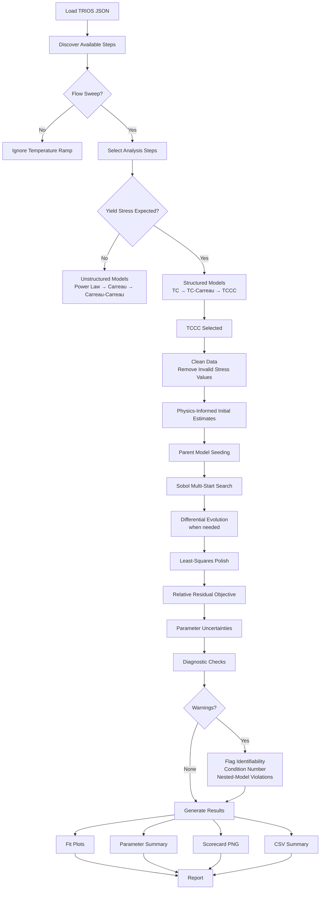
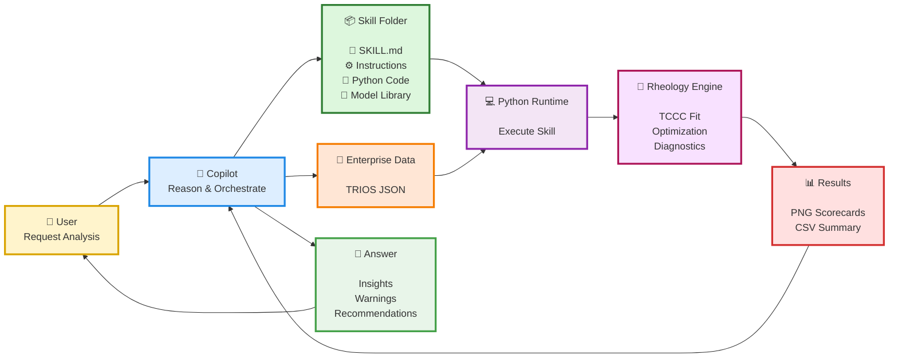

# Flow Curve Analysis

A **flow curve** is the measurement of viscosity as a function of shear rate. It is the fingerprint of
a non-Newtonian fluid: shear thinning, yield stress, plateaus and relaxation times all show up as
features of that single curve.

Fitting a **physically-based** model to a flow curve turns that fingerprint into numbers:

- it **quantifies material properties** ($\sigma_y$, $\eta_0$, $\lambda$, $n$, …) instead of describing curve shapes;
- it gives a **concise description of the material** — a handful of parameters replace hundreds of points, so samples, temperatures and batches become directly comparable;
- when those properties are tied back to the **formulation**, they give formulators **immediate feedback on which ingredient or level to change** to hit a material-property target.

This skill fits shear-rate sweep data from a TA Instruments TRIOS JSON file to a user-selected
rheological model and produces a diagnostic fit plot and a parameter scorecard.

It also **plots** the other two common measurements in the same file — **frequency sweeps** and
**amplitude sweeps**. Those are visualization only: there are no oscillatory models to fit yet, so
the skill draws the curves and reads model-free landmarks (LVR limit, G'/G'' crossover) off them.

**Default deliverables:** a scorecard PNG + a compact CSV summary.

**Optional deliverable (on request):** PowerPoint (`.pptx`) via `--output pptx`.

**Dependencies:** `numpy`, `scipy`, `matplotlib`, `pandas`, `python-pptx` (optional) — no `tadatakit`, no `lmfit`.

---

## Why the Model Choice Matters

Prefer models whose parameters mean something physically, because those are the ones a formulator
can act on:

| Parameter        | Reads as                          | Formulation lever it usually points at         |
| ---------------- | --------------------------------- | ---------------------------------------------- |
| $\sigma_y$       | strength of the structured network | structurant level, particle/fiber network       |
| $\eta_0$         | zero-shear / at-rest viscosity     | thickener or polymer concentration              |
| $\lambda$        | relaxation time, onset of thinning | molecular weight, micelle length                |
| $n$              | how sharply it shear-thins         | polymer architecture, degree of entanglement    |
| $\eta_{bg}$      | Newtonian background flow          | solvent/continuous phase                        |

In the multi-mode Carreau models the exponents are **fixed** at physically meaningful values rather
than fitted: $n=0$ (bracket exponent $-1/2$) is the worm-like-micelle stress plateau, and $n=1/2$
(bracket exponent $-1/4$) represents polymer–surfactant interaction or branched WLM. Each mode's
$\eta_{0,i}$ therefore reads as *how much of the viscosity comes from that specific mechanism*.

A good fit with meaningless parameters is worse than a slightly poorer fit with parameters that map
onto the formula. Always report **what the numbers mean for the material**, not just RedChi².

---

## Skill and Library Are One Thing

All behaviour described here is implemented by the **`rheofit` library** (`rheofit/`).
This file is simultaneously the agent workflow *and* the user-facing documentation of that library.

The user can drive the exact same code in three interchangeable ways:

| Route          | Command / call                                          | Best for                          |
| -------------- | ------------------------------------------------------- | --------------------------------- |
| Python API     | `import rheofit` → `rheofit.analyze(...)`               | notebooks, scripts, custom plots  |
| CLI            | `uv run rheofit <args>`                                 | one-shot runs from a terminal     |
| Skill (agent)  | this file — the agent runs the CLI on the user's behalf | guided analysis, model selection  |

Because the skill only calls the library, the two can never drift: change the physics or the
reporting in `rheofit/`, and every route changes with it. If you change the library's CLI
flags, model list or output modes, **update this file in the same edit**.

The repo is uv-managed. From a fresh clone, one command creates the environment, installs the
pinned dependencies from `uv.lock` and installs `rheofit` editable:

```bash
uv sync
```

After that, prefix commands with `uv run` — no activation needed. `pip install -e .` also works if
the user prefers pip.

### Library quick reference

```python
import rheofit

rheofit.list_models()                    # ['carreau', 'carreau_carreau', 'herschel_bulkley', ...]
rheofit.model_info("tccc")               # equation, params, scorecard params, nested parent
rheofit.demo_source()                    # path to the bundled demo TRIOS JSON

rheofit.print_steps("sample.json")       # step table incl. test type (Step 1 of the workflow below)
rheofit.discover_steps("sample.json")    # same, as a list of dicts

df = rheofit.load_step("sample.json", 0) # one step as a DataFrame; df.attrs['test_type'] is set
res = rheofit.fit(df, "tc", effort="thorough", seed=0)
res["params"], res["redchi"], res["notes"]

rheofit.plot(df)                         # plot it; the view follows df.attrs['test_type']
rheofit.plot(df, fits=res)               # same view + fitted curve + residual panel
rheofit.list_plots()                     # ['amplitude_sweep', 'flow_curve', 'frequency_sweep']
rheofit.plot_info("frequency_sweep")     # expected columns, axes, supports_fit

a = rheofit.analyze(                     # full pipeline + artifacts
    "sample.json", steps=[0, 2], model="tc", labels=["25C", "40C"],
    effort="thorough", output="png_csv",
)
a.results, a.summary, a.outputs          # fits, tidy DataFrame, saved file paths
```

`output="none"` fits without writing any file — useful when the user wants the numbers only.

> `analyze()` and the CLI are **flow-curve only**. Frequency and amplitude sweeps are reached
> through `rheofit.plot(...)` in Python; there is no CLI flag for them.

---

## Golden Rule — Interview First, Never Auto-Run

**Do not run the analysis until the user has explicitly approved a plan.**

The only command you may run before approval is step discovery (Step 1), which is read-only and prints nothing but a step table. Everything else waits for a green light.

Sequence: **discover steps → ask if structured → present the matching models → propose a plan → wait for approval → run → report.**

---

## First-use Demo Proposal (offer, do not auto-run)

When the skill is first introduced, offer an optional guided demo before asking for user data.

Before running anything, ask the user which data source they want to use:

- [ ] **Use bundled demo file** (quick walkthrough, no network needed)
- [ ] **Upload local JSON file**
- [ ] **Provide JSON URL**

If the host chat UI does not support clickable checkboxes/buttons, ask for a simple reply:
`demo` / `upload` / `url`.

The demo data ships with the library, as package data:

`rheofit/data/structured_shampoo.json` — a structured shampoo, flow curves at two temperatures

A second bundled sample covers the oscillatory views:

`rheofit/data/linear_polymer_HA_solution.json` — a hyaluronic-acid solution with an amplitude
sweep (step 0), a flow sweep (step 1) and a frequency sweep (step 2). Use this one when the user
wants to see frequency/amplitude plotting.

Never resolve either path relative to the user's working directory — use `--demo` on the CLI or
`rheofit.demo_source()` in Python, both of which locate the file inside the installed package.

Online fallback, used only if the bundled file is missing:

`https://pgone.sharepoint.com/:u:/s/i2iAcceleratedPrototypingScale/IQAW80L5GqglQIciUmYPko4CAU-CMKivBmKC78iY4VD0gdc`

Suggested prompt:

> "If you want, I can run a quick end-to-end demo using the test TRIOS JSON bundled with this skill,
> so you can see the workflow before we analyze your own sample. Shall I run that demo?"

If the user says yes, follow the normal approval flow with `--demo` as the input source and default output mode `png_csv`. Demo artifacts are written to `results/structured_shampoo/` under the current working directory, so the skill folder stays clean.

### Demo walkthrough script (recommended)

When running the online demo, explain the workflow step-by-step:

1. Discover available steps (read-only).
2. Ask whether the sample is expected to have a yield stress.
3. Present only the matching model family.
4. Propose plan (steps, labels, model, effort, output mode) and wait for approval.
5. Run fit and report results/warnings.

The demo sample is `structured_shampoo` — a structured shampoo with Thixin. Its steps are
`0` (Flow sweep - 1), `1` (Temperature ramp - 2, not fittable) and `2` (Flow sweep - 3).
When asked whether the sample is expected to have a yield stress, the expected answer is:

> **Yes** — this is a **structured shampoo** sample with **Thixin**
> (hydrogenated castor oil fibers, internally developed as a structurant),
> so the yield-stress family should be used.

If the user accepts that framing, recommend `tccc` as the demo model and explain why:

- The shampoo base is well represented by a **Carreau–Carreau viscosity background**
  (two fixed-exponent relaxation contributions: $n=0$ for the worm-like micelles of the
  surfactant base, $n=1/2$ for polymer–surfactant interaction / branched WLM).
- Thixin adds a **structured network with yield behavior**, captured by the `tc` term
  ($\sigma_y + \sigma_y\sqrt{\dot\gamma/\dot\gamma_c}$).
- `tccc` combines both physics in one model:
  yield-stress structure + two-component shear-thinning background.

So for this demo, prefer `tccc` first; only step down the ladder if residuals/identifiability
show the extra terms are not needed.

When you present the demo plan (before asking for approval), include this workflow preview so the user can follow the steps while waiting for the fit:



When providing demo results, also include this orchestration chart to explain how the
agent, skill, data, runtime, and outputs connect:



The CLI also supports `--demo`, which loads the bundled package demo JSON for step discovery and fitting, and falls back to the online URL only if that file is missing.

If that fallback URL is not accessible from the Python session (e.g., SharePoint `401/403`), tell the user the link is authenticated and ask them to either upload the JSON file or provide a direct-access URL.

If the user says no, proceed with their real data.

For real cases, users can provide data in either form:

- upload/provide a local `.json` file path
- provide an HTTP(S) URL to the JSON file

---

## Fitting Contract

These guarantees hold for every model and must be stated to the user when reporting results.

### Relative weighting (always)

The objective minimised is the **relative** distance between data and curve:

$$r_i = \frac{f(\dot\gamma_i;\,\mathbf{p}) - \sigma_i}{|\sigma_i|}, \qquad \chi^2_\nu = \frac{\sum_i r_i^2}{n - p}$$

Consequences worth repeating to the user:

- Every decade of stress contributes equally — a 5% miss at 0.2 Pa counts exactly as much as a 5% miss at 200 Pa. Low-shear-rate structure is never drowned out by the high-shear end.
- RedChi² is **dimensionless**, so it is directly comparable between steps, temperatures, samples, and models.
- Points with non-finite or non-positive stress are **dropped before fitting** (they would divide by zero). The library reports how many were removed, as a note on the fit result.

### Robust convergence

These models are strongly non-linear with parameters spanning many decades, so a single local fit from a hand-picked guess routinely lands in a local minimum. The pipeline therefore does all of the following, in order:

1. **Log-space search** — all strictly-positive, multi-decade parameters ($\sigma_y$, $\dot\gamma_c$, $\eta$, $\lambda$, $K$) are fitted as $\log_{10} p$, making the search scale-free. Bounded exponents such as $n$ stay linear. Standard errors are chain-ruled back into physical units.
2. **Physics-informed starting point** — read off the data rather than guessed: $\sigma_y$ from the low-rate stress plateau, $\eta_{bg}$ from the high-rate slope of $\sigma$ vs $\dot\gamma$, $\eta_0$ from the low-rate viscosity plateau, $\lambda$ from the viscosity half-fall crossover, and $(K, n)$ from a log-log regression.
3. **Ladder seeding from the nested parent** — before fitting a richer model, its simpler parent is fitted first and injected as a start with the extra terms at their degenerate limits. Exact nesting chains: `power_law → herschel_bulkley` and `tc → tc_carreau → tccc`. This makes it structurally impossible for the richer model to score worse than its parent.
4. **Sobol multi-start** — a scrambled low-discrepancy sample spanning ±3 decades around the physics estimate, sized by `--effort`.
5. **Differential evolution** — an extra global pre-pass for models with 4+ parameters at `--effort thorough`.
6. **Tight polish** — the best survivors are re-optimised with `x_scale='jac'` and tolerances at `1e-14`.

### Self-checks reported after every fit

Each of these is added to `result["notes"]` and printed by the CLI as a `[!]` warning line, and you must relay them:

- A richer model scoring worse than its exactly-nested parent → convergence failure, not model inadequacy.
- Any parameter with relative error above 100% → unidentifiable, model over-parameterised for this data.
- Jacobian condition number above `1e12` → near-degenerate parameter combination.

> **Never interpret a nesting violation as physics.** If `tccc` fits worse than `tc`, the optimiser failed — re-run with `--effort thorough` and a different `--seed` rather than concluding the simpler model is "better".

---

## Visualization Contract

Plotting lives in `rheofit/visualization/`, laid out exactly like `rheofit/models/`: **one module per
measurement type**, registered in a `PLOTS` dict. Every module exposes `TEST_NAME`, `X_COLUMN`,
`Y_COLUMNS`, `SUPPORTS_FIT`, `AXES`, `plot()` and `describe()`.

| Measurement type   | x-axis                    | Curves drawn                     | Fitting |
| ------------------ | ------------------------- | -------------------------------- | ------- |
| `flow_curve`       | shear rate [1/s]          | stress and/or viscosity          | **yes** |
| `frequency_sweep`  | angular frequency [rad/s] | G', G'' (+ optional tan δ or η*) | no      |
| `amplitude_sweep`  | oscillation strain [%] or stress [Pa] | G', G''              | no      |

All axes are log-log, since every one of these quantities spans decades.

### The fit / no-fit switch

This is the single rule that changes the figure layout:

- **No `fits`** → one panel, data only.
- **`fits` supplied** → two panels: the curve on top, **relative residuals** `(data − fit)/data` underneath, with a shaded ±5% band (`exp_err`).

Passing `fits` to a frequency or amplitude sweep raises a clear error — there are no oscillatory
models yet. Do not fabricate one; say so to the user.

### Multiple datasets and multiple fits

Every `plot()` accepts one dataset or many, and `flow_curve` accepts one fit per dataset:

```python
rheofit.plot(df)                                     # a single DataFrame
rheofit.plot([df1, df2])                             # a list; labels come from the step names
rheofit.plot({"25C": df1, "40C": df2},               # explicit labels
             fits={"25C": res1, "40C": res2})        # one fit each
rheofit.plot({"25C": df1, "40C": df2}, fits={"25C": res1})   # fit on one curve only
```

Fits may also be passed without data (`rheofit.plot(fits=res, test_type="flow_curve")`), because a
fit result already carries its own `x` and `y_data`.

### Colour convention — colour means the quantity, never the dataset

| Quantity                  | Colour            | Marker |
| ------------------------- | ----------------- | ------ |
| Stress                    | red `#E74C3C`     | open   |
| Viscosity                 | blue `#3498DB`    | open   |
| G' (elastic / storage)    | red `#E74C3C`     | filled |
| G'' (viscous / loss)      | blue `#3498DB`    | open   |

Because hue is reserved for the quantity, **multiple datasets are distinguished by marker shape**
(`o`, `s`, `^`, `D`, …) and a lighter shade of the same hue; a single dataset always uses the pure
colour. Axis labels are tinted to match, and secondary quantities (η*, tan δ) are drawn grey so
they never compete with the reserved red/blue. Keep this convention in any figure you hand back to
the user, including ones pasted into Office documents.

### Model-free landmarks

These are read straight off the curve, so they are available even without a model. Report them as
measured landmarks, **not** as fitted parameters:

- **`show_crossover`** (frequency sweep) — the G'/G'' crossover frequency $\omega_c$, interpolated in log-log space. Report the terminal relaxation time as $\tau = 1/\omega_c$. If the curves never cross inside the measured window, nothing is drawn — say so rather than extrapolating.
- **`show_lvr`** (amplitude sweep) — the end of the linear viscoelastic region: the plateau modulus $G_0$ is the median G' over the lowest-amplitude points, and the LVR ends where G' first drops more than `lvr_tol` (default 5%) below it **and stays below**. The "stays below" requirement matters: G' is often scattered by several percent at low amplitude, and a single-point test reads an isolated dip as yielding.
- **`show_flow_point`** (amplitude sweep) — the G'/G'' crossover, i.e. where the sample starts to flow. If G'' > G' across the whole sweep the material is liquid-like and no flow point exists.

### Plotting examples

```python
import rheofit
from rheofit.visualization import amplitude_sweep, frequency_sweep

steps = rheofit.discover_steps("sample.json")        # each entry carries a 'test_type'
flow = rheofit.load_step("sample.json", 1)
freq = rheofit.load_step("sample.json", 2)
amp  = rheofit.load_step("sample.json", 0)

rheofit.plot(flow, fits=rheofit.fit(flow, "carreau"))          # fit + residuals
rheofit.plot(flow, y="viscosity")                              # viscosity only
frequency_sweep.plot(freq, secondary="complex_viscosity", show_crossover=True)
amplitude_sweep.plot(amp, show_lvr=True, show_flow_point=True)
amplitude_sweep.plot({"before": a1, "after": a2}, show_lvr=True)   # compare two samples
```

Figures are returned as matplotlib `Figure` objects — save them with `fig.savefig(...)` or let a
notebook display them. The plotting layer never writes files on its own.

---

## How to Run

**Preferred — uv (the repo is uv-managed):**

```bash
uv run rheofit <args>
```

`uv run` creates/updates the environment from `uv.lock` on first use, so it works on a fresh clone
with no setup step. If the user reports no `uv` on their machine, fall back to the active
interpreter with the library installed (`pip install -e .`):

```bash
python -m rheofit <args>
```

**If `rheofit` is not installed at all** — the skill ships a wrapper that adds the repo's `src/` to
`sys.path` and forwards to the same CLI, so the flags are identical:

```bash
python .github/skills/flow-curve-analysis/scripts/flow_curve_fit.py <args>
```

**Last resort — if that still fails with `ModuleNotFoundError`:**

```bash
uv run .github/skills/flow-curve-analysis/scripts/flow_curve_fit.py <args>
```

That form reads the PEP 723 inline metadata in the wrapper and installs missing packages into an
isolated environment, without needing the project environment at all.

Every `uv run rheofit …` command below can be replaced by any of the fallbacks above, or by the
equivalent `rheofit.analyze(...)` call, without changing the result.

## When to Use

- User provides a TRIOS JSON file and wants to fit flow curve data
- User asks to analyze or compare flow curve steps at different temperatures or conditions
- User wants a scorecard comparing rheological parameters across steps
- User wants diagnostic residual plots for rheology fits
- User wants to **plot** a measurement — flow curve, frequency sweep or amplitude sweep — with or without a fit
- User wants to overlay several samples, steps or temperatures on one figure
- User asks for a **crossover frequency**, a **relaxation time**, an **LVR limit** or a **flow point** (these are read off the curve, no model needed)

---

## Step 1 — Discover Available Steps

This is the one command you may run before approval. Run the CLI without `--steps`:

```bash
uv run rheofit "sample.json"
```

Demo shortcut (loads the bundled package JSON automatically):

```bash
uv run rheofit --demo
```

Python equivalent: `rheofit.print_steps("sample.json")` (or `rheofit.discover_steps(...)` for the raw list).

`sample.json` may be either a local file path or an HTTP(S) URL.

This prints a table of step indices, names, row counts, and the detected **test type**. Report the non-empty steps (marked `<-- data`) to the user, grouped by test type.

> **Important:** These indices are 0-based `ResultsSteps` indices, **not** the procedure step numbers from TRIOS (which tadatakit exposes as a different numbering). Use the index from the printed table directly in `--steps`.

The `test_type` column tells you what each step can be used for:

| Test type          | What to offer                                                        |
| ------------------ | -------------------------------------------------------------------- |
| `flow_curve`       | the full fitting workflow below (Steps 2–5), or a plain plot          |
| `frequency_sweep`  | visualization only — `rheofit.plot(...)`, optionally with `show_crossover` |
| `amplitude_sweep`  | visualization only — `rheofit.plot(...)`, optionally with `show_lvr` |
| `unknown`          | inspect before offering anything; may be conditioning or a ramp       |

Temperature-ramp and conditioning steps appear in this table but are **not** shear-rate sweeps — do not offer them for flow-curve fitting.

If the file contains oscillatory steps, mention them: a user who came for a flow curve often does
not realise the amplitude and frequency sweeps in the same file can be plotted too. Offer, do not
auto-run.

---

## Step 2 — Ask Whether the Sample Is Structured

**This is the branching question. Ask it before showing any model list.**

*(Steps 2–5 apply to `flow_curve` steps. For a frequency or amplitude sweep, skip straight to
plotting — see the **Visualization Contract** — since there is no model to choose.)*

> "Is this sample **structured** — that is, do you expect it to have a yield stress?"
> 
> Signs of a structured sample: it holds its shape at rest, the stress curve flattens to a plateau at the lowest shear rates, or the viscosity keeps climbing as $\dot\gamma \to 0$ with no plateau.

If the user is unsure, inspect the low-shear end of the data and advise: a clear stress plateau at low $\dot\gamma$ indicates a yield stress; a viscosity that levels off into a Newtonian plateau indicates none.

Then present **only the matching family**.

### Branch A — No yield stress (unstructured)

| Model             | Equation                                                                                                                   | Use when                                                                                  | Parameters                                                                      |
| ----------------- | -------------------------------------------------------------------------------------------------------------------------- | ----------------------------------------------------------------------------------------- | ------------------------------------------------------------------------------- |
| `power_law`       | $\sigma = K\dot\gamma^n$                                                                                                   | Simplest shear-thinning fluid; no plateau at either end. Good baseline.                   | $K$ consistency, $n$ flow index                                                 |
| `carreau`         | $\sigma = \eta_0\dot\gamma[1+(\lambda\dot\gamma)^2]^{(n-1)/2}$                                                             | Polymer solution with one Newtonian plateau that shear-thins above a characteristic rate. **Only model with a free exponent** — $n\to0$ is the worm-like-micelle stress plateau. | $\eta_0$ zero-shear viscosity, $\lambda$ relaxation time, $n$ thinning exponent |
| `carreau_carreau` | $\sigma = \eta_{0,1}\dot\gamma[1+(\lambda_1\dot\gamma)^2]^{-1/2} + \eta_{0,2}\dot\gamma[1+(\lambda_2\dot\gamma)^2]^{-1/4}$ | Two distinct relaxation processes with **fixed** exponents: mode 1 ($n_1=0$) for worm-like micelles, mode 2 ($n_2=1/2$) for polymer–surfactant interaction or branched WLM. No yield stress. | $\eta_{0,1}, \lambda_1, \eta_{0,2}, \lambda_2$ per component — exponents are not fitted |

#### Fixed Carreau exponents and what they mean

Every Carreau term other than the one in `carreau` itself has its exponent **fixed, not fitted**.
This is a deliberate physical choice: it halves the parameter count of a two-mode model and keeps the
fit well-conditioned.

| Bracket exponent | Equivalent $n$ | High-rate limit                                                | Physical origin                                                                                    |
| ---------------- | -------------- | -------------------------------------------------------------- | -------------------------------------------------------------------------------------------------- |
| $-1/2$           | $n = 0$        | $\sigma \sim \dot\gamma^{0}$ (stress plateau), $\eta \sim \dot\gamma^{-1}$ | **Worm-like micelles** — shear banding clamps the stress at a constant value as the rate increases. |
| $-1/4$           | $n = 1/2$      | $\sigma \sim \dot\gamma^{1/2}$, $\eta \sim \dot\gamma^{-1/2}$           | **Polymer–surfactant interaction or branched WLM** — the extra network relaxation pathway softens the plateau. |

So in `carreau_carreau`, `tc_carreau` and `tccc`, only the amplitudes $\eta_{0,i}$ and onset times
$\lambda_i$ are free; each mode costs two well-identified parameters instead of three. `tc_carreau`
carries the $n=0$ WLM mode only; `tccc` carries both. When reporting results, say which physics each
mode represents rather than just quoting $\eta_{0,i}$.

### Branch B — Yield stress present (structured)

| Model              | Equation                                                                                                                                                                       | Use when                                                                                                             | Parameters                                                                              |
| ------------------ | ------------------------------------------------------------------------------------------------------------------------------------------------------------------------------ | -------------------------------------------------------------------------------------------------------------------- | --------------------------------------------------------------------------------------- |
| `tc`               | $\sigma = \sigma_y + \sigma_y\sqrt{\dot\gamma/\dot\gamma_c} + \eta_{bg}\dot\gamma$                                                                                             | Clear yield stress with simple Newtonian background flow. Start here.                                                | $\sigma_y$ yield stress, $\dot\gamma_c$ critical rate, $\eta_{bg}$ background viscosity |
| `herschel_bulkley` | $\sigma = \sigma_y + K\dot\gamma^n$                                                                                                                                            | Yield stress with power-law flow above it. The classical engineering choice.                                         | $\sigma_y$, $K$, $n$                                                                    |
| `tc_carreau`       | $\sigma = \sigma_y + \sigma_y\sqrt{\dot\gamma/\dot\gamma_c} + \eta_0\dot\gamma[1+(\lambda\dot\gamma)^2]^{-1/2}$                                                                | Yield stress plus a shear-thinning (rather than Newtonian) background. The Carreau exponent is fixed at $n=0$ — the worm-like-micelle stress plateau. | $\sigma_y$, $\dot\gamma_c$, $\eta_0$, $\lambda$                                         |
| `tccc`             | $\sigma = \sigma_y + \sigma_y\sqrt{\dot\gamma/\dot\gamma_c} + \eta_{0,1}\dot\gamma[1+(\lambda_1\dot\gamma)^2]^{-1/2} + \eta_{0,2}\dot\gamma[1+(\lambda_2\dot\gamma)^2]^{-1/4}$ | Yield stress plus both fixed-exponent modes: $n_1=0$ (worm-like micelles) and $n_2=1/2$ (polymer–surfactant interaction or branched WLM). Richest model — needs well-sampled data. | $\sigma_y$, $\dot\gamma_c$, $\eta_{0,1}, \lambda_1, \eta_{0,2}, \lambda_2$              |

**Guidance to offer alongside the table:**

- Prefer the simplest model that fits. Extra parameters buy little once RedChi² is below `0.01`, and cost identifiability.
- Within each branch the models form a ladder — climb it only if the simpler model leaves visible structure in the residuals.
- If the user has no preference, recommend `tc` for structured samples and `carreau` for unstructured ones, and say you will escalate if the residuals warrant it.

---

## Step 3 — Propose a Plan and Wait for Approval

Collect the remaining choices in one batch:

- Which step indices to analyse
- A label for each step (e.g. `26.7C`, `40C`)
- Effort level — `fast`, `normal`, or `thorough` (default `thorough`)
- Output mode — default `png_csv` / optional `pptx` / optional `both`

Then present the plan back and **stop**:

> **Proposed analysis**
> 
> - Sample: `<name>`
> - Steps: `0` (26.7C), `2` (40C)
> - Structured: yes → yield-stress family
> - Model: `tc` — chosen because …
> - Effort: `thorough`; relative-weighted objective; ladder seeding enabled
> - Output: `png_csv` (default) in `results/<sample>/`
> 
> Command to be run:
> 
> ```bash
> uv run rheofit "sample.json" --steps 0 2 --model tc --labels "26.7C" "40C" --effort thorough --output png_csv
> ```
> 
> Equivalent in Python:
> 
> ```python
> import rheofit
> a = rheofit.analyze("sample.json", steps=[0, 2], model="tc",
>                     labels=["26.7C", "40C"], effort="thorough", output="png_csv")
> ```
> 
> Shall I proceed?

Only after the user agrees do you continue.

---

## Step 4 — Run the Analysis

```bash
uv run rheofit \
  <path_to_json> \
  --steps <step_index_1> [step_index_2 ...] \
  --model <model_name> \
  [--labels <label_1> [label_2 ...]] \
  [--effort fast|normal|thorough] \
  [--seed N] \
  [--sample-name NAME] \
  [--output png_csv|pptx|both|none]
```

`<path_to_json>` may be a local path or an HTTP(S) URL, or replace it with `--demo` to use the bundled reference sample. For URL inputs, use `--sample-name` to control output folder/filename prefixes.

`--effort` controls how many multi-start seeds are explored before the polish (`fast` 32, `normal` 128, `thorough` 512) and whether differential evolution runs. `--seed` makes a run exactly reproducible; change it to test whether a fit is seed-robust. `--output none` fits without writing files.

If that fails with `ModuleNotFoundError`, use the wrapper script path (see **How to Run**).

Examples:

```bash
# Structured sample, two temperatures, TC model
uv run rheofit "sample.json" --steps 0 2 --model tc --labels "25C" "40C" --effort thorough

# Unstructured polymer solution, single step
uv run rheofit "sample.json" --steps 0 --model carreau --labels "25C"

# Structured sample, three steps, Herschel-Bulkley
uv run rheofit "sample.json" --steps 0 2 4 --model herschel_bulkley

# Bundled demo sample (structured shampoo with Thixin), TCCC
uv run rheofit --demo --steps 0 2 --model tccc --labels "Flow sweep 1" "Flow sweep 3"
```

Same runs from Python:

```python
import rheofit

rheofit.analyze("sample.json", steps=[0, 2], model="tc", labels=["25C", "40C"])
rheofit.analyze(rheofit.demo_source(), steps=[0, 2], model="tccc",
                labels=["Flow sweep 1", "Flow sweep 3"])
```

---

## Step 5 — Report Results

The CLI prints one or more saved file paths (`[>] Saved: ...`) based on `--output` (the same paths are returned as `Analysis.outputs` from `rheofit.analyze`):

- `png_csv` (default): one PNG scorecard + one compact CSV file
- `pptx`: one PowerPoint deck
- `both`: PNG + CSV + PPTX

The PNG scorecard contains:

- A concise task header box
- A small fit visualization (data + fitted curve)
- A parameter table including value, standard error, relative error, and fit quality metric (`RedChi2`)
- A notes/watchouts interpretation box

The PPTX, when requested, contains:

- **Slide 1** — Sample name, model, equation, date
- **Slide 2** — Fit diagnostic plots (stress overlay + relative residuals per step)
- **Slide 3** — Parameter tables (values / std errors / relative errors)
- **Slide 4** — Scorecard bar chart of key parameters

Always summarize in chat:

- The `SCORECARD_PARAMS` values for each step, **translated into material behaviour** — e.g. "σ_y of 1.2 Pa means the product holds its shape at rest", "η₀ dropped 40% at 40C, so it will feel thinner warm"
- The `RedChi2` per fit — below `0.01` excellent, above `0.1` consider a different model
- **Every `[!]` warning line printed** (i.e. every entry of `result["notes"]`), in plain language
- A reminder that the fit minimised relative error, so RedChi² is comparable across steps and models

If the user has told you what is in the formulation, close the loop: say which parameter moved, and
which ingredient or level is the likely lever for it (see **Why the Model Choice Matters**). If the
formulation is unknown, offer that step — the parameters are only actionable once they are tied to
the formula.

If RedChi² exceeds `0.1`, offer to climb one rung of the ladder within the same family — never switch families unless the yield-stress answer itself was wrong.

### Reporting an oscillatory measurement

Frequency and amplitude sweeps produce **no parameters, no scorecard and no CSV** — the deliverable
is the figure plus the landmarks read off it. Summarise them in material terms:

- **Which modulus dominates.** G' > G'' means solid-like/structured at rest; G'' > G' means liquid-like and pourable. State this before any number.
- **LVR limit** — how much deformation the structure survives before breaking down; relevant to shipping, pumping and shelf stability.
- **Flow point** (G'/G'' crossover on an amplitude sweep) — the strain or stress at which the sample starts to flow.
- **Crossover frequency** and $\tau = 1/\omega_c$ on a frequency sweep — the terminal relaxation time; longer $\tau$ means slower structural recovery.
- **Plateau modulus $G_0$** — network stiffness, which tracks structurant level much as $\sigma_y$ does on a flow curve.

Say explicitly that these are **measured landmarks, not fitted parameters**, so they carry no
standard error and no RedChi². If a landmark falls outside the measured window (no crossover, no
LVR departure), report that plainly rather than extrapolating — and offer to widen the sweep range
instead.

Then deliver results according to the output mode chosen in Step 3.

### Output Mode A — `png_csv` (default)

Report both saved files:

- `<sample> - <MODEL> Scorecard.png`
- `<sample> - <MODEL> Scorecard Summary.csv`

### Output Mode B — `pptx` (requested)

Report the saved path to the user. No further action needed — the `.pptx` is the deliverable.

### Output Mode C — `both`

Report all saved paths and call out that PNG+CSV are lightweight defaults while PPTX is presentation-ready.

---

### Optional Office insertion workflows (only if the user asks)

#### Paste into open PowerPoint (Microsoft 365 / Copilot agent)

The run has already saved a `.pptx`. Extract the content from it and insert into the user's active presentation:

1. **Diagnostic plots** (Slide 2 images): insert as pictures, one per step, arranged side-by-side, consistent size and log-log axes matching the saved file.
2. **Scorecard bar chart** (Slide 4): insert as a picture on a dedicated slide.
3. **Parameter table** (Slide 3): recreate as a native PowerPoint table — columns: parameter name | value (sci notation) | ±stderr | rel. error %; rows: one per step × parameter.
4. Add a title slide with sample name, model name, equation string, and date.

Keep typography consistent with the saved scorecard: monospaced font (Courier New), navy header (`#1F497D`), white slide background.

#### Paste into open Excel workbook (Microsoft 365 / Copilot agent)

1. **Parameters sheet** — Create a sheet named `Rheology Fit` with:
   - Row headers: step labels (e.g. 25C, 40C)
   - Column headers: parameter names, then `RedChi2`
   - Values in scientific notation; adjacent columns for ±stderr and rel. error %
   - Apply table formatting (header row bold + navy fill, alternating row shading)
2. **Scorecard chart** — Insert the scorecard bar chart image (from the saved `.pptx` Slide 4) as a picture into the sheet, or recreate it as a native Excel horizontal bar chart using the parameter values.
3. **Diagnostic plots** — Insert the per-step diagnostic images from the saved `.pptx` Slide 2, one per sheet column or on a dedicated `Diagnostics` sheet.

> The plots inserted into Office documents must be taken directly from the saved `.pptx`, or regenerated through `rheofit.plot(...)` so they inherit the library's styling automatically: log-log axes, red for stress/G', blue for viscosity/G'', marker shape distinguishing datasets, same figure size and DPI (see **Visualization Contract**). Do not create different-style charts for Office output.

---

## Library Layout

```
rheofit/
  __init__.py     public API: list_models, model_info, discover_steps, print_steps,
                  load_step, load_steps, fit, analyze, demo_source,
                  plot, list_plots, plot_info, get_plot
  io.py           TRIOS JSON reading, column standardisation, test-type detection,
                  URL download, demo data resolution
  models/         one module per model + _fitcore.py (the shared fitting engine)
  visualization/  one module per measurement type + _plotcore.py (shared plot primitives)
  report.py       PNG scorecard, parameter summary, PPTX builder
  analysis.py     analyze() — load → fit → summarise → save artifacts (flow curves only)
  cli.py          argparse front-end used by the skill (flow curves only)
  data/           bundled demo TRIOS JSON files
```

`models/` and `visualization/` are deliberately symmetrical: a registry dict, one module per
thing, and a private `_*core.py` holding the shared machinery. `report.plot_fit` is a thin
delegate to `visualization.flow_curve.plot`, so plots look identical everywhere.

## Data Loading Notes

`rheofit.io` reads TRIOS JSON directly without `tadatakit`:

- Steps come from `Results.Processed.ResultsSteps` (list, 0-indexed)
- Row data comes from `Results.Processed.Rows`, grouped by `Results Step Id`
- The primary stress signal used for fitting is `Stress_Pa` (or `Stress (step)_Pa` as fallback)
- Input can be a local path or an HTTP(S) URL (URL sources are downloaded to a temporary local file before parsing)
- Columns are standardised to `Shear rate / 1/s`, `Viscosity / Pa.s`, `Stress / Pa` for flow curves, and `Angular frequency / rad/s`, `Oscillation strain / %`, `Oscillation stress / Pa`, `Storage modulus / Pa`, `Loss modulus / Pa`, `Complex viscosity / Pa.s`, `Tan(delta)` for oscillatory steps
- Any DataFrame with the right columns can be passed to `rheofit.fit` or `rheofit.plot`, TRIOS or not

### How the test type is detected

**TRIOS writes every column on every row.** An amplitude sweep still carries `Shear rate_1/s` and
`Stress_Pa`, so the presence of a column proves nothing about what was measured. Detection
therefore works differently:

1. **Step name first** — `Oscillation-Amplitude`/`Amplitude sweep` → `amplitude_sweep`, `Oscillation-Frequency`/`Frequency sweep` → `frequency_sweep`, `Flow sweep` → `flow_curve`.
2. **Fallback: which control variable actually sweeps** — an amplitude sweep holds angular frequency fixed while strain spans decades; a frequency sweep does the reverse. The widest-spanning candidate wins.

`load_step` records the outcome in `df.attrs["test_type"]` (alongside `step_name` and `step_index`),
which is what lets `rheofit.plot(df)` pick the right view unprompted. Override it with
`rheofit.plot(df, test_type="...")` when the step name is misleading.

## Fitting Notes

See the **Fitting Contract** at the top of this file — that section is the authoritative description of the objective function, the log-space multi-start pipeline, and the self-checks.

## Adding a New Model

All fitting logic lives in `rheofit/models/_fitcore.py`. A model module supplies only its physics:

```python
MODEL_NAME, PARAMS, SCORECARD_PARAMS
LOG_PARAMS   # names fitted in log10 space
BOUNDS       # name -> (lo, hi) in physical units; lo > 0 for log params
PARENT       # simpler nested model name, or None
PARENT_EXACT # True only if the parent is an exact reduction
_func(x, *params)
initial_guess(x, y, eta) -> dict
seed_from_parent(parent_values, x, y, eta) -> dict   # if PARENT
fit_model(df, effort, seed) -> robust_fit(sys.modules[__name__], ...)
```

Register it in `rheofit/models/__init__.py`. Relative weighting, log-space search, multi-start, ladder seeding, polish, and error propagation are inherited automatically — never reimplement them in a model file. A newly registered model appears immediately in `rheofit.list_models()`, in `--model` on the CLI, and in this skill — but **add it to the model tables above in the same change**, otherwise the skill stops describing the library accurately.

## Adding a New Measurement Type

Plotting mirrors the model pattern. Shared machinery (input normalisation, panel layout, colour
convention, residuals) lives in `rheofit/visualization/_plotcore.py`; a view module supplies only
what is specific to that measurement:

```python
TEST_NAME      # e.g. "creep"
X_COLUMN       # standardised x column
Y_COLUMNS      # role -> standardised column
SUPPORTS_FIT   # False until models exist for this measurement
AXES           # labels and scales
plot(data=None, fits=None, **kw) -> matplotlib Figure
describe() -> dict
```

Register it in `rheofit/visualization/__init__.py`, add its TRIOS columns to `COLUMN_RENAME` and a
name pattern to `_NAME_PATTERNS` in `rheofit/io.py`, then **document it in the Visualization
Contract above in the same change**. Reuse `_plotcore.COLORS` — do not invent new hues for
quantities that already have one.

## Environment & Required Packages

The repo is uv-managed: `pyproject.toml` declares the dependencies and `uv.lock` pins the exact
resolved versions, so `uv sync` (or the first `uv run`) reproduces the same environment on any
clone. `python-pptx` and `ipykernel` come from the `dev` group, which `uv sync` installs by default.

```
numpy
scipy
matplotlib
pandas
python-pptx   # dev group; needed only for --output pptx / both
ipykernel     # dev group; needed only for notebooks
```

The wrapper script mirrors these as PEP 723 inline metadata, so the last-resort
`uv run …/flow_curve_fit.py` route works even without the project environment.

If the user has changed dependencies in `pyproject.toml`, run `uv lock` and commit the updated
`uv.lock` in the same change.
