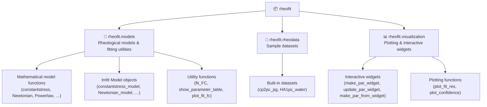
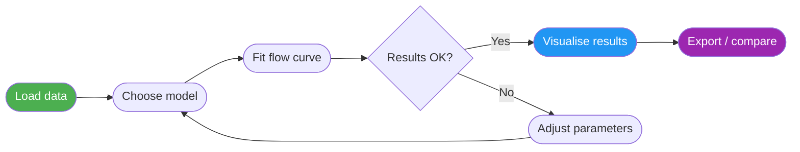
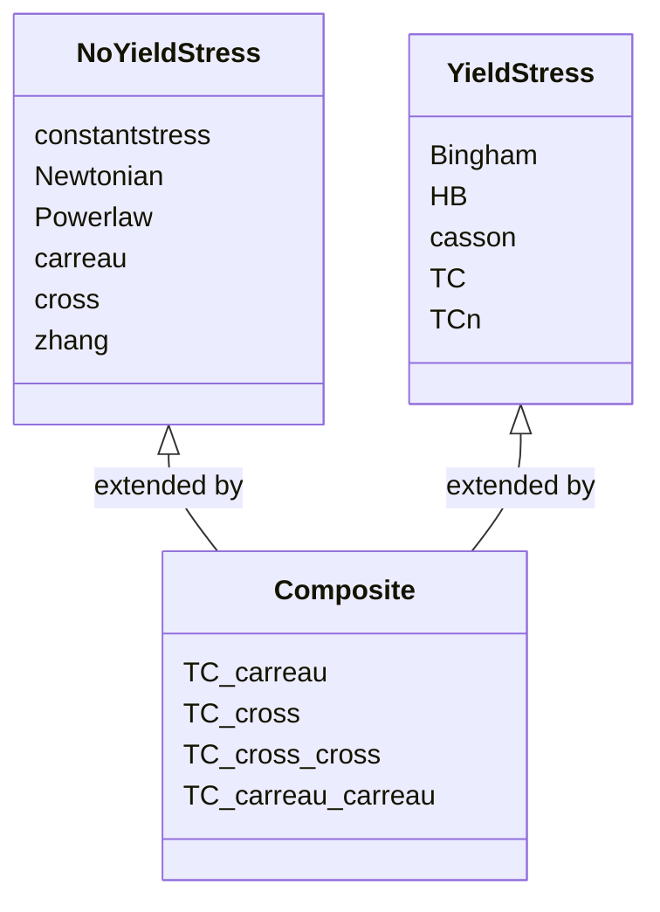
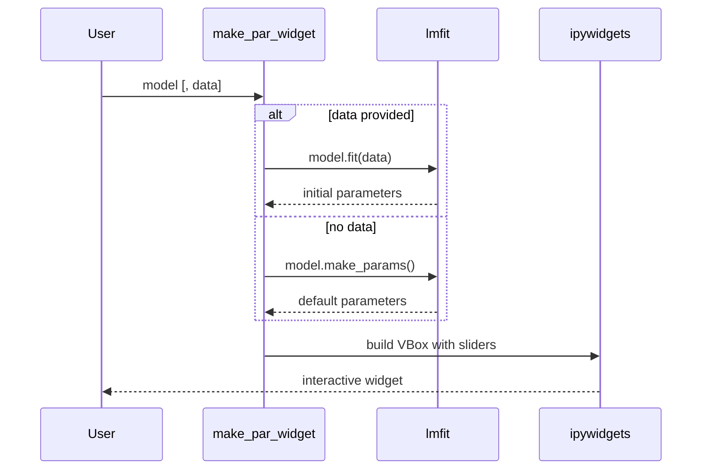
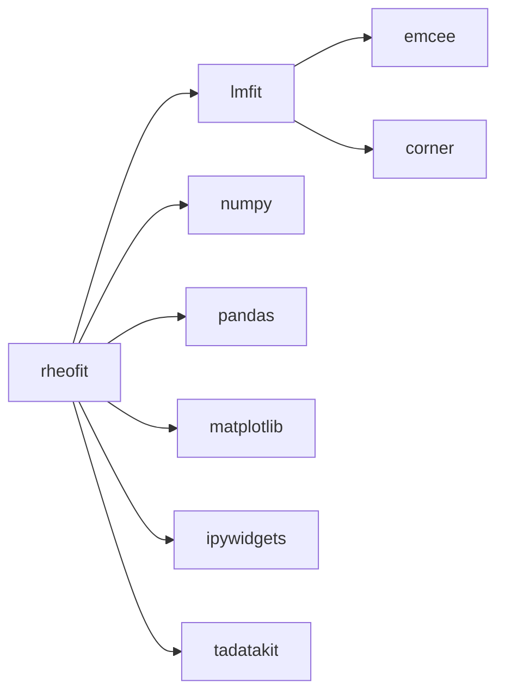

# rheofit API Reference

Python library for fitting rheology data flow curves.

---

## Package Structure



---

## Typical Workflow



**Example:**

```python
import rheofit.rheodata as rheodata
from rheofit.models import HB_model, fit_FC, show_parameter_table
from rheofit.visualization import plot_fit_res

# 1. Load built-in sample data
exp = rheodata.cp2pc_pg
data = exp.datasets[0].data  # pandas DataFrame

# 2. Fit the Herschel-Bulkley model
result = fit_FC(HB_model, data)

# 3. Inspect results
show_parameter_table(result)

# 4. Plot
fig = plot_fit_res(result)
```

---

## Model Classification



---

## `rheofit.models`

### Available Models

The dictionary `rheofit.models.available_models` maps string keys to the corresponding `lmfit` Model objects.

| Key | lmfit Model Object | Description |
|-----|--------------------|-------------|
| `'constantstress'` | `constantstress_model` | Constant yield stress |
| `'Newtonian'` | `Newtonian_model` | Newtonian fluid |
| `'Powerlaw'` | `Powerlaw_model` | Power-law (Ostwald–de Waele) |
| `'Bingham'` | `Bingham_model` | Bingham plastic |
| `'TC'` | `TC_model` | Three-Component |
| `'TCn'` | `TCn_model` | Three-Component (variable exponent) |
| `'HB'` | `HB_model` | Herschel-Bulkley |
| `'casson'` | `casson_model` | Casson |
| `'carreau'` | `carreau_model` | Carreau |
| `'cross'` | `cross_model` | Cross |
| `'TC_carreau'` | `TC_carreau_model` | Three-Component + Carreau |
| `'TC_cross'` | `TC_cross_model` | Three-Component + Cross |
| `'TC_cross_cross'` | `TC_cross_cross_model` | Three-Component + Cross + Cross |
| `'zhang'` | `zhang_model` | Zhang |
| `'TC_carreau_carreau'` | `TC_carreau_carreau_model` | Three-Component + Carreau + Carreau |

---

### Model Reference

Each model below provides:
- the underlying Python function (for direct evaluation),
- a pre-configured `lmfit.Model` object (for fitting), and
- a `.model_expression` attribute (LaTeX math rendered in Jupyter).

---

#### `constantstress` / `constantstress_model`

$$\sigma = \sigma_y$$

| Parameter | Default | Min | Description |
|-----------|---------|-----|-------------|
| `ystress` | 0.1 | 0 | Yield stress [Pa] |

---

#### `Newtonian` / `Newtonian_model`

$$\sigma = \eta_{bg} \cdot \dot\gamma$$

| Parameter | Default | Min | Description |
|-----------|---------|-----|-------------|
| `eta_bg` | 0.1 | 0 | Viscosity [Pa·s] |

---

#### `Powerlaw` / `Powerlaw_model`

$$\sigma = K \cdot \dot\gamma^n$$

| Parameter | Default | Min | Description |
|-----------|---------|-----|-------------|
| `K` | 0.1 | 0 | Consistency index [Pa·s^n] |
| `n` | 0.5 | 0 | Shear-thinning index (1 = Newtonian) [–] |

---

#### `Bingham` / `Bingham_model`

$$\sigma = \sigma_y + \eta_{bg} \cdot \dot\gamma$$

| Parameter | Default | Min | Description |
|-----------|---------|-----|-------------|
| `ystress` | 1.0 | 0 | Yield stress [Pa] |
| `eta_bg` | 0.1 | 0 | Background viscosity [Pa·s] |

---

#### `TC` / `TC_model` — Three-Component

$$\sigma = \sigma_y + \sigma_y \left(\frac{\dot\gamma}{\dot\gamma_c}\right)^{0.5} + \eta_{bg} \cdot \dot\gamma$$

| Parameter | Default | Min | Description |
|-----------|---------|-----|-------------|
| `ystress` | 1.0 | 0 | Yield stress [Pa] |
| `eta_bg` | 0.1 | 0 | Background viscosity [Pa·s] |
| `gammadot_crit` | 0.1 | 0 | Critical shear rate [1/s] |

---

#### `TCn` / `TCn_model` — Three-Component (variable exponent)

$$\sigma = \sigma_y + \sigma_y \left(\frac{\dot\gamma}{\dot\gamma_c}\right)^n + \eta_{bg} \cdot \dot\gamma$$

| Parameter | Default | Min | Max | Description |
|-----------|---------|-----|-----|-------------|
| `ystress` | 1.0 | 0 | – | Yield stress [Pa] |
| `eta_bg` | 0.1 | 0 | – | Background viscosity [Pa·s] |
| `gammadot_crit` | 0.1 | 0 | – | Critical shear rate [1/s] |
| `n` | 0.5 | 0 | 1 | Shear-thinning exponent [–] |

---

#### `HB` / `HB_model` — Herschel-Bulkley

$$\sigma = \sigma_y + K \cdot \dot\gamma^n$$

| Parameter | Default | Min | Max | Description |
|-----------|---------|-----|-----|-------------|
| `ystress` | 1.0 | 0 | – | Yield stress [Pa] |
| `K` | 1.0 | 0 | – | Consistency index [Pa·s^n] |
| `n` | 0.5 | 0 | 1 | Shear-thinning index [–] |

---

#### `casson` / `casson_model` — Casson

$$\sigma^{0.5} = \sigma_y^{0.5} + (\eta_{bg} \cdot \dot\gamma)^{0.5}$$

| Parameter | Default | Min | Description |
|-----------|---------|-----|-------------|
| `ystress` | 1.0 | 0 | Yield stress [Pa] |
| `eta_bg` | 0.1 | 0 | Background viscosity [Pa·s] |

---

#### `carreau` / `carreau_model` — Carreau

$$\sigma = \dot\gamma (\eta_0 - \eta_\infty) \left(1 + \left(\frac{\dot\gamma}{\dot\gamma_c}\right)^2\right)^{\frac{n-1}{2}} + \dot\gamma \cdot \eta_\infty$$

| Parameter | Default | Min | Max | Description |
|-----------|---------|-----|-----|-------------|
| `eta_0` | 1.0 | 0 | – | Low-shear viscosity [Pa·s] |
| `gammadot_crit` | 1.0 | 0 | – | Critical shear rate [1/s] |
| `n` | 0.5 | 0 | 1 | Shear-thinning exponent [–] |
| `eta_inf` | 0.001 | 0 | – | High-shear viscosity [Pa·s] |

---

#### `cross` / `cross_model` — Cross

$$\sigma = \dot\gamma \eta_\infty + \frac{\dot\gamma (\eta_0 - \eta_\infty)}{1 + \left(\frac{\dot\gamma}{\dot\gamma_c}\right)^n}$$

| Parameter | Default | Min | Max | Description |
|-----------|---------|-----|-----|-------------|
| `eta_inf` | 0.001 | 0 | – | High-shear viscosity [Pa·s] |
| `eta_0` | 1.0 | 0 | – | Low-shear viscosity [Pa·s] |
| `n` | 0.5 | 0 | 1 | Shear-thinning exponent [–] |
| `gammadot_crit` | 1.0 | 0 | – | Critical shear rate [1/s] |

---

#### `TC_carreau` / `TC_carreau_model` — Three-Component + Carreau

$$\sigma = \sigma_y + \sigma_y\left(\frac{\dot\gamma}{\dot\gamma_c}\right)^{0.5} + \dot\gamma \cdot \eta_0 \left(1 + (\lambda\dot\gamma)^2\right)^{\frac{n-1}{2}}$$

| Parameter | Default | Min | Max | Description |
|-----------|---------|-----|-----|-------------|
| `ystress` | 1.0 | 0 | – | Yield stress [Pa] |
| `eta_bg` | 0.1 | 0 | – | Background viscosity [Pa·s] |
| `gammadot_crit` | 0.1 | 0 | – | Critical shear rate [1/s] |
| `eta_0` | 0.1 | 0 | – | Low-shear viscosity (Carreau) [Pa·s] |
| `lambda_val` | 0.1 | 0 | – | Time constant (Carreau) [s] |
| `n` | 0.5 | 0 | 1 | Shear-thinning exponent [–] |

---

#### `TC_cross` / `TC_cross_model` — Three-Component + Cross

$$\sigma = \sigma_y + \sigma_y\left(\frac{\dot\gamma}{\dot\gamma_c}\right)^{0.5} + \dot\gamma \eta_\infty + \frac{\dot\gamma (\eta_0 - \eta_\infty)}{1 + \left(\frac{\dot\gamma}{\dot\gamma_c}\right)^n}$$

| Parameter | Default | Min | Max | Description |
|-----------|---------|-----|-----|-------------|
| `ystress` | 1.0 | 0 | – | Yield stress [Pa] |
| `eta_bg` | 0.1 | 0 | – | Background viscosity [Pa·s] |
| `gammadot_crit` | 0.1 | 0 | – | Critical shear rate [1/s] |
| `eta_inf` | 0.001 | 0 | – | High-shear viscosity [Pa·s] |
| `eta_0` | 1.0 | 0 | – | Low-shear viscosity [Pa·s] |
| `n` | 0.5 | 0 | 1 | Shear-thinning exponent [–] |

---

#### `TC_cross_cross` / `TC_cross_cross_model` — Three-Component + Cross + Cross

$$\sigma = \sigma_y + \sigma_y\sqrt{\dot\gamma \cdot \tau_{TC}} + \dot\gamma \eta_{\infty,1} + \frac{\dot\gamma (\eta_{0,1} - \eta_{\infty,1})}{1 + \left(\frac{\dot\gamma}{\dot\gamma_{c,1}}\right)^{n_1}} + \dot\gamma \eta_{\infty,2} + \frac{\dot\gamma (\eta_{0,2} - \eta_{\infty,2})}{1 + \left(\frac{\dot\gamma}{\dot\gamma_{c,2}}\right)^{n_2}}$$

| Parameter | Default | Min | Max | Description |
|-----------|---------|-----|-----|-------------|
| `sigma_y` | 1.0 | 0 | – | Yield stress [Pa] |
| `tau_TC` | 0.1 | 0 | – | TC characteristic stress [Pa] |
| `eta_inf_1` | 0.001 | 0 | – | High-shear viscosity (Cross 1) [Pa·s] |
| `eta_0_1` | 1.0 | 0 | – | Low-shear viscosity (Cross 1) [Pa·s] |
| `n_1` | 0.5 | 0 | 1 | Shear-thinning exponent (Cross 1) [–] |
| `gammadot_crit_1` | 1.0 | 0 | – | Critical shear rate (Cross 1) [1/s] |
| `eta_inf_2` | 0.001 | 0 | – | High-shear viscosity (Cross 2) [Pa·s] |
| `eta_0_2` | 1.0 | 0 | – | Low-shear viscosity (Cross 2) [Pa·s] |
| `n_2` | 0.5 | 0 | 1 | Shear-thinning exponent (Cross 2) [–] |
| `gammadot_crit_2` | 1.0 | 0 | – | Critical shear rate (Cross 2) [1/s] |

---

#### `zhang` / `zhang_model` — Zhang

$$\sigma = \frac{\dot\gamma \cdot \mu}{1 + \left(\dfrac{\mu \cdot \dot\gamma}{2(G_0 + \beta \cdot \mu \cdot \dot\gamma)}\right)^2}$$

| Parameter | Default | Min | Description |
|-----------|---------|-----|-------------|
| `mu` | 10 | 0 | Viscosity parameter [Pa·s] |
| `G0` | 100 | 0 | Storage modulus [Pa] |
| `beta` | 0.01 | 0 | Material constant [–] |

---

#### `TC_carreau_carreau` / `TC_carreau_carreau_model` — Three-Component + Carreau + Carreau

$$\sigma = \sigma_y + \sigma_y\sqrt{\dot\gamma \cdot \tau_{TC}} + \eta_{0,1}\left(1 + (\lambda_1 \dot\gamma)^2\right)^{\frac{n_1-1}{2}} \dot\gamma + \eta_{0,2}\left(1 + (\lambda_2 \dot\gamma)^2\right)^{\frac{n_2-1}{2}} \dot\gamma$$

| Parameter | Default | Min | Max | Description |
|-----------|---------|-----|-----|-------------|
| `sigma_y` | 1.0 | 0 | – | Yield stress [Pa] |
| `tau_TC` | 0.1 | 0 | – | TC characteristic stress [Pa] |
| `eta_0_1` | 0.1 | 0 | – | Low-shear viscosity (Carreau 1) [Pa·s] |
| `lambda_val_1` | 0.1 | 0 | – | Time constant (Carreau 1) [s] |
| `n_1` | 0.5 | 0 | 1 | Shear-thinning exponent (Carreau 1) [–] |
| `eta_0_2` | 0.1 | 0 | – | Low-shear viscosity (Carreau 2) [Pa·s] |
| `lambda_val_2` | 0.1 | 0 | – | Time constant (Carreau 2) [s] |
| `n_2` | 0.5 | 0 | 1 | Shear-thinning exponent (Carreau 2) [–] |

---

### Utility Functions

#### `fit_FC(model, data)`

Convenience wrapper around `lmfit.Model.fit` for flow-curve data.

**Parameters**

| Name | Type | Description |
|------|------|-------------|
| `model` | `lmfit.Model` | A pre-configured rheofit model object (e.g. `HB_model`) |
| `data` | `pandas.DataFrame` | Must contain columns `'Shear rate'` [1/s] and `'Stress'` [Pa] |

**Returns** `lmfit.ModelResult`

**Example**

```python
from rheofit.models import HB_model, fit_FC

result = fit_FC(HB_model, data)
print(result.fit_report())
```

---

#### `show_parameter_table(result)`

Convert a `lmfit.ModelResult` into a tidy `pandas.DataFrame` for display or concatenation.

**Parameters**

| Name | Type | Description |
|------|------|-------------|
| `result` | `lmfit.ModelResult` | Fit result returned by `fit_FC` or `model.fit` |

**Returns** `pandas.DataFrame` — one row per fit, columns for each parameter plus `bic` and `redchi`.

**Example**

```python
from rheofit.models import show_parameter_table

df = show_parameter_table(result)
display(df)
```

---

#### `plot_fit_fc(result, show_table=True)`

Quick log–log plot of data and best-fit curve on the current Matplotlib axes.

**Parameters**

| Name | Type | Default | Description |
|------|------|---------|-------------|
| `result` | `lmfit.ModelResult` | — | Fit result |
| `show_table` | `bool` | `True` | If `True`, also displays the parameter table below the plot |

**Returns** `None`

---

## `rheofit.rheodata`

Built-in sample datasets are lazy-loaded on first attribute access.

### Available Datasets

| Attribute | File | Description |
|-----------|------|-------------|
| `cp2pc_pg` | `cp2pc_pg.json` | 2 % w/w carbopol in propylene glycol |
| `HA1pc_water` | `HA1pc_water.json` | 1 % w/w hyaluronic acid in water |

### Usage

```python
import rheofit.rheodata as rheodata

exp = rheodata.cp2pc_pg          # tadatakit.classes.Experiment object
data = exp.datasets[0].data      # pandas DataFrame with 'Shear rate' and 'Stress' columns
```

The returned `Experiment` object follows the [tadatakit](https://github.com/NFDI4Chem/tadatakit) schema.

---

## `rheofit.visualization`

### Interactive Widgets (Jupyter)

#### `make_par_widget(model, data=None)`

Create an interactive `ipywidgets.VBox` to inspect and edit model parameters.



**Parameters**

| Name | Type | Default | Description |
|------|------|---------|-------------|
| `model` | `lmfit.Model` | — | Model whose parameters to expose |
| `data` | `pandas.DataFrame` | `None` | If provided, initialises widget values from a quick pre-fit |

**Returns** `ipywidgets.VBox`

---

#### `update_par_widget(par_wid, fit_res)`

Refresh the *values* displayed in an existing parameter widget after a new fit.

**Parameters**

| Name | Type | Description |
|------|------|-------------|
| `par_wid` | `ipywidgets.VBox` | Widget created by `make_par_widget` |
| `fit_res` | `lmfit.ModelResult` | New fit result |

**Returns** `None`

---

#### `make_par_from_widget(par_widget)`

Read the current widget state and return an `lmfit.Parameters` object ready for fitting.

**Parameters**

| Name | Type | Description |
|------|------|-------------|
| `par_widget` | `ipywidgets.VBox` | Widget created by `make_par_widget` |

**Returns** `lmfit.Parameters`

---

### Plotting Functions

#### `plot_fit_res(fit_res, show_par_values=False, exp_err=0.05)`

Two-panel diagnostic figure: stress & viscosity (log–log) on top, normalised residuals on the bottom.

**Parameters**

| Name | Type | Default | Description |
|------|------|---------|-------------|
| `fit_res` | `lmfit.ModelResult` | — | Fit result |
| `show_par_values` | `bool` | `False` | Annotate figure with parameter values and reduced χ² |
| `exp_err` | `float` | `0.05` | Estimated experimental relative error (draws ±band on residuals) |

**Returns** `matplotlib.figure.Figure`

**Example**

```python
from rheofit.visualization import plot_fit_res

fig = plot_fit_res(result, show_par_values=True, exp_err=0.05)
fig.savefig("fit.png", dpi=150)
```

---

#### `plot_confidence(res_fit, expand=1)`

Overlay a 3σ confidence band on the current Matplotlib axes.

**Parameters**

| Name | Type | Default | Description |
|------|------|---------|-------------|
| `res_fit` | `lmfit.ModelResult` | — | Fit result |
| `expand` | `float` | `1` | Scaling factor applied to the uncertainty band |

**Returns** `None`

**Example**

```python
import matplotlib.pyplot as plt
from rheofit.visualization import plot_confidence

plt.figure()
plot_confidence(result, expand=2)
plt.legend()
plt.show()
```

---

## Dependencies



| Package | Role |
|---------|------|
| `lmfit` | Non-linear least-squares model fitting |
| `numpy` | Numerical computations |
| `pandas` | Data frames for experimental data |
| `matplotlib` | Plotting |
| `ipywidgets` | Interactive Jupyter widgets |
| `tadatakit` | Experiment data schema / JSON loading |
| `emcee` | MCMC uncertainty estimation (via lmfit) |
| `corner` | Corner plots for MCMC results |
| `seaborn` | Statistical visualisations |
