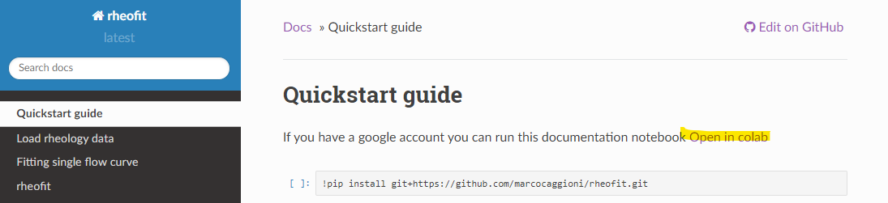
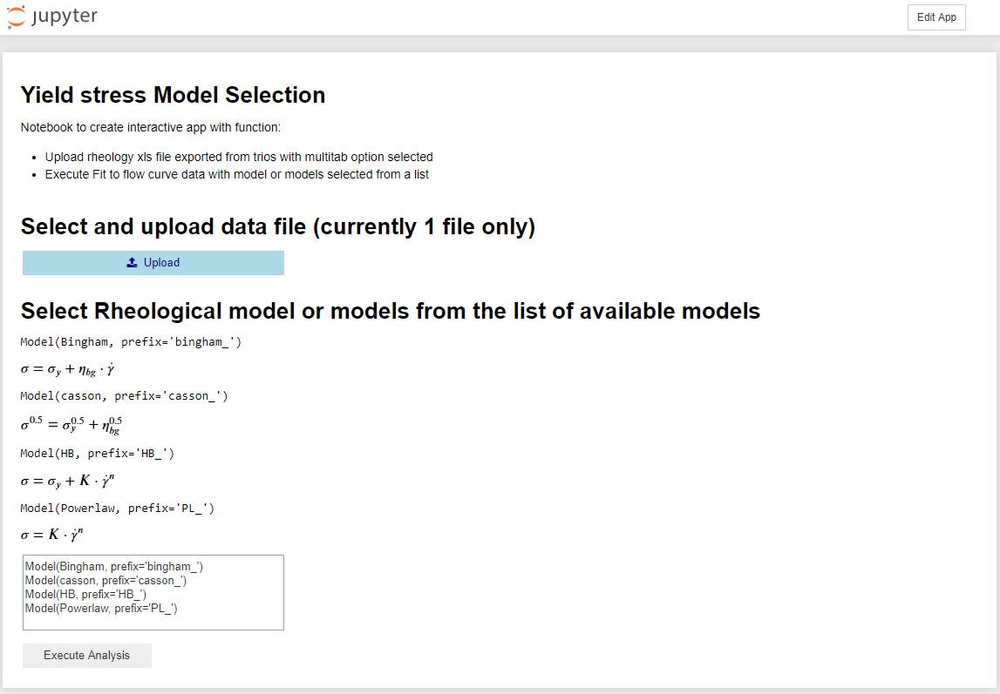

# rheofit
[](https://rheofit.readthedocs.io/en/latest/?badge=latest)

library for fitting rheology data flow curves

Documentation at https://rheofit.readthedocs.io

# Install

to install:

```
pip install git+https://github.com/rheopy/rheofit.git
```

If you change your mind:

```
pip uninstall rheofit
```

# Try it in the cloud

## With Colab (gmail account required)

[](https://colab.research.google.com/github/marcocaggioni/rheofit/blob/master/notebooks/index.ipynb)

In colab you can execute the notebooks used to create the documentation. Clicking the badge opens a index nobebook with links to the documentation notebooks. A direct link to each notebook is also available in the documentation by clicking the link at the top of the page.
You do not require a local python installation, colab provides all you need. You can try this also on a phone or tablet.



## With Binder

[](http://beta.mybinder.org/v2/gh/rheopy/rheofit/master)

In Binder you can test notebooks and also use Ipywidgets to run notebooks as small web applications. We provide one example app that uses widgets to let the user upload a file, select a rheological model and fit the data. Binder takes a few min to start but provides a very convenient way to test feature on a customized environemnt. For this specific app we also provide an example file with an example measurement of a flow curve in the format assumed by the app, you can download it here [flow_curve_example.xls](https://github.com/rheopy/rheofit/raw/master/notebooks/data/Flow_curve_example.xls) 


