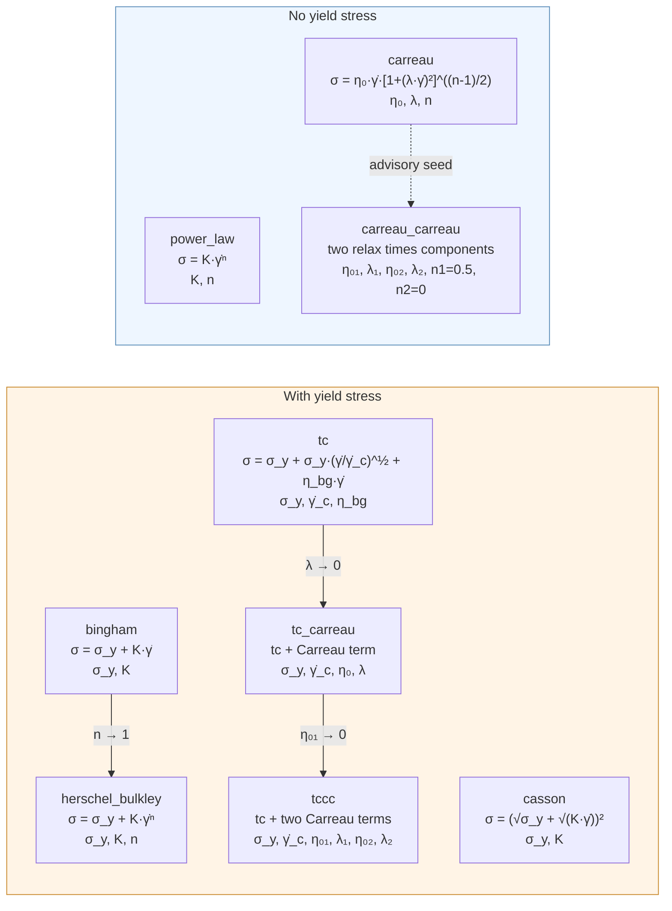

# ⚗️ rheofit

**Turn flow curves into material physics.** `rheofit` fits viscosity–vs–shear-rate data to
constitutive models whose parameters *mean something* — yield stress, zero-shear viscosity,
relaxation time — and hands you quantified material properties instead of curve shapes.

## 🧪 The idea

A flow curve is the fingerprint of a non-Newtonian fluid 🔍: shear thinning, yield stress,
low-shear plateaus and relaxation times all show up as features of that single curve. Fitting it
with a physically-based model does three things:

- 🎯 **Quantifies material properties** — $\sigma_y$, $\eta_0$, $\lambda$, $n$ — instead of describing curve shapes.
- 🗜️ **Compresses the material into numbers** — a handful of parameters replace hundreds of points, so samples, temperatures and batches become directly comparable.
- 🧬 **Closes the loop with formulation** — tied back to the formula, the parameters say *which ingredient or level to move* to hit a material-property target.

### From parameter → to physics → to formulation lever

|      | Parameter   | Reads as                           | Formulation lever                          |
| ---- | ----------- | ---------------------------------- | ------------------------------------------ |
| 🧱   | $\sigma_y$  | strength of the structured network | structurant level, particle/fiber network  |
| 💧   | $\eta_0$    | zero-shear / at-rest viscosity     | thickener or polymer concentration         |
| ⏳   | $\lambda$   | relaxation time, onset of thinning | molecular weight, micelle length           |
| 📐   | $n$         | how sharply it shear-thins         | polymer architecture, entanglement         |
| 🌊   | $\eta_{bg}$ | Newtonian background flow          | solvent / continuous phase                 |

Data is read directly from TA Instruments **TRIOS** JSON 📥, but `fit()` accepts any DataFrame
with shear-rate and stress columns.

## 🎯 The problem we're solving

Measuring a flow curve is easy; *interpreting* it is not. The inverse problem — recovering
constitutive parameters from $(\dot\gamma, \sigma)$ data — is ill-conditioned: parameters span
many decades, the objective landscape is riddled with local minima, and a naive least-squares fit
from a hand-picked guess will happily converge to a physically meaningless answer behind a
pretty curve. `rheofit` exists to make the fit *trustworthy*: scale-free search,
physics-informed starting points, and self-diagnostics that tell you when a parameter isn't
earned by the data.

## 🔬 The fitting engine

Every fit minimises the **relative** residual $(f(\dot\gamma;p)-\sigma)/|\sigma|$ 📏, so each
decade of stress counts equally and `RedChi2` is dimensionless — comparable across steps,
samples and models. Under the hood:

- 🧮 **Log-space parameters** — multi-decade quantities ($\sigma_y$, $\lambda$, $\eta$, …) are fitted as $\log_{10} p$, making the search scale-free; standard errors are chain-ruled back into physical units.
- 🧭 **Physics-informed starting values** — read off the data rather than guessed: $\sigma_y$ from the low-rate stress plateau, $\eta_{bg}$ from the high-rate slope, $\lambda$ from the viscosity half-fall crossover.
- 🪜 **Ladder seeding** — each model is seeded from its exactly-nested parent, so a richer model can never score worse than its parent. A nesting violation means the optimiser failed, not that the simpler model is "better".
- 🎲 **Sobol multi-start** (+ differential evolution at `thorough` effort) — global search over ±3 decades before the tight polish.
- 🚨 **Self-diagnostics** — weakly identified parameters (>100% relative error), near-degenerate Jacobians (condition number > 1e12) and nesting violations are reported as notes on every result. Never interpret them as physics.

## 📦 Install

### With uv (recommended) ⚡

Clone and run — `uv` creates the virtual environment, installs the pinned dependencies from
`uv.lock` and installs `rheofit` itself in editable mode:

```bash
git clone <repo-url>
cd rheofit
uv sync
```

Then prefix any command with `uv run` (no activation needed):

```bash
uv run rheofit --demo
uv run python -c "import rheofit; print(rheofit.list_models())"
uv run jupyter lab            # notebooks: pick the .venv kernel
```

`uv sync` also installs the `dev` group (`ipykernel`, `python-pptx`), so notebooks and PowerPoint
output work out of the box. For a lean runtime-only environment use `uv sync --no-default-groups`.

Prefer activation instead? `.venv\Scripts\Activate.ps1` (Windows) or `source .venv/bin/activate`.

### With pip 🐍

```bash
pip install -e .
pip install -e ".[pptx]"   # adds PowerPoint output
```

## 🐍 Python API

```python
import rheofit

rheofit.list_models()
# ['bingham', 'carreau', 'carreau_carreau', 'casson', 'herschel_bulkley', 'power_law', 'tc', 'tc_carreau', 'tccc']

rheofit.print_steps("sample.json")            # which steps exist (0-based ResultsSteps index)

df = rheofit.load_step("sample.json", 0)      # one step as a DataFrame
res = rheofit.fit(df, "tc", effort="thorough")
res["params"]   # {'sigma_y': {'value': ..., 'stderr': ...}, ...}
res["redchi"], res["notes"]

a = rheofit.analyze(                          # load -> fit -> summarise -> save
    "sample.json", steps=[0, 2], model="tc", labels=["25C", "40C"], output="png_csv",
)
a.summary      # tidy DataFrame: step, parameter, value, stderr, rel_error_pct, redchi2, quality
a.outputs      # saved PNG / CSV / PPTX paths
```

`analyze(..., output="none")` fits without writing files. Inputs may be a local path or an
HTTP(S) URL. `rheofit.demo_source()` returns the bundled demo flow-curve file.

It also **plots** oscillatory data 📊 — frequency and amplitude sweeps (visualization only, no
models to fit yet): `rheofit.plot(df)` picks the right view from the step's test type, and reads
model-free landmarks (LVR limit, G′/G″ crossover) straight off the curve.

## ⌨️ CLI

```bash
uv run rheofit sample.json                                     # list steps
uv run rheofit sample.json --steps 0 2 --model tc --labels 25C 40C
uv run rheofit --demo --steps 0 2 --model tccc --output both
```

(`python -m rheofit …` is equivalent inside an activated environment.)

Flags: `--steps`, `--model`, `--labels`, `--effort {fast,normal,thorough}`, `--seed`,
`--sample-name`, `--output {png_csv,pptx,both,none}`, `--demo`.

## 📚 Models

| 🧱 With yield stress (structured) | 💧 No yield stress      |
| --------------------------------- | ----------------------- |
| `bingham`, `casson`               | `power_law`             |
| `tc`, `herschel_bulkley`          | `carreau`               |
| `tc_carreau`                      | `carreau_carreau`       |
| `tccc`                            |                         |

Within each family the models form a ladder 🪜 — climb only if the residuals show structure the
simpler model missed. Prefer the simplest model that fits: extra parameters buy little once
`RedChi2` is below `0.01`, and they cost identifiability. A good fit with meaningless parameters
is worse than a slightly poorer fit with parameters that map onto the formula.

## 🗂️ Layout

```
rheofit/
  io.py            TRIOS JSON reading, URL download, demo data
  models/          one module per model + _fitcore.py (shared fitting engine)
  visualization/   flow-curve, frequency-sweep and amplitude-sweep plots
  report.py        plots, PNG scorecard, parameter summary, PPTX
  analysis.py      analyze()
  cli.py           command-line front-end
```

## 🤖 Agent skill

[.github/skills/flow-curve-analysis/SKILL.md](.github/skills/flow-curve-analysis/SKILL.md) is the
agent-facing companion to this library: it documents the models, the fitting contract and a guided
interview workflow (is the sample structured? which model? which steps?), and drives the same CLI.
Use the library directly, or let the skill walk you through it — they are the same code. Keep the
skill in sync when the library's models, flags or outputs change.

## 🗺️ Model map

Models split into two families by whether the constitutive equation carries a yield stress
$\sigma_y$. Arrows point from the simpler model to the model that reduces to it (the ladder used
for parent seeding); dashed arrows are advisory seeds only, not exact reductions.


```mermaid
flowchart LR


    subgraph Yield["With yield stress"]
        direction TB
        BI["bingham<br/>σ = σ_y + K·γ̇<br/>σ_y, K"]
        HB["herschel_bulkley<br/>σ = σ_y + K·γ̇ⁿ<br/>σ_y, K, n"]
        CS["casson<br/>σ = (√σ_y + √(K·γ̇))²<br/>σ_y, K"]
        TC["tc<br/>σ = σ_y + σ_y·(γ̇/γ̇_c)^½ + η_bg·γ̇<br/>σ_y, γ̇_c, η_bg"]
        TCA["tc_carreau<br/>tc + Carreau term<br/>σ_y, γ̇_c, η₀, λ"]
        TCCC["tccc<br/>tc + two Carreau terms<br/>σ_y, γ̇_c, η₀₁, λ₁, η₀₂, λ₂"]
        BI -->|n → 1| HB
        TC -->|λ → 0| TCA
        TCA -->|η₀₁ → 0| TCCC
    end

        subgraph NoYield["No yield stress"]
        direction TB
        PL["power_law<br/>σ = K·γ̇ⁿ<br/>K, n"]
        CA["carreau<br/>σ = η₀·γ̇·[1+(λ·γ̇)²]^((n-1)/2)<br/>η₀, λ, n"]
        CC["carreau_carreau<br/>two relax times components<br/>η₀₁, λ₁, η₀₂, λ₂, n1=0.5, n2=0"]
        CA -.->|advisory seed| CC
    end

    style NoYield fill:#eef6ff,stroke:#5b8db8
    style Yield fill:#fff4e6,stroke:#c98a2e
```

Prefer the simplest model that fits; climb the ladder only when the residuals show structure the
simpler model missed.
