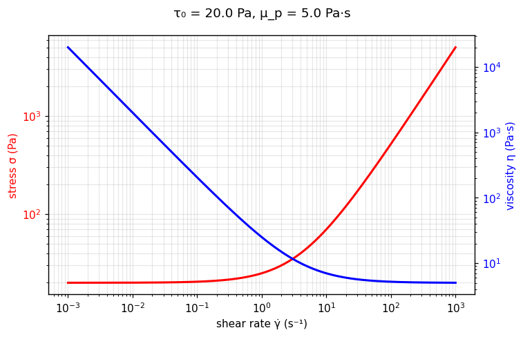

[← All models](index)

# The Bingham Plastic Model: Historical Foundations, Physics, Limitations, and Fitting Methodologies

## 1. Historical Background and Motivation

The **Bingham Plastic model** is the foundational constitutive equation in the study of viscoplasticity. It was formulated in the late 1910s and early 1920s by American chemist Eugene Cook Bingham at Lafayette College, in collaboration with chemist Henry Green. Their pivotal findings were presented in their 1919 paper, *"Paint, a plastic material and not a viscous liquid; the measurement of its mobility and yield value,"* and subsequently expanded in Bingham's 1922 classic treatise, *Fluidity and Plasticity*.

### The Motivation Behind the Model

Prior to Bingham's work, fluid mechanics operated under Isaac Newton's classic 1687 formulation:

$$
\tau = \mu \dot{\gamma}
$$

where shear stress ($\tau$) is strictly proportional to shear rate ($\dot{\gamma}$), meaning any non-zero shear stress—no matter how infinitesimally small—causes continuous fluid deformation.

While studying industrial materials such as oil paints, clay suspensions, and sewage sludges, Bingham and Green noticed that these substances departed radically from Newtonian theory:

1. **Finite Yield Threshold:** Below a certain critical force, the material refused to flow, behaving instead as an elastic solid capable of sustaining static loads.
2. **Constant Post-Yield Resistance:** Once this stress threshold was exceeded, the material flowed, with the incremental shear stress scaling linearly with the rate of shear.

Bingham recognized that classical mechanics lacked a unified model to bridge Hookean solid elasticity below a threshold force and Newtonian fluid flow above it. To solve this, he introduced the concept of the **yield value** (now called yield stress, $\tau_0$) and **plastic viscosity** ($\mu_p$), establishing the field of modern rheology (a term Bingham himself co-coined with Marcus Reiner in 1920).

## 2. Mathematical Formulation

In one-dimensional pure shear flow, the Bingham Plastic constitutive equations are expressed as:

$$
\begin{cases} \dot{\gamma} = 0, & \text{for } \vert{}\tau\vert{} \le \tau_0 \quad \text{(Unyielded / Solid-like State)} \\ \tau = \tau_0 + \mu_p \dot{\gamma}, & \text{for } \vert{}\tau\vert{} > \tau_0 \quad \text{(Yielded / Viscous Flow State)} \end{cases}
$$

Where:

* $\tau$ = Shear stress ($\text{Pa}$)
* $\tau_0$ = Yield stress ($\text{Pa}$): The threshold stress required to disrupt the material's internal structural network and initiate fluid motion.
* $\mu_p$ = Plastic viscosity or Bingham viscosity ($\text{Pa}\cdot\text{s}$): The constant differential slope ($\text{d}\tau / \text{d}\dot{\gamma}$) of the flow curve once yielded.
* $\dot{\gamma}$ = Shear rate ($\text{s}^{-1}$)

### Apparent Viscosity Formulation

The apparent (or effective) viscosity $\eta(\dot{\gamma})$ is defined as the total stress divided by shear rate ($\tau / \dot{\gamma}$):

$$
\eta(\dot{\gamma}) = \frac{\tau_0}{\dot{\gamma}} + \mu_p \quad \text{for } \vert{}\tau\vert{} > \tau_0
$$

### Three-Dimensional Tensorial Representation

In general 3D continuum mechanics, the Bingham constitutive equation utilizes the von Mises yield criterion and is written as:

$$
\begin{cases} \mathbf{D} = \mathbf{0}, & \text{for } \frac{1}{2} \text{tr}(\boldsymbol{\tau}^2) \le \tau_0^2 \\ \boldsymbol{\tau} = 2 \left( \frac{\tau_0}{\dot{\gamma}} + \mu_p \right) \mathbf{D}, & \text{for } \frac{1}{2} \text{tr}(\boldsymbol{\tau}^2) > \tau_0^2 \end{cases}
$$

where $\boldsymbol{\tau}$ is the extra stress tensor, $\mathbf{D} = \frac{1}{2} \left( \nabla \mathbf{u} + (\nabla \mathbf{u})^T \right)$ is the rate-of-deformation tensor, and $\dot{\gamma} = \sqrt{2 \text{tr}(\mathbf{D}^2)}$ is the second invariant of $\mathbf{D}$.

---

## 🔬 Interactive explorer

Drag the sliders to feel what each parameter does — the equation you just read, recomputed
live in your browser (Python via WebAssembly, no server involved).

````{only} builder_html
```{raw} html
<iframe src="../_static/interactive/bingham/index.html" width="100%" height="760" style="border: 1px solid #ddd; border-radius: 8px;" title="Bingham plastic interactive explorer" loading="lazy"></iframe>
```

*Tip: [open the explorer full-screen](../_static/interactive/bingham/index.html).*
````

*Static preview
(τ₀ = 20 Pa, μ_p = 5 Pa·s):*



---

## 3. Range of Applicable Materials

The Bingham model is the primary viscoplastic model for concentrated particulate suspensions and slurries where post-yield shear-thinning or shear-thickening is negligible over the operational shear rate window.

| Industry / Application | Material Examples | Key Rheological Feature Captured |
| :--- | :--- | :--- |
| **Civil Engineering & Construction** | Fresh concrete, self-consolidating concrete, cement pastes | Slump test height correlates directly with $\tau_0$; pumping pressure losses are governed by $\mu_p$. |
| **Drilling & Geotechnical** | Standard bentonite muds, clay-water suspensions | Suspends heavy mineral drill cuttings when circulation stops ($\tau_0$). |
| **Waste Management & Mining** | Sewage sludge, thickened tailings, mineral pulps | Governs pipe flow friction factors and open-channel gravity transport thresholds. |
| **Coatings & Paints** | Oil-based paints, architectural coatings | Prevents paint sagging on vertical walls ($\tau_0$) while maintaining predictable leveling ($\mu_p$). |
| **Consumer Products & Foods** | Basic toothpastes, mustard, margarine, chocolate pastes | Maintains structural shape on dispensing ($\tau_0$) with predictable extrusion rates ($\mu_p$). |

## 4. Intrinsic Theoretical Assumptions and Limitations

While the two-parameter Bingham model is mathematically straightforward, it introduces physical simplifications that create engineering and computational challenges.

### A. High-Shear Viscosity Limit ($\eta_\infty \to \mu_p$)

Unlike three-parameter models like Herschel–Bulkley ($n < 1$), where apparent viscosity continuously drops toward zero at high shear rates, the Bingham apparent viscosity approaches a finite lower plateau equal to the plastic viscosity:

$$
\lim_{\dot{\gamma} \to \infty} \eta(\dot{\gamma}) = \lim_{\dot{\gamma} \to \infty} \left( \frac{\tau_0}{\dot{\gamma}} + \mu_p \right) = \mu_p
$$

* **Physical Validity:** This linear asymptotic behavior is physically realistic for simple suspensions dominated by particle-particle friction rather than polymer chain disentanglement.
* **Limitation:** If the underlying material exhibits non-linear shear-thinning post-yield, the Bingham model will overestimate viscous drag and energy dissipation at high shear rates.

### B. Divergence at Zero Shear Rate ($\eta \to \infty$) and CFD Singularities

As $\dot{\gamma} \to 0^+$, the apparent viscosity diverges to infinity:

$$
\lim_{\dot{\gamma} \to 0^+} \eta(\dot{\gamma}) = \infty
$$

* **Numerical Singularity:** In Computational Fluid Dynamics (CFD), the step change between yielded and unyielded domains causes sharp spatial boundaries (yield surfaces) where the viscosity function becomes non-differentiable.
* **Regularization Solutions:** Continuous approximations are routinely applied to bypass numerical divergence:
  * **Papanastasiou Regularization (1987):**
    $$
    \tau = \tau_0 \left[ 1 - \exp(-m \dot{\gamma}) \right] + \mu_p \dot{\gamma}
    $$
  * **Bercovier–Engelman Regularization (1980):**
    $$
    \eta_{app} = \frac{\tau_0}{\sqrt{\dot{\gamma}^2 + \varepsilon^2}} + \mu_p
    $$
    where $m$ and $\varepsilon$ are regularization parameters controlling the steepness of the transition at low shear rates.

### C. Omission of Non-Linearity Post-Yield

The assumption of constant post-yield differential viscosity ($\text{d}\tau/\text{d}\dot{\gamma} = \mu_p$) fails for structured fluids containing macromolecules or deformable microgels. When post-yield curvature exists in experimental flow curves, using a linear Bingham fit leads to artificial inflation or underestimation of the calculated yield stress.

### D. Idealized Rigid Body vs. Elastic Deformation

The model assumes an ideal unyielded state ($\dot{\gamma} = 0$). Real materials exhibit elastic micro-deformation (Hookean elasticity, $\tau = G \gamma$), viscoelastic creep, and thixotropic aging prior to macroscopic flow initiation.

## 5. Parameter Fitting Challenges and Objective Functions

Because the Bingham equation is linear in the yielded domain ($\tau = \tau_0 + \mu_p \dot{\gamma}$), fitting appears simpler than for 3-parameter non-linear models. However, practical fitting introduces distinct analytical challenges:

1. **Identification of the Yield Boundary:** Including data points from the unyielded or transition regime ($\vert{}\tau\vert{} \le \tau_0$) in linear regression corrupts the line of best fit, distorting both $\tau_0$ and $\mu_p$.
2. **Instrument Limitations at Low Shear:** Rotational rheometers encounter torque limits and wall slip at low shear rates, generating erroneous stress values near yielding.

### Residual Weighting Schemes

The choice of objective function in least-squares regression heavily determines parameter accuracy:

#### 1. Absolute Residual Sum of Squares ($S_{abs}$)

$$
S_{abs} = \sum_{i=1}^{N} \left( \tau_{i, \text{measured}} - (\tau_0 + \mu_p \dot{\gamma}_i) \right)^2
$$

* **Behavior:** Weighting scales with the magnitude of shear stress (in Pascals).
* **Consequence:** High shear rate measurements (where $\tau$ is largest) dominate the sum. Errors in low shear rate measurements contribute negligibly, leading to inaccurate extrapolations of the yield stress intercept ($\tau_0$).

#### 2. Relative Residual Sum of Squares ($S_{rel}$)

$$
S_{rel} = \sum_{i=1}^{N} \left( \frac{\tau_{i, \text{measured}} - (\tau_0 + \mu_p \dot{\gamma}_i)}{\tau_{i, \text{measured}}} \right)^2 = \sum_{i=1}^{N} \left( 1 - \frac{\tau_0 + \mu_p \dot{\gamma}_i}{\tau_i} \right)^2
$$

* **Behavior:** Normalizes each error term by the measured stress value.
* **Consequence:** Equal weight is given to data across low, medium, and high shear rate regimes, yielding more accurate estimations of $\tau_0$.

#### 3. Weighted Linear Least Squares (WLLS)

$$
S_{weighted} = \sum_{i=1}^{N} w_i \left( \tau_i - (\tau_0 + \mu_p \dot{\gamma}_i) \right)^2 \quad \text{where } w_i = \frac{1}{\dot{\gamma}_i} \text{ or } \frac{1}{\tau_i^2}
$$

* **Behavior:** Applies inverse variance or magnitude weighting to balance high-shear leverage with low-shear intercept sensitivity.

## 6. Recommended Fitting Best Practices

1. **Unyielded Data Truncation:** Inspect raw flow curves on a linear scale $(\dot{\gamma}, \tau)$ and restrict the regression dataset strictly to points where flow is established ($\vert{}\tau\vert{} > \tau_0$).
2. **Two-Stage Experimental Hybrid Method:**
   * Measure the static yield stress ($\tau_0$) independently using direct methods (vane geometry stress ramps, stress-growth tests, or creep compliance).
   * Substitute the measured $\tau_0$ into the Bingham model and perform a single-parameter linear regression to determine $\mu_p$:
     $$
     \mu_p = \frac{\sum_{i=1}^{N} \dot{\gamma}_i (\tau_i - \tau_0)}{\sum_{i=1}^{N} \dot{\gamma}_i^2}
     $$
3. **Model Selection Verification:** If a plot of residual values $(\tau_i - \tau_{\text{predicted}})$ shows systematic curvature rather than random scatter around zero, transition from the 2-parameter Bingham model to a 3-parameter model (Herschel–Bulkley or Casson).

## Verified Literature References

* **Barnes, H. A.** (1999). The yield stress—a review or ‘$\pi\alpha\nu\tau\alpha\,\rho\epsilon\iota$’—everything flows?. *Journal of Non-Newtonian Fluid Mechanics*, 81(1-2), 133–178. https://doi.org/10.1016/S0377-0257(98)00094-9

* **Bercovier, M., & Engelman, M.** (1980). A finite element method for incompressible non-Newtonian flows. *Journal of Computational Physics*, 36(3), 313–326. https://doi.org/10.1016/0021-9991(80)90163-0

* **Bingham, E. C.** (1922). *Fluidity and Plasticity*. McGraw-Hill Book Company.

* **Bingham, E. C., & Green, H.** (1919). Paint, a plastic material and not a viscous liquid; the measurement of its mobility and yield value. *Proceedings of the American Society for Testing Materials*, 19, 640–664.

* **Papanastasiou, T. C.** (1987). Flows of materials with yield stress. *Journal of Rheology*, 31(5), 385–404. https://doi.org/10.1122/1.549926

* **Tattersall, G. H., & Banfill, P. F. G.** (1983). *The Rheology of Fresh Concrete*. Pitman Publishing.