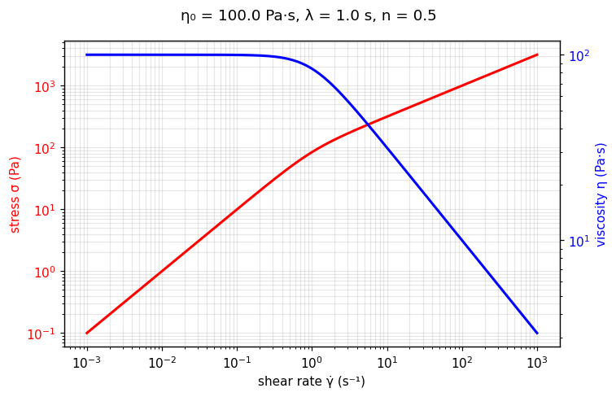

[← All models](index)

# The Carreau Model: Historical Foundations, Physical Mechanics, Limitations, and Fitting Methodologies

## 1. Historical Background and Motivation

The **Carreau model** was introduced in 1972 by Pierre J. Carreau in *"Rheological
Equations from Molecular Network Theories"* (*Transactions of the Society of
Rheology*), derived from transient network theory for polymeric liquids. It answered
the Power Law's most glaring defect: real polymer melts and solutions do not thin
forever — they show a **zero-shear Newtonian plateau** ($\eta_0$) at low rates before
thinning begins. Carreau's equation keeps the Power Law's high-shear behavior while
grafting on that plateau, with a single **relaxation time** $\lambda$ marking the
bend between them.

Yasuda, Armstrong, and Cohen (1981) later generalized the transition breadth with an
extra parameter $a$ (the Carreau–Yasuda form); `rheofit` implements the classic
three-parameter Carreau form.

---

## 2. Mathematical Formulation

In pure one-dimensional shear flow, the Carreau viscosity function is:

$$
\eta(\dot{\gamma}) = \eta_0 \left[1 + (\lambda \dot{\gamma})^2\right]^{\frac{n-1}{2}}
$$

and the shear stress follows as $\sigma = \eta(\dot{\gamma}) \, \dot{\gamma}$:

$$
\sigma = \eta_0 \, \dot{\gamma} \left[1 + (\lambda \dot{\gamma})^2\right]^{\frac{n-1}{2}}
$$

Where:
* $\sigma$ = Total shear stress ($\text{Pa}$)
* $\eta_0$ = Zero-shear viscosity ($\text{Pa}\cdot\text{s}$): the low-rate Newtonian plateau
* $\lambda$ = Relaxation time ($\text{s}$): sets the shear rate $1/\lambda$ where thinning begins
* $n$ = Power-law index (–): the high-shear thinning slope, $0 < n \le 1$
* $\dot{\gamma}$ = Shear rate ($\text{s}^{-1}$)

### Asymptotes

* **Low shear** ($\lambda\dot{\gamma} \ll 1$): $\eta \to \eta_0$ — Newtonian plateau.
* **High shear** ($\lambda\dot{\gamma} \gg 1$): $\eta \approx \eta_0 \lambda^{\,n-1} \dot{\gamma}^{\,n-1}$,
  i.e. a Power Law with consistency $K = \eta_0 \lambda^{\,n-1}$.

---

## 🔬 Interactive explorer

Drag the sliders to feel what each parameter does — the equation you just read, recomputed
live in your browser (Python via WebAssembly, no server involved). Dashed lines show the
low-shear Newtonian asymptote and the high-shear power-law asymptote; $\lambda$ slides
the bend between them. The blue axis shows the apparent viscosity $\eta = \sigma/\dot{\gamma}$.

````{only} builder_html
```{raw} html
<iframe src="../_static/interactive/carreau/index.html" width="100%" height="760" style="border: 1px solid #ddd; border-radius: 8px;" title="Carreau model interactive explorer" loading="lazy"></iframe>
```

*Tip: [open the explorer full-screen](../_static/interactive/carreau/index.html).*
````

*Static preview
($\eta_0$ = 100 Pa·s, $\lambda$ = 1.0 s, $n$ = 0.5):*



---

## 3. Physical Foundation

Carreau derived the model from **molecular network theory**: above a critical shear
rate, the entangled polymer network can no longer reform as fast as flow tears it
apart, so the viscosity drops. The relaxation time $\lambda$ is therefore a genuine
material timescale — roughly the longest relaxation time of the polymer — which is
why the Carreau model extrapolates far more safely than the Power Law: its plateaus
are physics, not curve-fitting artifacts.

---

## 4. Range of Applicable Materials

| Industry / Application | Material Examples | Key Rheological Feature Captured |
| :--- | :--- | :--- |
| **Polymer processing** | Polymer melts (PE, PP, PS), concentrated solutions | Zero-shear plateau for sag/swell + thinning for die flow |
| **Personal care** | Shampoo bases, conditioners (polymer-thickened) | Pump viscosity ($\eta_0$) vs. spreading viscosity |
| **Foods** | Starch-thickened sauces, dressings | Mouthfeel plateau vs. processing shear |
| **Pharma** | Polymeric gels, ointment bases | Rest stability vs. syringeability |

---

## 5. Intrinsic Limitations

### A. No yield stress

The Carreau curve passes through the origin — it cannot describe a yield-stress
network. For a yield stress plus Carreau thinning, use [TC-Carreau](tc_carreau).

### B. Single relaxation time

One $\lambda$ means one bend. Formulations blending two relaxing species (e.g. two
polymers, or polymer plus emulsion) show two bends — use
[Carreau-Carreau](carreau_carreau).

### C. No infinite-shear plateau

In this three-parameter form, $\eta \to 0$ as $\dot{\gamma} \to \infty$ for $n < 1$.
If a high-shear plateau $\eta_\infty$ is measurable, the four-parameter
Carreau–Yasuda form (Yasuda et al., 1981) adds it.

---

## 6. Parameter Fitting Best Practices

1. **Anchor $\eta_0$ first:** the low-shear plateau is the most robust parameter —
   read it off the data before optimizing, and bound it tightly.
2. **$\lambda$ needs the bend:** if the data never reach $\dot{\gamma} \sim 1/\lambda$,
   $\lambda$ is unidentifiable — fix or bound it rather than fit it blindly.
3. **Step up, don't force:** systematic S-shaped residuals around a single bend mean a
   second microstructure is present — try [Carreau-Carreau](carreau_carreau) rather
   than torturing $n$.

---

## Verified Literature References

* **Carreau, P. J.** (1972). Rheological equations from molecular network theories. *Transactions of the Society of Rheology*, 16(1), 99–127. [https://doi.org/10.1122/1.549276](https://doi.org/10.1122/1.549276)

* **Yasuda, K., Armstrong, R. C., & Cohen, R. E.** (1981). Shear flow properties of concentrated solutions of linear and star branched polystyrenes. *Rheologica Acta*, 20(2), 163–178. [https://doi.org/10.1007/BF01513059](https://doi.org/10.1007/BF01513059)
