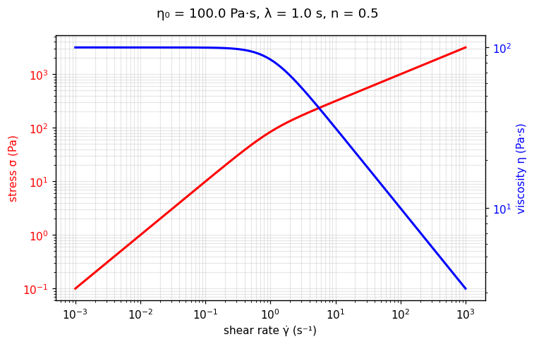

[← All models](index)

# Fitting the Carreau model

> 🧬 **The model itself lives in [rheomodel](https://rheomodel.readthedocs.io/en/latest/models/carreau.html).** Equations, parameters, history, applicability, and references are documented there. In code, `rheofit.models.carreau` is a thin adapter over `rheomodel` — same physics, same parameters. This page is about *fitting* it to your data.

The constitutive equation, for reference:

$$
\sigma = \eta_0\dot{\gamma}[1+(\lambda\dot{\gamma})^2]^{(n-1)/2}
$$

## 🔬 Interactive explorer

Drag the sliders to feel what each parameter does — the equation you just read, recomputed
live in your browser (Python via WebAssembly, no server involved). Dashed lines show the
low-shear Newtonian asymptote and the high-shear power-law asymptote; $\lambda$ slides
the bend between them. The blue axis shows the apparent viscosity $\eta = \sigma/\dot{\gamma}$.

````{only} builder_html
```{raw} html
<iframe src="../_static/interactive/carreau/index.html" width="100%" height="760" style="border: 1px solid #ddd; border-radius: 8px;" title="Carreau model interactive explorer" loading="lazy"></iframe>
```

*Tip: [open the explorer full-screen](../_static/interactive/carreau/index.html).*
````

*Static preview
($\eta_0$ = 100 Pa·s, $\lambda$ = 1.0 s, $n$ = 0.5):*



---

## Parameter Fitting Best Practices

1. **Anchor $\eta_0$ first:** the low-shear plateau is the most robust parameter —
   read it off the data before optimizing, and bound it tightly.
2. **$\lambda$ needs the bend:** if the data never reach $\dot{\gamma} \sim 1/\lambda$,
   $\lambda$ is unidentifiable — fix or bound it rather than fit it blindly.
3. **Step up, don't force:** systematic S-shaped residuals around a single bend mean a
   second microstructure is present — try [Carreau-Carreau](carreau_carreau) rather
   than torturing $n$.

---
