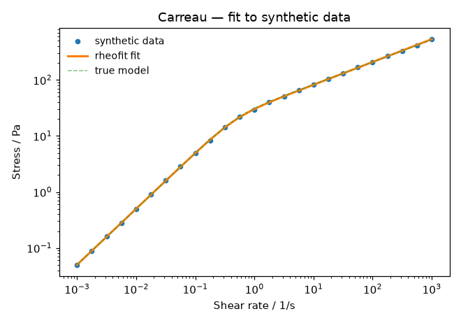

[← All models](index)

# Fitting the Carreau model

> 🧬 **The model itself lives in [rheomodel](https://rheomodel.readthedocs.io/en/latest/models/carreau.html).** Equations, parameters, history, applicability, and references are documented there. In code, `rheofit.models.carreau` is a thin adapter over `rheomodel` — same physics, same parameters. This page is about *fitting* it to data.

The constitutive equation, for reference:

$$
\sigma = \eta_0\dot{\gamma}[1+(\lambda\dot{\gamma})^2]^{(n-1)/2}
$$

## Worked example

Generate a flow curve from `rheomodel` with known parameters, add 2% noise, and fit it with `rheofit`:

```python
import numpy as np
import pandas as pd
from rheomodel import get_model
import rheofit

# 1. synthetic flow curve from rheomodel: known truth + 2% noise
model = get_model("carreau")
gamma_dot = np.logspace(-3, 3, 25)
true = {"eta_0": 50.0, "lambda_val": 2.0, "n": 0.4}
rng = np.random.default_rng(0)
stress = model.equation(gamma_dot, **true)
stress = stress * (1 + 0.02 * rng.standard_normal(gamma_dot.size))

# 2. fit it with rheofit
df = pd.DataFrame({"Shear rate / 1/s": gamma_dot, "Stress / Pa": stress})
res = rheofit.fit(df, "carreau", effort="fast", seed=0)

for name, p in res["params"].items():
    print(f"{name:12s} true={true[name]:8.3g}  fit={p['value']:8.3g} ± {p['stderr']:.2g}")
print(f"RedChi2 = {res['redchi']:.2e}")
```

Output:

```
eta_0        true=      50  fit=    50.1 ± 0.24
lambda_val   true=       2  fit=    2.11 ± 0.04
n            true=     0.4  fit=   0.406 ± 0.002
RedChi2 = 2.29e-04
```



## 🔬 Interactive explorer

Drag the sliders to feel what each parameter does — the equation you just read, recomputed
live in your browser (Python via WebAssembly, no server involved). Dashed lines show the
low-shear Newtonian asymptote and the high-shear power-law asymptote; $\lambda$ slides
the bend between them. The blue axis shows the apparent viscosity $\eta = \sigma/\dot{\gamma}$.

````{only} builder_html
```{raw} html
<iframe src="../_static/interactive/carreau/index.html" width="100%" height="760" style="border: 1px solid #ddd; border-radius: 8px;" title="Carreau model interactive explorer" loading="lazy"></iframe>
```

*Tip: [open the explorer full-screen](../_static/interactive/carreau/index.html).*
````

*Static preview
($\eta_0$ = 100 Pa·s, $\lambda$ = 1.0 s, $n$ = 0.5):*


