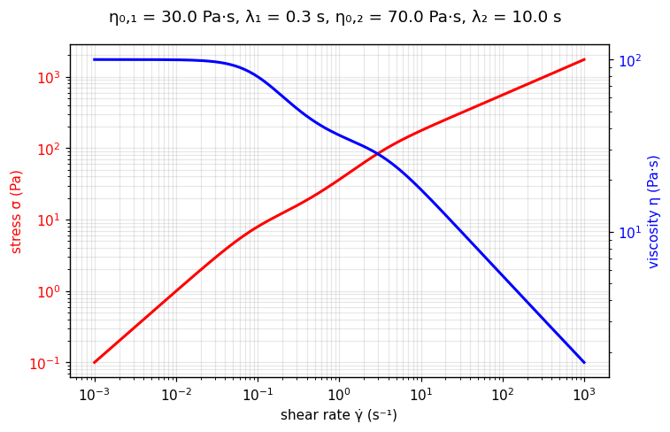

[← All models](index)

# The Carreau-Carreau Model: Historical Foundations, Physical Mechanics, Limitations, and Fitting Methodologies

## 1. Historical Background and Motivation

The **Carreau-Carreau model** is a `rheofit` construction built on Carreau's 1972
molecular-network equation (see the [Carreau](carreau) page). A single Carreau term
carries one relaxation time — one bend on the viscosity curve. But many real
formulations contain **two relaxing microstructures with distinct timescales**: a
bimodal polymer blend, a polymer thickener plus an emulsion, a wormlike-micellar
solution with two relaxation modes. Their viscosity curves show two bends, and a
single Carreau term can only split the difference.

Carreau-Carreau answers by adding two Carreau primitives, each with its own
$(\eta_{0,i}, \lambda_i)$ pair — a textbook **microstructure-informed rheological
model (MIRM)**: a linear combination of primitive stress contributions, one per
microstructural population (see the {ref}`MIRM discussion <mirm>` on the TC page).

---

## 2. Mathematical Formulation

In pure one-dimensional shear flow:

$$
\sigma = \eta_{0,1} \, \dot{\gamma} \left[1 + (\lambda_1 \dot{\gamma})^2\right]^{-1/4}
\;+\;
\eta_{0,2} \, \dot{\gamma} \left[1 + (\lambda_2 \dot{\gamma})^2\right]^{-1/2}
$$

Where:
* $\sigma$ = Total shear stress ($\text{Pa}$)
* $\eta_{0,1}$, $\eta_{0,2}$ = Zero-shear viscosities of components 1 and 2 ($\text{Pa}\cdot\text{s}$)
* $\lambda_1$, $\lambda_2$ = Relaxation times of components 1 and 2 ($\text{s}$)
* $\dot{\gamma}$ = Shear rate ($\text{s}^{-1}$)

Component 1 carries the fixed Carreau exponent $n = 1/2$ and component 2 the fixed
exponent $n = 0$, giving the two bends different high-shear slopes — typically
$\lambda_1 < \lambda_2$, so component 1 thins first and component 2 later.

### Asymptotes

* **Low shear** ($\lambda_i \dot{\gamma} \ll 1$): $\sigma \approx (\eta_{0,1} + \eta_{0,2})\,\dot{\gamma}$ —
  a single Newtonian plateau summing both populations.
* **High shear**: each term follows its own power law, $\sigma_i \sim \dot{\gamma}^{1/2}$ and
  $\sigma_i \sim \dot{\gamma}^{0}$ (constant stress) respectively.

---

## 🔬 Interactive explorer

Drag the sliders to feel what each parameter does — the equation you just read, recomputed
live in your browser (Python via WebAssembly, no server involved). Dashed lines show the
two Carreau components; watch how separating $\lambda_1$ and $\lambda_2$ opens two distinct
bends. The blue axis shows the apparent viscosity $\eta = \sigma/\dot{\gamma}$.

````{only} builder_html
```{raw} html
<iframe src="../_static/interactive/carreau_carreau/index.html" width="100%" height="760" style="border: 1px solid #ddd; border-radius: 8px;" title="Carreau-Carreau model interactive explorer" loading="lazy"></iframe>
```

*Tip: [open the explorer full-screen](../_static/interactive/carreau_carreau/index.html).*
````

*Static preview
($\eta_{0,1}$ = 30 Pa·s, $\lambda_1$ = 0.3 s, $\eta_{0,2}$ = 70 Pa·s, $\lambda_2$ = 10 s):*



---

## 3. Physical Foundation

The model is additive by construction: each term is the stress dissipated by one
relaxing population, and the measured stress is their sum — the populations flow in
parallel. Because the terms stay separate, the fitted $\lambda_i$ values read out
directly as the two relaxation times of the formulation, e.g. a fast polymer mode
and a slow emulsion-droplet mode, rather than collapsing into one compromised bend.

---

## 4. Range of Applicable Materials

| Industry / Application | Material Examples | Key Rheological Feature Captured |
| :--- | :--- | :--- |
| **Personal care** | Polymer-thickened shampoos, styling gels | Two polymer populations with distinct molecular weights |
| **Foods** | Dressings with starch + xanthan | Fast and slow thinning modes in one curve |
| **Coatings** | Latex paints with associative thickeners | Emulsion + thickener relaxation |
| **Oil & gas** | Fracturing fluids with mixed polymers | Bimodal relaxation spectra |

---

## 5. Intrinsic Limitations

### A. Timescale separation required

If $\lambda_1 \approx \lambda_2$, the two terms are degenerate — the fit cannot tell
the populations apart and the parameters become strongly correlated. The model earns
its keep only when the data show two distinguishable bends.

### B. No yield stress

Both terms pass through the origin. For a yield stress plus two Carreau populations,
use [TCCC](tccc).

### C. Fixed component exponents

The $-1/4$ and $-1/2$ exponents are baked in; the model trades the Carreau $n$'s
fitting freedom for identifiability. (Its `PARENT` hint toward plain Carreau is only
an advisory fitting seed, not an exact reduction.)

---

## 6. Parameter Fitting Best Practices

1. **Fit single-Carreau first:** if one Carreau term already fits, stop — the second
   term must earn its keep against the parameter-correlation cost.
2. **Separate the lambdas:** bound $\lambda_1 < \lambda_2$ (or vice versa) to keep the
   optimizer from swapping the components mid-fit.
3. **Read the bends:** initial guesses for $\lambda_i$ come straight off the viscosity
   curve — each bend sits near $\dot{\gamma} \sim 1/\lambda_i$.

---

## Verified Literature References

* **Carreau, P. J.** (1972). Rheological equations from molecular network theories. *Transactions of the Society of Rheology*, 16(1), 99–127. [https://doi.org/10.1122/1.549276](https://doi.org/10.1122/1.549276)

* **Yasuda, K., Armstrong, R. C., & Cohen, R. E.** (1981). Shear flow properties of concentrated solutions of linear and star branched polystyrenes. *Rheologica Acta*, 20(2), 163–178. [https://doi.org/10.1007/BF01513059](https://doi.org/10.1007/BF01513059)
