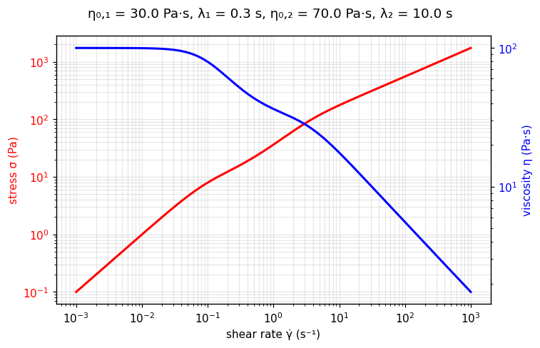

[← All models](index)

# Fitting the Carreau–Carreau model

> 🧬 **The model itself lives in [rheomodel](https://rheomodel.readthedocs.io/en/latest/models/carreau_carreau.html).** Equations, parameters, history, applicability, and references are documented there. In code, `rheofit.models.carreau_carreau` is a thin adapter over `rheomodel` — same physics, same parameters. This page is about *fitting* it to your data.

The constitutive equation, for reference:

$$
\sigma = \sum_{i=1,2} \eta_{0,i}\dot{\gamma}[1+(\lambda_i\dot{\gamma})^2]^{-1/4,-1/2}
$$

## 🔬 Interactive explorer

Drag the sliders to feel what each parameter does — the equation you just read, recomputed
live in your browser (Python via WebAssembly, no server involved). Dashed lines show the
two Carreau components; watch how separating $\lambda_1$ and $\lambda_2$ opens two distinct
bends. The blue axis shows the apparent viscosity $\eta = \sigma/\dot{\gamma}$.

````{only} builder_html
```{raw} html
<iframe src="../_static/interactive/carreau_carreau/index.html" width="100%" height="760" style="border: 1px solid #ddd; border-radius: 8px;" title="Carreau-Carreau model interactive explorer" loading="lazy"></iframe>
```

*Tip: [open the explorer full-screen](../_static/interactive/carreau_carreau/index.html).*
````

*Static preview
($\eta_{0,1}$ = 30 Pa·s, $\lambda_1$ = 0.3 s, $\eta_{0,2}$ = 70 Pa·s, $\lambda_2$ = 10 s):*



---

## Parameter Fitting Best Practices

1. **Fit single-Carreau first:** if one Carreau term already fits, stop — the second
   term must earn its keep against the parameter-correlation cost.
2. **Separate the lambdas:** bound $\lambda_1 < \lambda_2$ (or vice versa) to keep the
   optimizer from swapping the components mid-fit.
3. **Read the bends:** initial guesses for $\lambda_i$ come straight off the viscosity
   curve — each bend sits near $\dot{\gamma} \sim 1/\lambda_i$.
