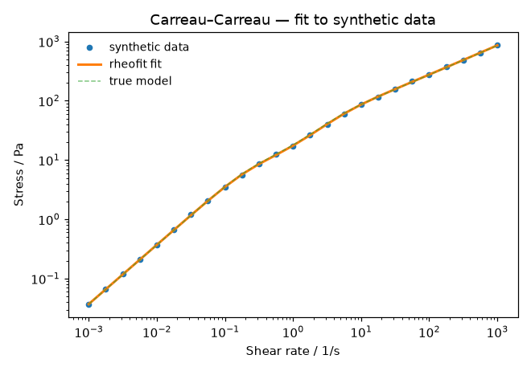

[← All models](index)

# Fitting the Carreau–Carreau model

> 🧬 **The model itself lives in [rheomodel](https://rheomodel.readthedocs.io/en/latest/models/carreau_carreau.html).** Equations, parameters, history, applicability, and references are documented there. In code, `rheofit.models.carreau_carreau` is a thin adapter over `rheomodel` — same physics, same parameters. This page is about *fitting* it to data.

The constitutive equation, for reference:

$$
\sigma = \sum_{i=1,2} \eta_{0,i}\dot{\gamma}[1+(\lambda_i\dot{\gamma})^2]^{-1/4,-1/2}
$$

## Worked example

Generate a flow curve from `rheomodel` with known parameters, add 2% noise, and fit it with `rheofit`:

```python
import numpy as np
import pandas as pd
from rheomodel import get_model
import rheofit

# 1. synthetic flow curve from rheomodel: known truth + 2% noise
model = get_model("carreau_carreau")
gamma_dot = np.logspace(-3, 3, 25)
true = {"eta_0_1": 12.0, "lambda_val_1": 0.2, "eta_0_2": 25.0, "lambda_val_2": 4.0}
rng = np.random.default_rng(0)
stress = model.equation(gamma_dot, **true)
stress = stress * (1 + 0.02 * rng.standard_normal(gamma_dot.size))

# 2. fit it with rheofit
df = pd.DataFrame({"Shear rate / 1/s": gamma_dot, "Stress / Pa": stress})
res = rheofit.fit(df, "carreau_carreau", effort="fast", seed=0)

for name, p in res["params"].items():
    print(f"{name:12s} true={true[name]:8.3g}  fit={p['value']:8.3g} ± {p['stderr']:.2g}")
print(f"RedChi2 = {res['redchi']:.2e}")
```

Output:

```
eta_0_1      true=      12  fit=    11.6 ± 0.25
lambda_val_1 true=     0.2  fit=   0.185 ± 0.0083
eta_0_2      true=      25  fit=    25.5 ± 0.29
lambda_val_2 true=       4  fit=    4.16 ± 0.15
RedChi2 = 2.16e-04
```



## 🔬 Interactive explorer

Drag the sliders to feel what each parameter does — the equation you just read, recomputed
live in your browser (Python via WebAssembly, no server involved). Dashed lines show the
two Carreau components; watch how separating $\lambda_1$ and $\lambda_2$ opens two distinct
bends. The blue axis shows the apparent viscosity $\eta = \sigma/\dot{\gamma}$.

````{only} builder_html
```{raw} html
<iframe src="../_static/interactive/carreau_carreau/index.html" width="100%" height="760" style="border: 1px solid #ddd; border-radius: 8px;" title="Carreau-Carreau model interactive explorer" loading="lazy"></iframe>
```

*Tip: [open the explorer full-screen](../_static/interactive/carreau_carreau/index.html).*
````

*Static preview
($\eta_{0,1}$ = 30 Pa·s, $\lambda_1$ = 0.3 s, $\eta_{0,2}$ = 70 Pa·s, $\lambda_2$ = 10 s):*


