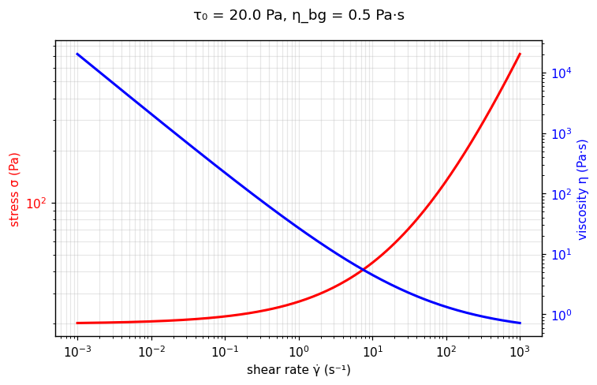

[← All models](index)

# The Casson Model: Historical Foundations, Physical Mechanics, Limitations, and Fitting Methodologies

## 1. Historical Background and Motivation

The **Casson model** is a prominent two-parameter viscoplastic constitutive equation introduced in 1959 by British scientist N. Casson in his seminal chapter, *"A flow equation for pigment-oil suspensions of the printing ink type,"* published in the book *Rheology of Disperse Systems*.

### The Motivation Behind the Model

In the mid-20th century, industrial formulation of printing inks, paints, and lacquers presented severe rheological challenges. Neither the two-parameter **Bingham Plastic model** ($\tau = \tau_0 + \mu_p \dot{\gamma}$) nor the two-parameter **Ostwald–de Waele Power Law** ($\tau = K \dot{\gamma}^n$) could accurately describe pigment-in-oil dispersions across broad shear rate windows:

1. **Failure of Bingham Plastics:** Printing inks exhibited pronounced non-linear shear-thinning post-yield; assuming a constant plastic viscosity ($\mu_p$) resulted in gross overestimates of pumping pressures and inaccurate yield stress predictions.
2. **Failure of Power Law Fluids:** Power law fluids omitted the physical yield stress threshold ($\tau_0$) entirely, failing to predict structural leveling, pigment sedimentation, and anti-sagging behavior at rest.

Casson sought to derive a constitutive equation grounded in structural micromechanics rather than pure empirical curve-fitting. By modeling the reversible aggregation and breakdown of suspended particles into chain-like rod structures under hydrodynamic shear, Casson established a model that successfully bridges non-linear pseudoplasticity at low shear rates with a constant high-shear limiting viscosity.

---

## 2. Mathematical Formulation

In pure one-dimensional shear flow, the standard square-root formulation of the Casson equation is written as:

$$
\begin{cases} 
\dot{\gamma} = 0, & \text{for } \vert{}\tau\vert{} \le \tau_0 \quad \text{(Unyielded / Solid-like State)} \\ 
\sqrt{\tau} = \sqrt{\tau_0} + \sqrt{\eta_{bg} \dot{\gamma}}, & \text{for } \vert{}\tau\vert{} > \tau_0 \quad \text{(Yielded / Flow State)} 
\end{cases}
$$

Alternatively, by squaring both sides, the yielded state can be expressed directly in terms of total shear stress $\tau$:

$$
\tau = \tau_0 + 2\sqrt{\tau_0 \eta_{bg} \dot{\gamma}} + \eta_{bg} \dot{\gamma} \quad \text{for } \vert{}\tau\vert{} > \tau_0
$$

Where:
* $\tau$ = Total shear stress ($\text{Pa}$)
* $\tau_0$ = Casson dynamic yield stress ($\text{Pa}$): The stress threshold required to break the static chain aggregate network and initiate flow.
* $\eta_{bg}$ = Casson plastic viscosity / Infinite-shear background viscosity ($\text{Pa}\cdot\text{s}$): The high-shear limiting differential viscosity as the structural aggregates are fully oriented or disrupted.
* $\dot{\gamma}$ = Shear rate ($\text{s}^{-1}$)

### Apparent Viscosity Formulation

Dividing the expanded stress expression by shear rate $\dot{\gamma}$ yields the Casson apparent viscosity $\eta(\dot{\gamma})$:

$$
\eta(\dot{\gamma}) = \frac{\tau}{\dot{\gamma}} = \left( \sqrt{\frac{\tau_0}{\dot{\gamma}}} + \sqrt{\eta_{bg}} \right)^2 = \frac{\tau_0}{\dot{\gamma}} + 2 \sqrt{\frac{\tau_0 \eta_{bg}}{\dot{\gamma}}} + \eta_{bg} \quad \text{for } \vert{}\tau\vert{} > \tau_0
$$

### Three-Dimensional Tensorial Representation

For 3D continuum mechanics and CFD implementations, using the von Mises yield criterion gives:

$$
\begin{cases} 
\mathbf{D} = \mathbf{0}, & \text{for } \frac{1}{2} \text{tr}(\boldsymbol{\tau}^2) \le \tau_0^2 \\ 
\boldsymbol{\tau} = 2 \left[ \sqrt{\frac{\tau_0}{\dot{\gamma}}} + \sqrt{\eta_{bg}} \right]^2 \mathbf{D}, & \text{for } \frac{1}{2} \text{tr}(\boldsymbol{\tau}^2) > \tau_0^2 
\end{cases}
$$

where $\boldsymbol{\tau}$ is the extra stress tensor, $\mathbf{D} = \frac{1}{2}\left( \nabla \mathbf{u} + (\nabla \mathbf{u})^T \right)$ is the rate-of-deformation tensor, and $\dot{\gamma} = \sqrt{2 \text{tr}(\mathbf{D}^2)}$ is the second invariant of $\mathbf{D}$.

---

## 🔬 Interactive explorer

Drag the sliders to feel what each parameter does — the equation you just read, recomputed
live in your browser (Python via WebAssembly, no server involved). The dashed lines show the
three terms of the expanded form τ = τ₀ + 2√(τ₀η_bgγ̇) + η_bgγ̇. The blue axis shows
the apparent viscosity η = τ/γ̇.

````{only} builder_html
```{raw} html
<iframe src="../_static/interactive/casson/index.html" width="100%" height="760" style="border: 1px solid #ddd; border-radius: 8px;" title="Casson model interactive explorer" loading="lazy"></iframe>
```

*Tip: [open the explorer full-screen](../_static/interactive/casson/index.html).*
````

*Static preview
(τ₀ = 20 Pa, η_bg = 0.5 Pa·s):*



---

## 3. Physical Foundation and Microstructural Dynamics

Casson's original physical derivation was based on the physical state of attractive particles dispersed in a liquid medium:

1. **Flocculated Chain Aggregates at Rest:** In an un-sheared fluid, interparticle attractive forces (e.g., van Waals, hydrophobic interaction, or polymer bridging) cause suspended particles to clump into chain-like rods or aggregate networks (such as red blood cells forming *rouleaux*).
2. **Shear-Induced Orientation and Rupture:** Applying shear produces hydrodynamic drag forces that align these chain aggregates parallel to flow streamlines and progressively break interparticle bonds.
3. **Square-Root Scaling Mechanism ($\dot{\gamma}^{1/2}$):** Casson demonstrated that the balance between hydrodynamic orientation/rupture forces and interparticle binding energy yields a continuous reduction in rod aspect ratio proportional to $\dot{\gamma}^{-1/2}$. This structural orientation directly generates the characteristic square-root scaling ($\sqrt{\tau} \propto \sqrt{\dot{\gamma}}$).

---

## 4. Unification: Casson as a Constrained Special Case of the TC Model

A major insight in modern rheology (Caggioni, Trappe, & Spicer, 2020) is that the Casson equation is mathematically equivalent to a **rigidly constrained 2-parameter special case of the 3-parameter Three-Component (TC) model**.

### Comparison of Formulations

* **Three-Component (TC) Model:**
  $$
  \tau = \tau_0 + \tau_0 \left( \frac{\dot{\gamma}}{\dot{\gamma}_c} \right)^{1/2} + \eta_{bg} \dot{\gamma}
  $$

* **Expanded Casson Model:**
  $$
  \tau = \tau_0 + 2\sqrt{\tau_0 \eta_{bg}} \dot{\gamma}^{1/2} + \eta_{bg} \dot{\gamma}
  $$

Equating the coefficients of the intermediate plastic square-root terms ($\dot{\gamma}^{1/2}$):

$$
\frac{\tau_0}{\sqrt{\dot{\gamma}_c}} = 2 \sqrt{\tau_0 \eta_{bg}} \implies \sqrt{\dot{\gamma}_c} = \frac{\tau_0}{2 \sqrt{\tau_0 \eta_{bg}}} = \frac{\sqrt{\tau_0}}{2 \sqrt{\eta_{bg}}} \implies \dot{\gamma}_c = \frac{\tau_0}{4 \eta_{bg}}
$$

### Structural Implication
The Casson model **strictly forces** the critical characteristic shear rate ($\dot{\gamma}_c$, defining the onset of plastic rearrangements) to equal exactly $\frac{\tau_0}{4 \eta_{bg}}$. 

* **Limitation:** While this constraint reduces the model to two free parameters $(\tau_0, \eta_{bg})$, it eliminates fitting flexibility when independent physical factors (such as solvent viscosity variations, variable particle volume fraction $\phi$, or soft particle elasticity) decouple particle rearrangement kinetics from background solvent friction.

---

## 5. Range of Applicable Materials

The Casson model is widely recognized across industrial and biological sectors, often established as an official regulatory or standard model:

| Industry / Application | Material Examples | Key Rheological Feature Captured |
| :--- | :--- | :--- |
| **Confectionery & Food Science** | Molten Chocolate, Cocoa Pastes | Official **IOCCC / OICC standard model** for liquid chocolate rheology. Captures yield behavior for mold filling alongside high-shear pumping flow. |
| **Hemorheology & Biomedical** | Whole Human Blood, Plasma Suspensions | Describes the reversible stacking of erythrocytes (red blood cells) into *rouleaux* structures at low shear and their dispersion at high shear. |
| **Coatings & Inks** | Printing Inks, Pigment Dispersions, High-Gloss Paints | Prevents pigment settling and ink dripping ($\tau_0$) while accurately predicting high-speed printing roller drag ($\eta_{bg}$). |
| **Petroleum & Drilling** | Drilling Fluids, Heavy Oil Emulsions | Models structural breaking of flocculated clay additives in wellbores. |

---

## 6. Intrinsic Physics, Asymptotes, and Limitations

### A. Realistic Infinite-Shear Asymptote ($\eta_\infty \to \eta_{bg}$)

Taking the infinite-shear limit of the Casson apparent viscosity equation yields:

$$
\lim_{\dot{\gamma} \to \infty} \eta(\dot{\gamma}) = \lim_{\dot{\gamma} \to \infty} \left( \frac{\tau_0}{\dot{\gamma}} + 2 \sqrt{\frac{\tau_0 \eta_{bg}}{\dot{\gamma}}} + \eta_{bg} \right) = \eta_{bg}
$$

Like the Bingham and TC models—and unlike the standard Herschel–Bulkley model (where $\eta_\infty \to 0$)—the Casson model correctly approaches a finite Newtonian limiting viscosity ($\eta_{bg}$). This ensures reliable drag and energy dissipation predictions at high shear rates.

### B. Zero-Shear Divergence ($\eta \to \infty$) and CFD Regularization

As $\dot{\gamma} \to 0^+$, the Casson apparent viscosity diverges to infinity ($\lim_{\dot{\gamma} \to 0^+} \eta(\dot{\gamma}) = \infty$). 

To avoid numerical instabilities and division-by-zero singularities in Computational Fluid Dynamics (CFD), modified regularization schemes (e.g., Papanastasiou-type exponential smoothing) are applied:

$$
\tau = \left[ \sqrt{\tau_0 \left(1 - e^{-m \dot{\gamma}}\right)} + \sqrt{\eta_{bg} \dot{\gamma}} \right]^2
$$

where $m$ is a large regularization parameter controlling the low-shear transition.

### C. Rigidity in Intermediate Post-Yield Transition

Because the Casson model locks $\dot{\gamma}_c = \frac{\tau_0}{4 \eta_{bg}}$, it cannot independently tune the curvature of the intermediate plastic flow region. For soft particle glasses, microgel pastes, or polydisperse emulsions, this constraint often leads to systematic underestimation of the dynamic yield stress $\tau_0$.

---

## 7. Parameter Fitting Challenges and Objective Functions

Because the Casson equation can be linearized by taking the square root of both sides ($\sqrt{\tau} = \sqrt{\tau_0} + \sqrt{\eta_{bg}} \sqrt{\dot{\gamma}}$), parameters are frequently extracted using simple Linear Least Squares (LLS) on transformed coordinates ($y = \sqrt{\tau}, x = \sqrt{\dot{\gamma}}$).

### The Statistical Trap of Square-Root Linearization

While plotting $\sqrt{\tau}$ vs. $\sqrt{\dot{\gamma}}$ yields a straight line with y-intercept $\sqrt{\tau_0}$ and slope $\sqrt{\eta_{bg}}$, **performing standard linear regression in square-root space fundamentally distorts the experimental error distribution**.

#### 1. Residual Sum of Squares in Transformed Space ($S_{\sqrt{\tau}}$)

$$
S_{\sqrt{\tau}} = \sum_{i=1}^{N} \left( \sqrt{\tau_{i, \text{meas}}} - \left[\sqrt{\tau_0} + \sqrt{\eta_{bg} \dot{\gamma}_i}\right] \right)^2
$$

* **Statistical Artifact:** The square-root transformation compresses high stress values significantly more than low stress values. Consequently, minimizing $S_{\sqrt{\tau}}$ places artificially high statistical weight on low-shear measurements, making the resulting fit highly vulnerable to low-shear experimental noise, torque limits, or wall slip.

#### 2. Absolute Residual Sum of Squares in Stress Space ($S_{abs}$)

$$
S_{abs} = \sum_{i=1}^{N} \left( \tau_{i, \text{meas}} - \left[ \tau_0 + 2\sqrt{\tau_0 \eta_{bg} \dot{\gamma}_i} + \eta_{bg} \dot{\gamma}_i \right] \right)^2
$$

* **Behavior:** Operates on raw physical stress (Pascals). High shear rate data points (where $\tau$ is largest) dominate the fit, potentially biasing the high-shear slope ($\eta_{bg}$).

#### 3. Relative Residual Sum of Squares ($S_{rel}$)

$$
S_{rel} = \sum_{i=1}^{N} \left( \frac{\tau_{i, \text{meas}} - \tau_{i, \text{pred}}}{\tau_{i, \text{meas}}} \right)^2 = \sum_{i=1}^{N} \left( 1 - \frac{\tau_0 + 2\sqrt{\tau_0 \eta_{bg} \dot{\gamma}_i} + \eta_{bg} \dot{\gamma}_i}{\tau_i} \right)^2
$$

* **Advantage:** Provides unbiased, equal percentage weighting across all measured shear rate decades, providing the most accurate estimation of both $\tau_0$ and $\eta_{bg}$.

---

## 8. Recommended Fitting Best Practices

1. **Avoid Fitting Transformed Linear Data directly without Validation:** Use square-root linearization ($\sqrt{\tau}$ vs $\sqrt{\dot{\gamma}}$) only to generate initial guess values $(\tau_0^{(0)}, \eta_{bg}^{(0)})$.
2. **Perform Non-Linear Regression on Raw Stress Data:** Refine parameters using Non-Linear Least Squares (NLLS) optimization applied directly to the un-transformed stress equation ($\tau = \tau_0 + 2\sqrt{\tau_0 \eta_{bg} \dot{\gamma}} + \eta_{bg} \dot{\gamma}$) using a relative objective function ($S_{rel}$).
3. **Filter Wall Slip Artifacts:** Inspect low-shear rate data on logarithmic axes. Exclude non-homogeneous slip-corrupted points prior to optimization.
4. **Model Comparison Step:** If Casson fits exhibit systematic residual deviations across intermediate shear rates, unconstrain the intermediate parameter by upgrading to the **Three-Component (TC) model**.

---

## Verified Literature References

* **Caggioni, M., Trappe, V., & Spicer, P. T.** (2020). Variations of the Herschel-Bulkley exponent reflecting contributions of the viscous continuous phase to the shear rate-dependent stress of soft glassy materials. *Journal of Rheology*, 64(2), 413–422. [https://doi.org/10.1122/1.5127805](https://doi.org/10.1122/1.5127805)

* **Casson, N.** (1959). A flow equation for pigment-oil suspensions of the printing ink type. In C. Mill (Ed.), *Rheology of Disperse Systems* (pp. 84–104). Pergamon Press.

* **Charm, S., & Kurland, G. S.** (1965). Viscometry of human blood for shear rates of 0 to 100,000 $s^{-1}$. *Nature*, 206(4984), 617–618. [https://doi.org/10.1038/206617a0](https://doi.org/10.1038/206617a0)

* **IOCCC / OICC.** (2000). *Viscosity of Cocoa and Chocolate Products*. International Office of Cocoa, Chocolate and Sugar Confectionery, Official Method 46.

* **Merrill, E. W., Cokelet, G. C., Britten, A., & Wells, R. E.** (1963). Non-Newtonian rheology of human blood—effect of fibrinogen and rouleaux formation. *Biophysical Journal*, 3(3), 199–213. [https://doi.org/10.1016/S0006-3495(63](https://doi.org/10.1016/S0006-3495(63))86816-2

* **Steffe, J. F.** (1996). *Rheological Methods in Food Process Engineering* (2nd ed.). Freeman Press.