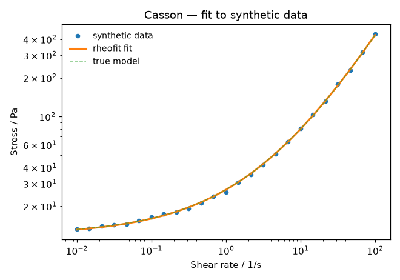

[← All models](index)

# Fitting the Casson model

> 🧬 **The model itself lives in [rheomodel](https://rheomodel.readthedocs.io/en/latest/models/casson.html).** Equations, parameters, history, applicability, and references are documented there. In code, `rheofit.models.casson` is a thin adapter over `rheomodel` — same physics, same parameters. This page is about *fitting* it to data.

The constitutive equation, for reference:

$$
\sigma = (\sqrt{\sigma_y} + \sqrt{K\dot{\gamma}})^2
$$

## Worked example

Generate a flow curve from `rheomodel` with known parameters, add 2% noise, and fit it with `rheofit`:

```python
import numpy as np
import pandas as pd
from rheomodel import get_model
import rheofit

# 1. synthetic flow curve from rheomodel: known truth + 2% noise
model = get_model("casson")
gamma_dot = np.logspace(-2, 2, 25)
true = {"sigma_y": 12.0, "K": 3.0}
rng = np.random.default_rng(0)
stress = model.equation(gamma_dot, **true)
stress = stress * (1 + 0.02 * rng.standard_normal(gamma_dot.size))

# 2. fit it with rheofit
df = pd.DataFrame({"Shear rate / 1/s": gamma_dot, "Stress / Pa": stress})
res = rheofit.fit(df, "casson", effort="fast", seed=0)

for name, p in res["params"].items():
    print(f"{name:12s} true={true[name]:8.3g}  fit={p['value']:8.3g} ± {p['stderr']:.2g}")
print(f"RedChi2 = {res['redchi']:.2e}")
```

Output:

```
sigma_y      true=      12  fit=    11.9 ± 0.076
K            true=       3  fit=    3.01 ± 0.028
RedChi2 = 3.19e-04
```



## 🔬 Interactive explorer

Drag the sliders to feel what each parameter does — the equation you just read, recomputed
live in your browser (Python via WebAssembly, no server involved). The dashed lines show the
three terms of the expanded form τ = τ₀ + 2√(τ₀η_bgγ̇) + η_bgγ̇. The blue axis shows
the apparent viscosity η = τ/γ̇.

````{only} builder_html
```{raw} html
<iframe src="../_static/interactive/casson/index.html" width="100%" height="760" style="border: 1px solid #ddd; border-radius: 8px;" title="Casson model interactive explorer" loading="lazy"></iframe>
```

*Tip: [open the explorer full-screen](../_static/interactive/casson/index.html).*
````

*Static preview
(τ₀ = 20 Pa, η_bg = 0.5 Pa·s):*


