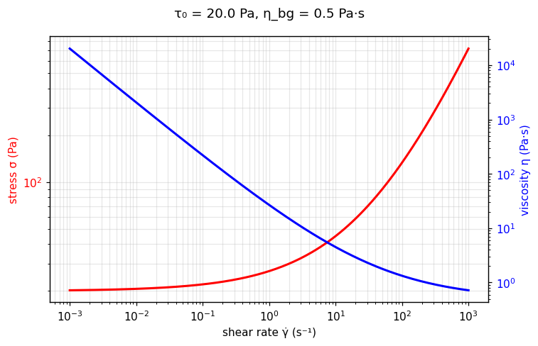

[← All models](index)

# Fitting the Casson model

> 🧬 **The model itself lives in [rheomodel](https://rheomodel.readthedocs.io/en/latest/models/casson.html).** Equations, parameters, history, applicability, and references are documented there. In code, `rheofit.models.casson` is a thin adapter over `rheomodel` — same physics, same parameters. This page is about *fitting* it to your data.

The constitutive equation, for reference:

$$
\sigma = (\sqrt{\sigma_y} + \sqrt{K\dot{\gamma}})^2
$$

## 🔬 Interactive explorer

Drag the sliders to feel what each parameter does — the equation you just read, recomputed
live in your browser (Python via WebAssembly, no server involved). The dashed lines show the
three terms of the expanded form τ = τ₀ + 2√(τ₀η_bgγ̇) + η_bgγ̇. The blue axis shows
the apparent viscosity η = τ/γ̇.

````{only} builder_html
```{raw} html
<iframe src="../_static/interactive/casson/index.html" width="100%" height="760" style="border: 1px solid #ddd; border-radius: 8px;" title="Casson model interactive explorer" loading="lazy"></iframe>
```

*Tip: [open the explorer full-screen](../_static/interactive/casson/index.html).*
````

*Static preview
(τ₀ = 20 Pa, η_bg = 0.5 Pa·s):*



---

## Parameter Fitting Challenges and Objective Functions

Because the Casson equation can be linearized by taking the square root of both sides ($\sqrt{\tau} = \sqrt{\tau_0} + \sqrt{\eta_{bg}} \sqrt{\dot{\gamma}}$), parameters are frequently extracted using simple Linear Least Squares (LLS) on transformed coordinates ($y = \sqrt{\tau}, x = \sqrt{\dot{\gamma}}$).

### The Statistical Trap of Square-Root Linearization

While plotting $\sqrt{\tau}$ vs. $\sqrt{\dot{\gamma}}$ yields a straight line with y-intercept $\sqrt{\tau_0}$ and slope $\sqrt{\eta_{bg}}$, **performing standard linear regression in square-root space fundamentally distorts the experimental error distribution**.

#### 1. Residual Sum of Squares in Transformed Space ($S_{\sqrt{\tau}}$)

$$
S_{\sqrt{\tau}} = \sum_{i=1}^{N} \left( \sqrt{\tau_{i, \text{meas}}} - \left[\sqrt{\tau_0} + \sqrt{\eta_{bg} \dot{\gamma}_i}\right] \right)^2
$$

* **Statistical Artifact:** The square-root transformation compresses high stress values significantly more than low stress values. Consequently, minimizing $S_{\sqrt{\tau}}$ places artificially high statistical weight on low-shear measurements, making the resulting fit highly vulnerable to low-shear experimental noise, torque limits, or wall slip.

#### 2. Absolute Residual Sum of Squares in Stress Space ($S_{abs}$)

$$
S_{abs} = \sum_{i=1}^{N} \left( \tau_{i, \text{meas}} - \left[ \tau_0 + 2\sqrt{\tau_0 \eta_{bg} \dot{\gamma}_i} + \eta_{bg} \dot{\gamma}_i \right] \right)^2
$$

* **Behavior:** Operates on raw physical stress (Pascals). High shear rate data points (where $\tau$ is largest) dominate the fit, potentially biasing the high-shear slope ($\eta_{bg}$).

#### 3. Relative Residual Sum of Squares ($S_{rel}$)

$$
S_{rel} = \sum_{i=1}^{N} \left( \frac{\tau_{i, \text{meas}} - \tau_{i, \text{pred}}}{\tau_{i, \text{meas}}} \right)^2 = \sum_{i=1}^{N} \left( 1 - \frac{\tau_0 + 2\sqrt{\tau_0 \eta_{bg} \dot{\gamma}_i} + \eta_{bg} \dot{\gamma}_i}{\tau_i} \right)^2
$$

* **Advantage:** Provides unbiased, equal percentage weighting across all measured shear rate decades, providing the most accurate estimation of both $\tau_0$ and $\eta_{bg}$.

---

## Recommended Fitting Best Practices

1. **Avoid Fitting Transformed Linear Data directly without Validation:** Use square-root linearization ($\sqrt{\tau}$ vs $\sqrt{\dot{\gamma}}$) only to generate initial guess values $(\tau_0^{(0)}, \eta_{bg}^{(0)})$.
2. **Perform Non-Linear Regression on Raw Stress Data:** Refine parameters using Non-Linear Least Squares (NLLS) optimization applied directly to the un-transformed stress equation ($\tau = \tau_0 + 2\sqrt{\tau_0 \eta_{bg} \dot{\gamma}} + \eta_{bg} \dot{\gamma}$) using a relative objective function ($S_{rel}$).
3. **Filter Wall Slip Artifacts:** Inspect low-shear rate data on logarithmic axes. Exclude non-homogeneous slip-corrupted points prior to optimization.
4. **Model Comparison Step:** If Casson fits exhibit systematic residual deviations across intermediate shear rates, unconstrain the intermediate parameter by upgrading to the **Three-Component (TC) model**.

---
