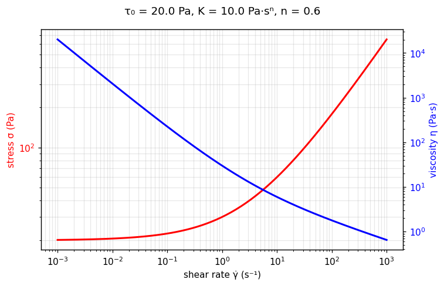

[← All models](index)

# The Herschel–Bulkley Model: Historical Foundations, Physics, Limitations, and Fitting Methodologies

## 1. Historical Background and Motivation

The **Herschel–Bulkley (HB) model** was introduced in 1926 by American chemical engineer Winslow H. Herschel and chemist Ronald Bulkley in their seminal publication, *"Konsistenzmessungen von Gummi-Benzollösungen"* (*Kolloid-Zeitschrift*). 

### The Motivation Behind the Model
During the early 20th century, fluid mechanics relied primarily on two idealizations:
1. **Newtonian Model (1687):** Assumed a constant proportionality between shear stress ($\tau$) and shear rate ($\dot{\gamma}$), written as $\tau = \mu \dot{\gamma}$.
2. **Bingham Plastic Model (Bingham, 1922):** Introduced the concept of a yield stress ($\tau_0$), below which a material behaves as a rigid body and above which it flows with a constant plastic viscosity ($\mu_p$), written as $\tau = \tau_0 + \mu_p \dot{\gamma}$.
3. **Power Law / Ostwald–de Waele Model (1920s):** Described fluid flow without a yield stress but accounted for non-linear shear-thinning or shear-thickening behavior ($\tau = K \dot{\gamma}^n$).

Herschel and Bulkley observed that concentrated colloidal systems—specifically rubber solutions dissolved in benzene—exhibited behaviors that neither model could adequately represent. These materials required a finite critical force to initiate motion (a yield stress, like a Bingham plastic), but once flowing, their resistance did not scale linearly with shear rate (like a Power Law fluid). 

To bridge this gap, Herschel and Bulkley proposed a three-parameter empirical constitutive equation combining the yield stress threshold of the Bingham model with the non-linear power-law post-yield response.

---

## 2. Mathematical Formulation

In one-dimensional pure shear, the Herschel–Bulkley constitutive equations are expressed as:

$$\begin{cases} \dot{\gamma} = 0, & \text{for } |\tau| \le \tau_0 \quad \text{(Unyielded / Solid-like State)} \\ \tau = \tau_0 + K \dot{\gamma}^n, & \text{for } |\tau| > \tau_0 \quad \text{(Yielded / Flow State)} \end{cases}$$

Where:
* **$\tau$** = Shear stress ($\text{Pa}$)
* **$\tau_0$** = Yield stress ($\text{Pa}$): The minimum stress required to break the internal physical network or structural jammed state and induce flow.
* **$K$** = Consistency index ($\text{Pa}\cdot\text{s}^n$): A measure of the fluid's overall flow resistance post-yielding. Note that the physical units of $K$ depend on the value of $n$.
* **$n$** = Flow behavior index (dimensionless): Quantifies the degree of non-Newtonian post-yield behavior:
  * $n < 1$: Shear-thinning (pseudoplastic) behavior.
  * $n = 1$: Collapses to the linear Bingham Plastic model (where $K = \mu_p$).
  * $n > 1$: Shear-thickening (dilatant) behavior.
  * $\tau_0 = 0, n = 1$: Collapses to a Newtonian fluid (where $K = \mu$).
  * $\tau_0 = 0$: Collapses to the Ostwald–de Waele Power Law model.

### Apparent Viscosity Formulation
The apparent (or effective) viscosity $\eta(\dot{\gamma})$ is defined as $\tau / \dot{\gamma}$:

$$\eta(\dot{\gamma}) = \frac{\tau_0}{\dot{\gamma}} + K \dot{\gamma}^{n-1} \quad \text{for } |\tau| > \tau_0$$

---

## 🔬 Interactive explorer

Drag the sliders to feel what each parameter does — the equation you just read, recomputed
live in your browser (Python via WebAssembly, no server involved).

```{raw} html
<iframe src="../_static/interactive/hb/index.html" width="100%" height="760" style="border: 1px solid #ddd; border-radius: 8px;" title="Herschel–Bulkley interactive explorer" loading="lazy"></iframe>
```

*Tip: [open the explorer full-screen](../_static/interactive/hb/index.html). Static preview
(τ₀ = 20 Pa, K = 10 Pa·sⁿ, n = 0.6):*



---

## 3. Range of Applicable Materials

The Herschel–Bulkley model is one of the most widely applied viscoplastic equations across industrial processing, geophysics, and soft matter physics. It accurately describes materials that form temporary, stress-sensitive physical structures (e.g., microgel packing, colloidal attractive networks, or polymer entanglements).

| Industry / Application | Material Examples | Key Rheological Feature Captured |
| :--- | :--- | :--- |
| **Drilling & Oil Engineering** | Bentonite drilling muds, cement slumping pastes | Prevents settling of heavy cuttings when pumps stop ($\tau_0$), while minimizing pressure loss during pumping ($n < 1$). |
| **Food Science** | Mayonnaise, ketchup, mustard, melted chocolate, dairy pastes | Maintains product shape on a plate or spoon ($\tau_0$), but flows easily when squeezed through a bottle nozzle ($n < 1$). |
| **Consumer Products** | Toothpaste, hair gel, creams, lotions | Prevents sagging on the toothbrush; thins during brushing or skin application. |
| **Geophysics & Civil Eng.** | Debris flows, mine tailings, clay slurries, fresh concrete | Governs the stopping distance and runout behavior of landslides and concrete pouring. |
| **Soft Matter Physics** | Carbopol microgel suspensions, concentrated emulsions | Serves as a model yield-stress material for fundamental unjamming studies. |

---

## 4. Intrinsic Theoretical Assumptions and Limitations

Despite its empirical success, the standard Herschel–Bulkley equation introduces several mathematical and physical limitations that engineers and rheologists must navigate.

### A. Non-Physical Infinite High-Shear Behavior ($\eta_\infty \to 0$)
For shear-thinning materials ($n < 1$), taking the limit of apparent viscosity as shear rate approaches infinity yields:

$$\lim_{\dot{\gamma} \to \infty} \eta(\dot{\gamma}) = \lim_{\dot{\gamma} \to \infty} \left( \frac{\tau_0}{\dot{\gamma}} + K \dot{\gamma}^{n-1} \right) = 0$$

* **Physical Reality:** Real complex fluids do **not** reach zero viscosity at infinite shear. As shear forces completely uncoil polymers or align suspended particles, the fluid approaches a non-zero, lower limiting Newtonian viscosity plateau ($\eta_\infty > 0$) dictated by the solvent viscosity and hydrodynamic particle interactions.
* **Implication:** Extrapolating the Herschel–Bulkley fit to ultra-high shear rates (e.g., inside high-pressure injection nozzles or lubrication gaps) will severely underestimate viscous drag and pressure drops.

### B. Divergence at Zero Shear Rate ($\eta \to \infty$) and Computational Singularities
As $\dot{\gamma} \to 0^+$, the apparent viscosity diverges to infinity:

$$\lim_{\dot{\gamma} \to 0^+} \eta(\dot{\gamma}) = \infty$$

* **Numerical Issue:** In Computational Fluid Dynamics (CFD) and Finite Element Analysis (FEA), infinite viscosity causes severe numerical instability or division-by-zero errors in unyielded fluid regions ($|\tau| \le \tau_0$).
* **Regularization Solutions:** To perform stable numerical simulations, regularized modifications are used, such as the **Papanastasiou model (1987)**, which replaces the discontinuous step change with a continuous exponential function:

$$\tau = \tau_0 \left[ 1 - \exp(-m \dot{\gamma}) \right] + K \dot{\gamma}^n$$

Where $m$ is a large regularization parameter controlling how sharply the fluid transitions into flow.

### C. Sharp Idealized Yielding vs. Viscoelastic Creep
The HB model assumes an abrupt mathematical threshold between an infinitely rigid solid ($\dot{\gamma} = 0$) and a fluid. In reality, most real-world yield-stress materials undergo elastic deformation, micro-structural creep, and viscoelastic aging below the macroscopically observed yield stress.

---

## 5. Parameter Fitting Challenges and Objective Functions

Fitting experimental shear rate vs. shear stress data $(\dot{\gamma}_i, \tau_i)$ to estimate $(\tau_0, K, n)$ presents severe optimization challenges:

1. **Non-Linear Parameter Coupling:** The parameters $\tau_0$, $K$, and $n$ are highly correlated. Small shifts in $\tau_0$ can be compensated for by adjustments in $K$ and $n$, leading to non-unique solutions or multiple local minima in optimization landscapes.
2. **Sensitivity to Initial Seed Values:** Direct Non-Linear Least Squares (NLLS) optimization routines (e.g., Levenberg–Marquardt, Gauss–Newton) can easily diverge or yield unphysical parameter values (such as $\tau_0 < 0$) if poorly initialized.

### Relative vs. Absolute Residual Weighting

The choice of the objective function (residual definition) in non-linear regression fundamentally alters the fitted parameters:

#### 1. Absolute Residual Sum of Squares ($S_{abs}$)
$$S_{abs} = \sum_{i=1}^{N} \left( \tau_{i, \text{measured}} - \tau_{i, \text{predicted}} \right)^2 = \sum_{i=1}^{N} \left( \tau_i - (\tau_0 + K \dot{\gamma}_i^n) \right)^2$$

* **Behavior:** Minimizes absolute stress differences (in Pascals). Because shear stress typically spans several orders of magnitude (e.g., $1\text{ Pa}$ at low shear to $500\text{ Pa}$ at high shear), high-shear data points contribute disproportionately large error values to $S_{abs}$.
* **Consequence:** The optimization algorithm heavily prioritizes fitting the high shear rate region, often compromising the low-shear fit and producing highly inaccurate, unreliable estimates for the yield stress $\tau_0$.

#### 2. Relative (Percentage) Residual Sum of Squares ($S_{rel}$)
$$S_{rel} = \sum_{i=1}^{N} \left( \frac{\tau_{i, \text{measured}} - \tau_{i, \text{predicted}}}{\tau_{i, \text{measured}}} \right)^2 = \sum_{i=1}^{N} \left( 1 - \frac{\tau_0 + K \dot{\gamma}_i^n}{\tau_i} \right)^2$$

* **Behavior:** Normalizes residuals by the magnitude of the observed shear stress, measuring relative percentage error across the dataset.
* **Consequence:** Equal weight is assigned to each decade of shear rate. This prevents high-shear points from dominating the regression and results in significantly more accurate, physically meaningful estimations of $\tau_0$. However, $S_{rel}$ can become overly sensitive to experimental noise at very low shear rates.

#### 3. Logarithmic Residual Formulation ($S_{log}$)
$$S_{log} = \sum_{i=1}^{N} \left( \ln \tau_{i, \text{measured}} - \ln(\tau_0 + K \dot{\gamma}_i^n) \right)^2$$

* **Behavior:** Logarithmic transformation naturally balances error distributions across decades of measurements, performing similarly to relative weighting while offering superior numerical stability against near-zero outliers.

---

## 6. Recommended Fitting Best Practices

1. **Analytical Linearization / Root-Finding (Mullineux Method):** Rather than performing an unconstrained 3-parameter search, reduce the optimization to a single-variable root-finding problem $F(n) = 0$. Solving for $n$ uniquely determines $K$ and $\tau_0$ via linear regression, guaranteeing convergence to the global minimum.
2. **Hybrid / Sequential Determination:** Measure $\tau_0$ independently using static yield stress methods (such as vane geometry, stress growth tests, or low-shear creep tests). Fix $\tau_0$ as a constant, and then solve for $K$ and $n$ using a simple 2-parameter linear regression in log-space:

$$\ln(\tau - \tau_0) = \ln K + n \ln \dot{\gamma}$$

---

## Verified Literature References

* **Bingham, E. C.** (1922). *Fluidity and Plasticity*. McGraw-Hill Book Company.
* **Bonn, D., Denn, M. M., Berthier, L., Divoux, T., & Manneville, S.** (2017). Yield stress materials in soft condensed matter. *Reviews of Modern Physics*, 89(3), 035005. https://doi.org/10.1103/RevModPhys.89.035005
* **Herschel, W. H., & Bulkley, R.** (1926). Konsistenzmessungen von Gummi-Benzollösungen. *Kolloid-Zeitschrift*, 39(4), 291–300. https://doi.org/10.1007/BF01432034
* **Macosko, C. W.** (1994). *Rheology: Principles, Measurements, and Applications*. Wiley-VCH.
* **Magnon, E., & Cayeux, E.** (2021). Precise method to estimate the Herschel-Bulkley parameters from pipe rheometer measurements. *Fluids*, 6(4), 157. https://doi.org/10.3390/fluids6040157
* **Mullineux, G.** (2008). Linearization method for fitting the Herschel–Bulkley model. *Applied Mathematical Modelling*, 32(12), 2538–2547. https://doi.org/10.1016/j.apm.2007.09.009
* **Papanastasiou, T. C.** (1987). Flows of materials with yield stress. *Journal of Rheology*, 31(5), 385–404. https://doi.org/10.1122/1.549926