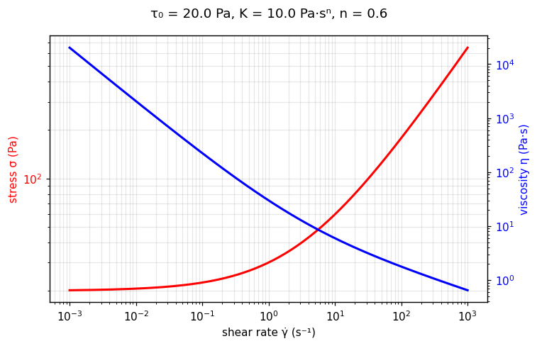

[← All models](index)

# Fitting the Herschel–Bulkley model

> 🧬 **The model itself lives in [rheomodel](https://rheomodel.readthedocs.io/en/latest/models/herschel_bulkley.html).** Equations, parameters, history, applicability, and references are documented there. In code, `rheofit.models.herschel_bulkley` is a thin adapter over `rheomodel` — same physics, same parameters. This page is about *fitting* it to your data.

The constitutive equation, for reference:

$$
\tau = \tau_0 + K\dot{\gamma}^n
$$

## 🔬 Interactive explorer

Drag the sliders to feel what each parameter does — the equation you just read, recomputed
live in your browser (Python via WebAssembly, no server involved).

````{only} builder_html
```{raw} html
<iframe src="../_static/interactive/hb/index.html" width="100%" height="760" style="border: 1px solid #ddd; border-radius: 8px;" title="Herschel–Bulkley interactive explorer" loading="lazy"></iframe>
```

*Tip: [open the explorer full-screen](../_static/interactive/hb/index.html).*
````

*Static preview
(τ₀ = 20 Pa, K = 10 Pa·sⁿ, n = 0.6):*



---

## Parameter Fitting Challenges and Objective Functions

Fitting experimental shear rate vs. shear stress data $(\dot{\gamma}_i, \tau_i)$ to estimate $(\tau_0, K, n)$ presents severe optimization challenges:

1. **Non-Linear Parameter Coupling:** The parameters $\tau_0$, $K$, and $n$ are highly correlated. Small shifts in $\tau_0$ can be compensated for by adjustments in $K$ and $n$, leading to non-unique solutions or multiple local minima in optimization landscapes.
2. **Sensitivity to Initial Seed Values:** Direct Non-Linear Least Squares (NLLS) optimization routines (e.g., Levenberg–Marquardt, Gauss–Newton) can easily diverge or yield unphysical parameter values (such as $\tau_0 < 0$) if poorly initialized.

### Relative vs. Absolute Residual Weighting

The choice of the objective function (residual definition) in non-linear regression fundamentally alters the fitted parameters:

#### 1. Absolute Residual Sum of Squares ($S_{abs}$)
$$S_{abs} = \sum_{i=1}^{N} \left( \tau_{i, \text{measured}} - \tau_{i, \text{predicted}} \right)^2 = \sum_{i=1}^{N} \left( \tau_i - (\tau_0 + K \dot{\gamma}_i^n) \right)^2$$

* **Behavior:** Minimizes absolute stress differences (in Pascals). Because shear stress typically spans several orders of magnitude (e.g., $1\text{ Pa}$ at low shear to $500\text{ Pa}$ at high shear), high-shear data points contribute disproportionately large error values to $S_{abs}$.
* **Consequence:** The optimization algorithm heavily prioritizes fitting the high shear rate region, often compromising the low-shear fit and producing highly inaccurate, unreliable estimates for the yield stress $\tau_0$.

#### 2. Relative (Percentage) Residual Sum of Squares ($S_{rel}$)
$$S_{rel} = \sum_{i=1}^{N} \left( \frac{\tau_{i, \text{measured}} - \tau_{i, \text{predicted}}}{\tau_{i, \text{measured}}} \right)^2 = \sum_{i=1}^{N} \left( 1 - \frac{\tau_0 + K \dot{\gamma}_i^n}{\tau_i} \right)^2$$

* **Behavior:** Normalizes residuals by the magnitude of the observed shear stress, measuring relative percentage error across the dataset.
* **Consequence:** Equal weight is assigned to each decade of shear rate. This prevents high-shear points from dominating the regression and results in significantly more accurate, physically meaningful estimations of $\tau_0$. However, $S_{rel}$ can become overly sensitive to experimental noise at very low shear rates.

#### 3. Logarithmic Residual Formulation ($S_{log}$)
$$S_{log} = \sum_{i=1}^{N} \left( \ln \tau_{i, \text{measured}} - \ln(\tau_0 + K \dot{\gamma}_i^n) \right)^2$$

* **Behavior:** Logarithmic transformation naturally balances error distributions across decades of measurements, performing similarly to relative weighting while offering superior numerical stability against near-zero outliers.

---

## Recommended Fitting Best Practices

1. **Analytical Linearization / Root-Finding (Mullineux Method):** Rather than performing an unconstrained 3-parameter search, reduce the optimization to a single-variable root-finding problem $F(n) = 0$. Solving for $n$ uniquely determines $K$ and $\tau_0$ via linear regression, guaranteeing convergence to the global minimum.
2. **Hybrid / Sequential Determination:** Measure $\tau_0$ independently using static yield stress methods (such as vane geometry, stress growth tests, or low-shear creep tests). Fix $\tau_0$ as a constant, and then solve for $K$ and $n$ using a simple 2-parameter linear regression in log-space:

$$\ln(\tau - \tau_0) = \ln K + n \ln \dot{\gamma}$$

---
