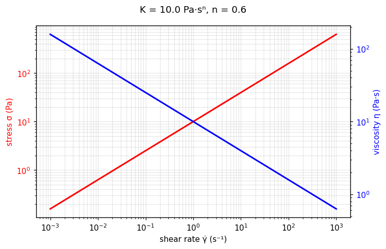

[← All models](index)

# The Power Law Model: Historical Foundations, Physical Mechanics, Limitations, and Fitting Methodologies

## 1. Historical Background and Motivation

The **Power Law** (or **Ostwald–de Waele**) model is the oldest and simplest description
of non-Newtonian shear-thinning and shear-thickening flow. It was introduced in the
1920s by German colloid chemist Wolfgang Ostwald — *"Über die Geschwindigkeitsfunktion
der Viskosität disperser Systeme"* (*Kolloid-Zeitschrift*, 1925) — and, independently,
by A. de Waele (1923) in the coatings literature, both seeking a compact empirical law
for pigment dispersions and polymer solutions whose viscosity falls (or rises) steadily
with shear rate.

### The Motivation Behind the Model

Newton's law ($\tau = \eta \dot{\gamma}$) assigns every fluid a single constant
viscosity. By the 1920s it was clear that most structured liquids — polymer solutions,
paints, food pastes — have no such constant: their apparent viscosity drifts across
decades of shear rate. The Power Law captures that drift with just two parameters,
making it the workhorse of engineering rheology for a century.

---

## 2. Mathematical Formulation

In pure one-dimensional shear flow:

$$
\sigma = K \dot{\gamma}^n
$$

Dividing by shear rate gives the apparent viscosity:

$$
\eta(\dot{\gamma}) = \frac{\sigma}{\dot{\gamma}} = K \dot{\gamma}^{\,n-1}
$$

Where:
* $\sigma$ = Total shear stress ($\text{Pa}$)
* $K$ = Consistency index ($\text{Pa}\cdot\text{s}^n$): sets the overall stress level
* $n$ = Flow behavior index (–): sets the curvature
* $\dot{\gamma}$ = Shear rate ($\text{s}^{-1}$)

The exponent classifies the fluid at a glance:

| $n$ | Behavior | Viscosity trend |
| :---: | :--- | :--- |
| $n < 1$ | **Shear-thinning** (pseudoplastic) | $\eta$ falls with $\dot{\gamma}$ |
| $n = 1$ | **Newtonian** | $\eta = K$ constant |
| $n > 1$ | **Shear-thickening** (dilatant) | $\eta$ rises with $\dot{\gamma}$ |

---

## 🔬 Interactive explorer

Drag the sliders to feel what each parameter does — the equation you just read, recomputed
live in your browser (Python via WebAssembly, no server involved). The dashed line is the
Newtonian reference ($n = 1$, same $K$). The blue axis shows the apparent viscosity
$\eta = \sigma/\dot{\gamma}$.

````{only} builder_html
```{raw} html
<iframe src="../_static/interactive/power_law/index.html" width="100%" height="760" style="border: 1px solid #ddd; border-radius: 8px;" title="Power Law model interactive explorer" loading="lazy"></iframe>
```

*Tip: [open the explorer full-screen](../_static/interactive/power_law/index.html).*
````

*Static preview
($K$ = 10 Pa·sⁿ, $n$ = 0.6):*



---

## 3. Physical Foundation

The Power Law is **purely empirical** — it postulates a straight line on log–log axes
rather than deriving one from microstructure. Its endurance comes from a robust
observation: over the 2–4 decades of shear rate a single process step typically spans,
most thinning fluids *look* log-linear, because progressive structural breakdown
(disentanglement, deflocculation, droplet deformation) keeps lowering the resistance
to flow in a self-similar way.

That same empiricism is its weakness: $K$ and $n$ are curve-shape descriptors, not
material constants with microstructural meaning, and their values drift when the
fitted shear-rate window changes.

---

## 4. Range of Applicable Materials

| Industry / Application | Material Examples | Key Rheological Feature Captured |
| :--- | :--- | :--- |
| **Polymer processing** | Polymer melts, concentrated polymer solutions | Log-linear thinning over the processing window; die-flow calculations |
| **Foods** | Ketchup, fruit purees, yoghurt | Shear-thinning across mastication and pumping rates |
| **Coatings & inks** | Paints, printing inks | Brush/roller thinning behavior |
| **Oil & gas** | Drilling muds, fracturing fluids | Pump-pressure estimation over operating shear rates |

---

## 5. Intrinsic Limitations

### A. No plateaus — unphysical asymptotes

Real fluids approach a constant zero-shear viscosity $\eta_0$ at low rates and often a
second plateau $\eta_\infty$ at high rates. The Power Law has neither: for $n < 1$,
$\eta \to \infty$ as $\dot{\gamma} \to 0$ and $\eta \to 0$ as $\dot{\gamma} \to \infty$.
Extrapolating outside the fitted window is therefore dangerous — use the
[Carreau](carreau) model when plateaus matter.

### B. No yield stress

The curve passes through the origin: at vanishing shear rate the stress vanishes too.
Any material with a true yield stress needs a viscoplastic model
([Bingham](bingham), [Herschel–Bulkley](herschel_bulkley), [TC](tc)).

### C. Window-dependent parameters

Because the model is empirical, $K$ and $n$ shift with the fitted shear-rate range.
Always report the window alongside the parameters.

---

## 6. Parameter Fitting Best Practices

1. **Fit in log–log space:** $\log \sigma = \log K + n \log \dot{\gamma}$ is linear,
   so ordinary least squares on logarithms gives $n$ (slope) and $K$ (intercept) —
   and weights each decade of shear rate equally.
2. **Check the residuals:** systematic curvature on log–log axes means the fluid has
   a plateau the Power Law cannot follow — step up to [Carreau](carreau).
3. **Low-shear cutoff:** exclude the yield-dominated or slip-corrupted low-rate tail
   before fitting; it bends the log–log line and corrupts $n$.

---

## Verified Literature References

* **de Waele, A.** (1923). Viscometry and plastometry. *Journal of the Oil & Colour Chemists' Association*, 6, 33–69.

* **Ostwald, W.** (1925). Über die Geschwindigkeitsfunktion der Viskosität disperser Systeme. I. *Kolloid-Zeitschrift*, 36, 99–117. [https://doi.org/10.1007/BF01431449](https://doi.org/10.1007/BF01431449)
