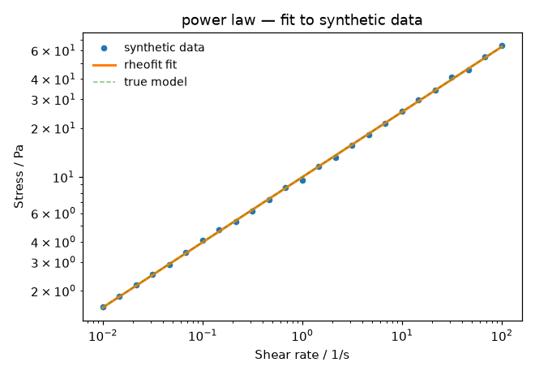
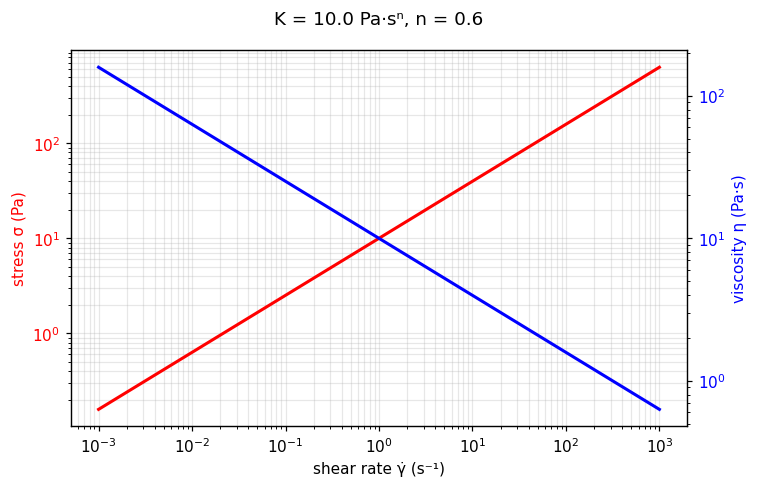

[← All models](index)

# Fitting the power law model

> 🧬 **The model itself lives in [rheomodel](https://rheomodel.readthedocs.io/en/latest/models/power_law.html).** Equations, parameters, history, applicability, and references are documented there. In code, `rheofit.models.power_law` is a thin adapter over `rheomodel` — same physics, same parameters. This page is about *fitting* it to data.

The constitutive equation, for reference:

$$
\sigma = K\dot{\gamma}^n
$$

## Worked example

Generate a flow curve from `rheomodel` with known parameters, add 2% noise, and fit it with `rheofit`:

```python
import numpy as np
import pandas as pd
from rheomodel import get_model
import rheofit

# 1. synthetic flow curve from rheomodel: known truth + 2% noise
model = get_model("power_law")
gamma_dot = np.logspace(-2, 2, 25)
true = {"K": 10.0, "n": 0.4}
rng = np.random.default_rng(0)
stress = model.equation(gamma_dot, **true)
stress = stress * (1 + 0.02 * rng.standard_normal(gamma_dot.size))

# 2. fit it with rheofit
df = pd.DataFrame({"Shear rate / 1/s": gamma_dot, "Stress / Pa": stress})
res = rheofit.fit(df, "power_law", effort="fast", seed=0)

for name, p in res["params"].items():
    print(f"{name:12s} true={true[name]:8.3g}  fit={p['value']:8.3g} ± {p['stderr']:.2g}")
print(f"RedChi2 = {res['redchi']:.2e}")
```

Output:

```
K            true=      10  fit=    9.98 ± 0.036
n            true=     0.4  fit=     0.4 ± 0.0013
RedChi2 = 3.23e-04
```



## 🔬 Interactive explorer

Drag the sliders to feel what each parameter does — the equation you just read, recomputed
live in your browser (Python via WebAssembly, no server involved). The dashed line is the
Newtonian reference ($n = 1$, same $K$). The blue axis shows the apparent viscosity
$\eta = \sigma/\dot{\gamma}$.

````{only} builder_html
```{raw} html
<iframe src="../_static/interactive/power_law/index.html" width="100%" height="760" style="border: 1px solid #ddd; border-radius: 8px;" title="Power Law model interactive explorer" loading="lazy"></iframe>
```

*Tip: [open the explorer full-screen](../_static/interactive/power_law/index.html).*
````

*Static preview
($K$ = 10 Pa·sⁿ, $n$ = 0.6):*


