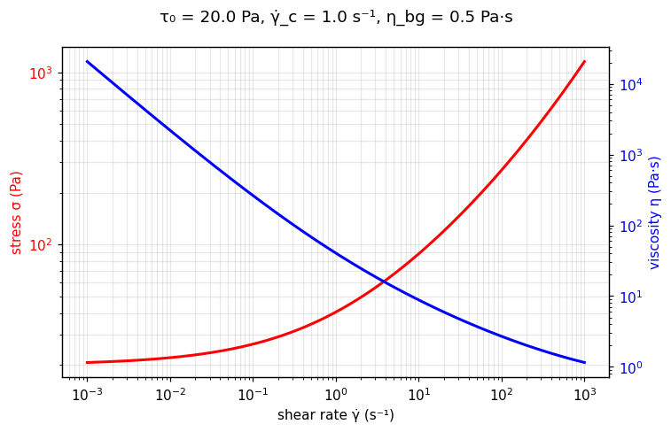

[← All models](index)

# The Three-Component (TC) Model: Physical Foundations, Mathematics, Limitations, and Fitting Methodologies

## 1. Historical Background and Motivation

The **Three-Component (TC) model** was introduced in 2020 by Marco Caggioni, Véronique Trappe, and Patrick T. Spicer in their paper, *"Variations of the Herschel-Bulkley exponent reflecting contributions of the viscous continuous phase to the shear rate-dependent stress of soft glassy materials"* (*Journal of Rheology*).

### The Motivation Behind the Model

For nearly a century, non-linear yield-stress fluids—specifically soft glassy materials (SGMs) such as concentrated emulsions, microgel suspensions, dense colloidal pastes, and foams—were fitted empirically using the **Herschel–Bulkley (HB) model**:

$$
\tau = \tau_0 + K \dot{\gamma}^n
$$

While the HB equation provides high fitting flexibility, it suffers from a fundamental physical limitation: **neither the consistency index ($K$) nor the power-law exponent ($n$) possesses a constant, intrinsic physical meaning.** 

Experimental studies routinely revealed that for identical materials, the fitted HB exponent $n$ fluctuates significantly ($0.4 < n < 0.8$) depending on:
1. The experimental shear rate range accessible during measurement.
2. The viscosity of the continuous solvent phase ($\eta_{sol}$).
3. The particle volume fraction or packing density.

Caggioni, Trappe, and Spicer demonstrated that this floating exponent $n$ is an artificial artifact caused by forcing two distinct rate-dependent energy dissipation mechanisms into a single mathematical power term ($K \dot{\gamma}^n$). To solve this issue and restore physical meaning to flow curve parameters, they proposed decomposing the total shear stress into three distinct, additive dissipation mechanisms.

---

## 2. Mathematical Formulation

In pure one-dimensional shear flow, the Three-Component (TC) constitutive equation is formulated as:

$$
\begin{cases} 
\dot{\gamma} = 0, & \text{for } \vert{}\tau\vert{} \le \tau_0 \quad \text{(Unyielded / Solid-like State)} \\ 
\tau = \tau_0 + \tau_0 \left( \frac{\dot{\gamma}}{\dot{\gamma}_c} \right)^{1/2} + \eta_{bg} \dot{\gamma}, & \text{for } \vert{}\tau\vert{} > \tau_0 \quad \text{(Yielded / Flow State)} 
\end{cases}
$$

Alternatively, by defining the plastic prefactor $A = \frac{\tau_0}{\sqrt{\dot{\gamma}_c}}$, the yielded state can be expressed as:

$$
\tau = \tau_0 + A \dot{\gamma}^{1/2} + \eta_{bg} \dot{\gamma}
$$

Where:
* $\tau$ = Total shear stress ($\text{Pa}$)
* $\tau_0$ = Dynamic yield stress ($\text{Pa}$): Quantifies the rate-independent **elastic dissipation** threshold required to deform the structural network past its critical yield strain.
* $\dot{\gamma}_c$ = Critical characteristic shear rate ($\text{s}^{-1}$): The structural relaxation rate defining the onset of rate-dependent plastic rearrangements.
* $\eta_{bg}$ = Background viscous viscosity ($\text{Pa}\cdot\text{s}$): The high-shear limiting viscosity representing hydrodynamic **viscous dissipation** across the continuous phase.
* $\dot{\gamma}$ = Shear rate ($\text{s}^{-1}$)

### Apparent Viscosity Formulation

Dividing total shear stress by shear rate yields the TC apparent viscosity $\eta(\dot{\gamma})$:

$$
\eta(\dot{\gamma}) = \frac{\tau}{\dot{\gamma}} = \frac{\tau_0}{\dot{\gamma}} + \frac{\tau_0}{\sqrt{\dot{\gamma}_c \dot{\gamma}}} + \eta_{bg} \quad \text{for } \vert{}\tau\vert{} > \tau_0
$$

---

## 🔬 Interactive explorer

Drag the sliders to feel what each parameter does — the equation you just read, recomputed
live in your browser (Python via WebAssembly, no server involved). The dashed lines decompose
the total stress (red) into its three physical contributions: **elastic** τ₀,
**plastic** τ₀(γ̇/γ̇_c)^{1/2}, and **viscous** η_bg·γ̇ — the heart of §3. The blue axis shows
the apparent viscosity η = τ/γ̇.

````{only} builder_html
```{raw} html
<iframe src="../_static/interactive/tc/index.html" width="100%" height="760" style="border: 1px solid #ddd; border-radius: 8px;" title="Three-Component model interactive explorer" loading="lazy"></iframe>
```

*Tip: [open the explorer full-screen](../_static/interactive/tc/index.html).*
````

*Static preview
(τ₀ = 20 Pa, γ̇_c = 1.0 s⁻¹, η_bg = 0.5 Pa·s):*



---

## 3. The Three Physical Dissipation Mechanisms

The central core of the TC model is that flow resistance in soft complex fluids is governed by three independent physical regimes:

```
 Total Stress  =  [ Elastic Stress ] + [ Plastic Stress ] + [ Viscous Stress ]
      τ        =        τ₀         +   τ₀(γ̇/γ̇_c)^0.5   +      η_bg * γ̇
```

```
   log(τ) |                                         / (Viscous Dominated: τ ~ η_bg * γ̇)
          |                                       /.
          |                                     /  .
          |                      _ - - - - -  /    .
          |          _ - - - - '            /      .
          |      _ '                      /        . (Plastic Dominated: τ ~ γ̇^0.5)
          |  _ '                        /          .
       τ₀ |---------------------------/------------.----------
          | .                        /             .
          | .                       /              .
          +------------------------+---------------+-------------> log(γ̇)
                                   γ̇_c           τ₀/η_bg
```

1. **Elastic Dissipation Term ($\tau_0$):**
   * **Mechanism:** Strain-dependent, rate-independent energy dissipation. Occurs when local elastic strain exceeds a critical threshold, triggering localized structural breakdown.
   * **Dominance:** Prevails at low shear rates ($\dot{\gamma} < \dot{\gamma}_c$).

2. **Plastic Dissipation Term ($\tau_0 \sqrt{\dot{\gamma} / \dot{\gamma}_c}$):**
   * **Mechanism:** Rate-dependent energy loss caused by irreversible local elastoplastic rearrangements. As derived in kinetic elastoplastic theories (Hébraud & Lequeux, 1998; Bocquet et al., 2009), local stress redistribution generates cooperative flow, yielding a universal square-root rate scaling ($\dot{\gamma}^{1/2}$).
   * **Dominance:** Prevails at intermediate shear rates ($\dot{\gamma}_c < \dot{\gamma} < \tau_0 / \eta_{bg}$).

3. **Viscous Dissipation Term ($\eta_{bg} \dot{\gamma}$):**
   * **Mechanism:** Hydrodynamic friction dissipated through the suspending liquid matrix surrounding suspended particles/droplets.
   * **Dominance:** Prevails at high shear rates ($\dot{\gamma} > \tau_0 / \eta_{bg}$).

---

## 4. Comparison with Classical Models (HB, Casson, Bingham)

The TC model reconciles and unifies several classic viscoplastic flow models:

| Model | Equation | Free Parameters | Comparison with the TC Model |
| :--- | :--- | :---: | :--- |
| **TC Model** | $\tau = \tau_0 + \tau_0 \left(\frac{\dot{\gamma}}{\dot{\gamma}_c}\right)^{1/2} + \eta_{bg} \dot{\gamma}$ | **3** $(\tau_0, \dot{\gamma}_c, \eta_{bg})$ | **Base Model:** Accounts for elastic, plastic ($n=0.5$), and linear background viscous dissipation independently. |
| **Herschel–Bulkley** | $\tau = \tau_0 + K \dot{\gamma}^n$ | **3** $(\tau_0, K, n)$ | **Empirical Equivalent:** Lumps plastic and viscous dissipation into an artificial floating exponent $n$. Extrapolations fail outside fitted data range. |
| **Casson** | $\sqrt{\tau} = \sqrt{\tau_0} + \sqrt{\eta_{bg} \dot{\gamma}}$ $\implies \tau = \tau_0 + 2\sqrt{\tau_0 \eta_{bg} \dot{\gamma}} + \eta_{bg}\dot{\gamma}$ | **2** $(\tau_0, \eta_{bg})$ | **Constrained Special Case:** Equivalent to TC when $\dot{\gamma}_c$ is strictly locked to $\frac{\tau_0}{4 \eta_{bg}}$. Lacks fitting flexibility for varied particle dynamics. |
| **Bingham Plastic** | $\tau = \tau_0 + \mu_p \dot{\gamma}$ | **2** $(\tau_0, \mu_p)$ | **Simplified Limit:** Omits the plastic rearrangement term entirely ($A = 0$), assuming an abrupt transition directly from static yield to linear viscous flow. |

---

(mirm)=
## 🧬 Microstructure-informed models (MIRM): linear combinations of primitives

Real consumer-product formulations rarely contain a single microstructure. A shampoo
may combine a jammed surfactant network (yield + plastic rearrangements) with entangled
polymers (shear-thinning with its own relaxation time); a skin cream may add a second
emollient phase with yet another timescale — all tuned to obtain a tailored texture.
No single primitive model spans that complexity, so `rheofit` builds
**microstructure-informed rheological models (MIRM)** as *linear combinations* —
plain sums — of primitive models, one additive stress term per microstructural
contributor:

| MIRM model | Construction | Page |
| :--- | :--- | :--- |
| **TC-Carreau** (`tc_carreau`) | TC + one Carreau term: $\sigma = \sigma_y + \sigma_y(\dot{\gamma}/\dot{\gamma}_c)^{1/2} + \eta_0\dot{\gamma}[1+(\lambda\dot{\gamma})^2]^{-1/2}$ | [📖 guide](tc_carreau) |
| **Carreau-Carreau** (`carreau_carreau`) | Carreau + Carreau: two shear-thinning components with distinct relaxation times $\lambda_1$, $\lambda_2$ | [📖 guide](carreau_carreau) |
| **TCCC** (`tccc`) | TC + two Carreau terms: yield, plastic rearrangement, plus two distinct thinning timescales | [📖 guide](tccc) |

Because the construction is additive, each fitted parameter keeps a direct physical
readout — $\sigma_y$ still the network yield stress, each $\lambda_i$ the relaxation
time of one thinning contributor — instead of collapsing into an uninterpretable
effective exponent. Climb this ladder only when the data demand it: extra terms must
earn their keep against the identifiability cost (see [§9](#tc-fitting)).

---

## 5. Range of Applicable Materials

The TC model is tailored for soft glassy materials (SGMs) and dense jammed suspensions where elastoplastic rearrangements govern intermediate flow and hydrodynamic drag dominates at elevated shear rates:

| Industry / Application | Material Examples | Key Rheological Feature Captured |
| :--- | :--- | :--- |
| **Emulsions & Foods** | Concentrated Mayonnaise, Whipped Cream, Dense O/W Industrial Emulsions | Explains why HB $n$-values decrease as droplet volume fraction ($\phi$) increases toward jamming. |
| **Soft Matter & Microgels** | Carbopol microgel pastes, pNIPAM suspensions, packed microcapsules | Captures both internal microgel yield mechanics ($\tau_0, \dot{\gamma}_c$) and aqueous solvent friction ($\eta_{bg}$). |
| **Personal Care & Consumer** | Structured Shampoos, Liquid Detergents with Wormlike Micelles | Accurately models temperature-dependent solvent viscosity variations ($\eta_{sol}$) on total fluid drag. |
| **Dense Colloidal Suspensions** | Hard-sphere silica suspensions near random close packing ($\phi \approx 0.64$) | Correctly isolates hydrodynamic lubrication forces from structural rearrangement thresholds. |

---

## 6. Intrinsic Physics, Asymptotes, and Advantages

### A. Realistic Infinite-Shear Asymptote ($\eta_\infty \to \eta_{bg}$)

Unlike the Herschel–Bulkley model (where apparent viscosity unphysically drops to zero for $n < 1$), taking the infinite shear rate limit of the TC model yields a finite Newtonian lower limit:

$$
\lim_{\dot{\gamma} \to \infty} \eta(\dot{\gamma}) = \lim_{\dot{\gamma} \to \infty} \left( \frac{\tau_0}{\dot{\gamma}} + \frac{\tau_0}{\sqrt{\dot{\gamma}_c \dot{\gamma}}} + \eta_{bg} \right) = \eta_{bg} \approx \eta_{sol}
$$

This matches physical reality: at ultra-high shear rates, internal particle structures are fully aligned or deformed, leaving viscous drag across the solvent as the sole remaining resistance.

### B. Robustness Outside Experimental Data Windows

Because HB parameters ($K, n$) lack distinct physical boundaries, extrapolating an HB flow curve beyond measured data often introduces severe errors. In contrast, the TC model's parameters remain rooted in physical bounds ($\eta_{bg} \approx \eta_{sol}$), allowing reliable extrapolation across unmeasured shear rate ranges.

### C. Theoretical Limitations

1. **Zero-Shear Divergence:** Like Bingham and Herschel–Bulkley models, $\lim_{\dot{\gamma} \to 0^+} \eta(\dot{\gamma}) = \infty$. Computational fluid dynamics (CFD) applications require regularization (e.g., Papanastasiou-type smoothing).
2. **Wall Slip Sensitivity:** At low shear rates ($\dot{\gamma} < \dot{\gamma}_c$), non-homogeneous flow and wall slip can drop measured stresses below theoretical yield predictions, requiring grooved or roughened geometries during testing.
3. **Non-Newtonian Solvent Limit:** The standard TC model assumes a constant background viscosity $\eta_{bg}$. If the suspending phase itself is shear-thinning (e.g., highly entangled polymer solutions), $\eta_{bg}$ becomes rate-dependent.

---

## 7. Master Curve Universal Rescaling

A major insight of the TC model is that traditional normalization schemes (dividing $\tau$ by $\tau_0$ and $\dot{\gamma}$ by $(\tau_0/K)^{1/n}$) fail to collapse flow curves across different concentrations or temperatures because they do not isolate viscous drag.

### Rescaling Protocol

To collapse flow curves from varied temperatures, background solvent viscosities, or packing fractions onto a single universal master curve:

1. Subtract the linear viscous stress contribution ($\eta_{bg} \dot{\gamma}$) from total shear stress ($\tau$).
2. Normalize the remaining stress by the dynamic yield stress ($\tau_0$).
3. Normalize the shear rate by the critical shear rate ($\dot{\gamma}_c$).

$$
\frac{\tau - \eta_{bg} \dot{\gamma}}{\tau_0} = 1 + \left( \frac{\dot{\gamma}}{\dot{\gamma}_c} \right)^{1/2}
$$

Plotting $\frac{\tau - \eta_{bg} \dot{\gamma}}{\tau_0}$ versus $\frac{\dot{\gamma}}{\dot{\gamma}_c}$ collapses diverse datasets across emulsions, microgels, and hard-sphere colloids onto one universal collapse line.

---

## 8. Parameter Fitting Challenges and Objective Functions

Non-linear optimization to extract $(\tau_0, \dot{\gamma}_c, \eta_{bg})$ requires careful selection of objective functions.

### Objective Function Formulations

#### 1. Absolute Residual Sum of Squares ($S_{abs}$)

$$
S_{abs} = \sum_{i=1}^{N} \left( \tau_{i, \text{meas}} - \left[ \tau_0 + \tau_0 \left(\frac{\dot{\gamma}_i}{\dot{\gamma}_c}\right)^{1/2} + \eta_{bg} \dot{\gamma}_i \right] \right)^2
$$

* **Drawback:** Disproportionately weights high shear rate stress values ($\tau > 100 \text{ Pa}$), leading to precise determination of $\eta_{bg}$ at the expense of severe errors in the yield stress intercept ($\tau_0$).

#### 2. Relative Residual Sum of Squares ($S_{rel}$)

$$
S_{rel} = \sum_{i=1}^{N} \left( \frac{\tau_{i, \text{meas}} - \tau_{i, \text{pred}}}{\tau_{i, \text{meas}}} \right)^2 = \sum_{i=1}^{N} \left( 1 - \frac{\tau_0 + \tau_0 (\dot{\gamma}_i/\dot{\gamma}_c)^{1/2} + \eta_{bg} \dot{\gamma}_i}{\tau_i} \right)^2
$$

* **Advantage:** Gives equal relative weight to each decade of shear rate, enabling balanced, highly accurate extraction of all three parameters ($\tau_0, \dot{\gamma}_c, \eta_{bg}$).

---

(tc-fitting)=
## 9. Recommended Fitting Best Practices

1. **Independent Solvent Viscosity Anchor:** Measure the viscosity of the pure continuous phase ($\eta_{sol}$) independently. Use $\eta_{sol}$ as an initial seed value or lower bound constraint for $\eta_{bg}$ during non-linear regression.
2. **Truncate Slip-Corrupted Low-Shear Data:** Inspect raw flow curves on logarithmic axes. Exclude points at low shear rates where wall slip causes artificial stress drops.
3. **Multi-Stage Sequential Initialization:**
   * Step A: Estimate $\tau_0$ from low-shear stress plateau data.
   * Step B: Estimate $\eta_{bg}$ from the high-shear differential slope ($\text{d}\tau / \text{d}\dot{\gamma}$ at maximum $\dot{\gamma}$).
   * Step C: Perform non-linear optimization (Levenberg–Marquardt or Nelder-Mead algorithm) using $S_{rel}$ to solve for all three parameters simultaneously.

---

## Verified Literature References

* **Bocquet, L., Colin, A., & Ajdari, A.** (2009). Kinetic theory of plastic flow in soft glassy materials. *Physical Review Letters*, 103(3), 036001. [https://doi.org/10.1103/PhysRevLett.103.036001](https://doi.org/10.1103/PhysRevLett.103.036001)

* **Caggioni, M., Trappe, V., & Spicer, P. T.** (2020). Variations of the Herschel-Bulkley exponent reflecting contributions of the viscous continuous phase to the shear rate-dependent stress of soft glassy materials. *Journal of Rheology*, 64(2), 413–422. [https://doi.org/10.1122/1.5127805](https://doi.org/10.1122/1.5127805)

* **Casson, N.** (1959). A flow equation for pigment-oil suspensions of the printing ink type. In C. Mill (Ed.), *Rheology of Disperse Systems* (pp. 84–104). Pergamon Press.

* **Hébraud, P., & Lequeux, F.** (1998). Mode-coupling theory for the pasty rheology of soft glassy materials. *Physical Review Letters*, 81(14), 2934–2937. [https://doi.org/10.1103/PhysRevLett.81.2934](https://doi.org/10.1103/PhysRevLett.81.2934)

* **Herschel, W. H., & Bulkley, R.** (1926). Konsistenzmessungen von Gummi-Benzollösungen. *Kolloid-Zeitschrift*, 39(4), 291–300. [https://doi.org/10.1007/BF01432034](https://doi.org/10.1007/BF01432034)