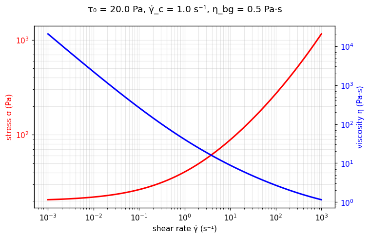

[← All models](index)

# Fitting the TC (three-component) model

> 🧬 **The model itself lives in [rheomodel](https://rheomodel.readthedocs.io/en/latest/models/tc.html).** Equations, parameters, history, applicability, and references are documented there. In code, `rheofit.models.tc` is a thin adapter over `rheomodel` — same physics, same parameters. This page is about *fitting* it to your data.

The constitutive equation, for reference:

$$
\sigma = \sigma_y + \sigma_y(\dot{\gamma}/\dot{\gamma}_c)^{1/2} + \eta_{bg}\dot{\gamma}
$$

## 🔬 Interactive explorer

Drag the sliders to feel what each parameter does — the equation you just read, recomputed
live in your browser (Python via WebAssembly, no server involved). The dashed lines decompose
the total stress (red) into its three physical contributions: **elastic** τ₀,
**plastic** τ₀(γ̇/γ̇_c)^{1/2}, and **viscous** η_bg·γ̇ — the heart of §3. The blue axis shows
the apparent viscosity η = τ/γ̇.

````{only} builder_html
```{raw} html
<iframe src="../_static/interactive/tc/index.html" width="100%" height="760" style="border: 1px solid #ddd; border-radius: 8px;" title="Three-Component model interactive explorer" loading="lazy"></iframe>
```

*Tip: [open the explorer full-screen](../_static/interactive/tc/index.html).*
````

*Static preview
(τ₀ = 20 Pa, γ̇_c = 1.0 s⁻¹, η_bg = 0.5 Pa·s):*



---

## Parameter Fitting Challenges and Objective Functions

Non-linear optimization to extract $(\tau_0, \dot{\gamma}_c, \eta_{bg})$ requires careful selection of objective functions.

### Objective Function Formulations

#### 1. Absolute Residual Sum of Squares ($S_{abs}$)

$$
S_{abs} = \sum_{i=1}^{N} \left( \tau_{i, \text{meas}} - \left[ \tau_0 + \tau_0 \left(\frac{\dot{\gamma}_i}{\dot{\gamma}_c}\right)^{1/2} + \eta_{bg} \dot{\gamma}_i \right] \right)^2
$$

* **Drawback:** Disproportionately weights high shear rate stress values ($\tau > 100 \text{ Pa}$), leading to precise determination of $\eta_{bg}$ at the expense of severe errors in the yield stress intercept ($\tau_0$).

#### 2. Relative Residual Sum of Squares ($S_{rel}$)

$$
S_{rel} = \sum_{i=1}^{N} \left( \frac{\tau_{i, \text{meas}} - \tau_{i, \text{pred}}}{\tau_{i, \text{meas}}} \right)^2 = \sum_{i=1}^{N} \left( 1 - \frac{\tau_0 + \tau_0 (\dot{\gamma}_i/\dot{\gamma}_c)^{1/2} + \eta_{bg} \dot{\gamma}_i}{\tau_i} \right)^2
$$

* **Advantage:** Gives equal relative weight to each decade of shear rate, enabling balanced, highly accurate extraction of all three parameters ($\tau_0, \dot{\gamma}_c, \eta_{bg}$).

---

(tc-fitting)=

## Recommended Fitting Best Practices

1. **Independent Solvent Viscosity Anchor:** Measure the viscosity of the pure continuous phase ($\eta_{sol}$) independently. Use $\eta_{sol}$ as an initial seed value or lower bound constraint for $\eta_{bg}$ during non-linear regression.
2. **Truncate Slip-Corrupted Low-Shear Data:** Inspect raw flow curves on logarithmic axes. Exclude points at low shear rates where wall slip causes artificial stress drops.
3. **Multi-Stage Sequential Initialization:**
   * Step A: Estimate $\tau_0$ from low-shear stress plateau data.
   * Step B: Estimate $\eta_{bg}$ from the high-shear differential slope ($\text{d}\tau / \text{d}\dot{\gamma}$ at maximum $\dot{\gamma}$).
   * Step C: Perform non-linear optimization (Levenberg–Marquardt or Nelder-Mead algorithm) using $S_{rel}$ to solve for all three parameters simultaneously.

---
