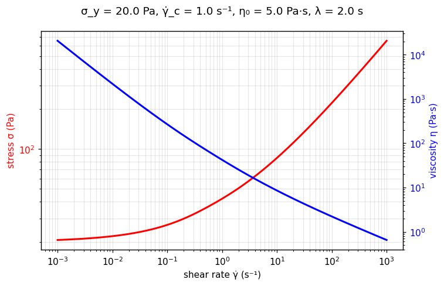

[← All models](index)

# The TC-Carreau Model: Historical Foundations, Physical Mechanics, Limitations, and Fitting Methodologies

## 1. Historical Background and Motivation

The **TC-Carreau model** is a `rheofit` **microstructure-informed rheological model
(MIRM)** — a linear combination of the [TC](tc) model (Caggioni et al., 2020) and
the [Carreau](carreau) model (Carreau, 1972). It was born out of a practical
necessity: consumer-product formulations routinely combine a **yield-stress network**
(a jammed emulsion, a microgel paste, a surfactant mesophase) with a **relaxing
polymeric microstructure** (thickeners, conditioners) to tailor texture. The TC
model captures the yielding network; the Carreau term captures the polymer's
zero-shear plateau and its shear-thinning onset at its own relaxation time.

---

## 2. Mathematical Formulation

In pure one-dimensional shear flow:

$$
\sigma = \sigma_y + \sigma_y \left(\frac{\dot{\gamma}}{\dot{\gamma}_c}\right)^{1/2}
\;+\;
\eta_0 \, \dot{\gamma} \left[1 + (\lambda \dot{\gamma})^2\right]^{-1/2}
$$

Where:
* $\sigma$ = Total shear stress ($\text{Pa}$)
* $\sigma_y$ = Yield stress ($\text{Pa}$): the jammed network's strength
* $\dot{\gamma}_c$ = Plastic transition rate ($\text{s}^{-1}$): where rearrangements dominate
* $\eta_0$ = Zero-shear viscosity of the Carreau component ($\text{Pa}\cdot\text{s}$)
* $\lambda$ = Relaxation time of the Carreau component ($\text{s}$)
* $\dot{\gamma}$ = Shear rate ($\text{s}^{-1}$)

The three terms are read left to right: **yield** (elastic network), **plastic**
($\dot{\gamma}^{1/2}$ rearrangements), **Carreau** (relaxing microstructure).

### Asymptotes

* **Low shear** ($\dot{\gamma} \to 0$): $\sigma \to \sigma_y$ — the yield stress dominates.
* **High shear** ($\lambda\dot{\gamma} \gg 1$): the Carreau term saturates to the
  constant stress $\eta_0/\lambda$, so the curve approaches
  $\sigma \approx \sigma_y + \eta_0/\lambda + \sigma_y(\dot{\gamma}/\dot{\gamma}_c)^{1/2}$ —
  the relaxing microstructure contributes a bounded stress rather than a growing one.

---

## 🔬 Interactive explorer

Drag the sliders to feel what each parameter does — the equation you just read, recomputed
live in your browser (Python via WebAssembly, no server involved). Dashed lines show the
three additive terms: the TC yield stress, the TC plastic term, and the Carreau term.
The blue axis shows the apparent viscosity $\eta = \sigma/\dot{\gamma}$.

````{only} builder_html
```{raw} html
<iframe src="../_static/interactive/tc_carreau/index.html" width="100%" height="760" style="border: 1px solid #ddd; border-radius: 8px;" title="TC-Carreau model interactive explorer" loading="lazy"></iframe>
```

*Tip: [open the explorer full-screen](../_static/interactive/tc_carreau/index.html).*
````

*Static preview
($\sigma_y$ = 20 Pa, $\dot{\gamma}_c$ = 1.0 s⁻¹, $\eta_0$ = 5 Pa·s, $\lambda$ = 2.0 s):*



---

## 3. Physical Foundation

The model is additive by construction — a MIRM in the sense described on the
{ref}`TC page <mirm>`:
the jammed network and the relaxing polymer flow in parallel, each dissipating
stress through its own mechanism, and the rheometer measures their sum. Because the
terms stay separate, every parameter keeps a direct physical readout — $\sigma_y$
the network strength, $\lambda$ the polymer's relaxation time — instead of
collapsing into an uninterpretable effective exponent.

---

## 4. Range of Applicable Materials

| Industry / Application | Material Examples | Key Rheological Feature Captured |
| :--- | :--- | :--- |
| **Personal care** | Structured shampoos, conditioners | Yield network (suspending) + polymer thinning (spreading) |
| **Home care** | Structured liquid detergents | Surfactant mesophase yield + polymeric rheology modifier |
| **Foods** | Dressings, sauces with mixed thickeners | Gel network + starch/xanthan relaxation |
| **Pharma** | Topical gels with polymeric excipients | Yield for tube stability + thinning for rub-in |

---

## 5. Intrinsic Limitations

### A. Four parameters need four features

$\sigma_y$, $\dot{\gamma}_c$, $\eta_0$, $\lambda$ are identifiable only if the data
span the yield plateau, the plastic regime, the Carreau plateau, and the thinning
onset. Narrow data → correlated parameters.

### B. Single relaxing microstructure

One Carreau term means one relaxation time. Two distinct thinning populations need
[TCCC](tccc).

### C. Time-independent

Like its parents, TC-Carreau is a steady-state model — no thixotropy, aging, or
viscoelastic transients.

---

## 6. Parameter Fitting Best Practices

1. **Fit TC first, then add Carreau:** a good TC fit isolates what the Carreau term
   must explain — the residual bend at $\dot{\gamma} \sim 1/\lambda$.
2. **Bound $\lambda$ by the data window:** the thinning onset must sit inside the
   measured shear-rate range, or $\lambda$ floats.
3. **Climb the ladder deliberately:** if the extra term's uncertainty exceeds its
   value, the data only support [TC](tc) — step back down.

---

## Verified Literature References

* **Caggioni, M., et al.** (2020). On the elastoplastic transition in soft solids: Unifying the rheology of soft glassy materials. *Journal of Rheology*, 64(3). [https://doi.org/10.1122/8.0000011](https://doi.org/10.1122/8.0000011)

* **Carreau, P. J.** (1972). Rheological equations from molecular network theories. *Transactions of the Society of Rheology*, 16(1), 99–127. [https://doi.org/10.1122/1.549276](https://doi.org/10.1122/1.549276)
