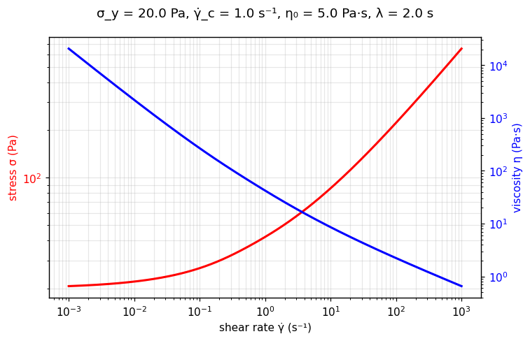

[← All models](index)

# Fitting the TC–Carreau model

> 🧬 **The model itself lives in [rheomodel](https://rheomodel.readthedocs.io/en/latest/models/tc_carreau.html).** Equations, parameters, history, applicability, and references are documented there. In code, `rheofit.models.tc_carreau` is a thin adapter over `rheomodel` — same physics, same parameters. This page is about *fitting* it to your data.

The constitutive equation, for reference:

$$
\sigma = \sigma_y + \sigma_y(\dot{\gamma}/\dot{\gamma}_c)^{1/2} + \eta_0\dot{\gamma}[1+(\lambda\dot{\gamma})^2]^{-1/2}
$$

## 🔬 Interactive explorer

Drag the sliders to feel what each parameter does — the equation you just read, recomputed
live in your browser (Python via WebAssembly, no server involved). Dashed lines show the
three additive terms: the TC yield stress, the TC plastic term, and the Carreau term.
The blue axis shows the apparent viscosity $\eta = \sigma/\dot{\gamma}$.

````{only} builder_html
```{raw} html
<iframe src="../_static/interactive/tc_carreau/index.html" width="100%" height="760" style="border: 1px solid #ddd; border-radius: 8px;" title="TC-Carreau model interactive explorer" loading="lazy"></iframe>
```

*Tip: [open the explorer full-screen](../_static/interactive/tc_carreau/index.html).*
````

*Static preview
($\sigma_y$ = 20 Pa, $\dot{\gamma}_c$ = 1.0 s⁻¹, $\eta_0$ = 5 Pa·s, $\lambda$ = 2.0 s):*



---

## Parameter Fitting Best Practices

1. **Fit TC first, then add Carreau:** a good TC fit isolates what the Carreau term
   must explain — the residual bend at $\dot{\gamma} \sim 1/\lambda$.
2. **Bound $\lambda$ by the data window:** the thinning onset must sit inside the
   measured shear-rate range, or $\lambda$ floats.
3. **Climb the ladder deliberately:** if the extra term's uncertainty exceeds its
   value, the data only support [TC](tc) — step back down.
