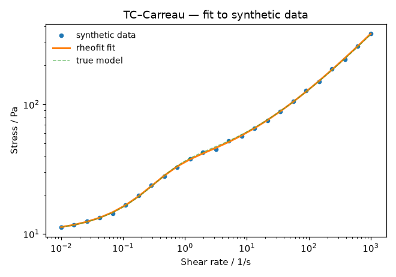

[← All models](index)

# Fitting the TC–Carreau model

> 🧬 **The model itself lives in [rheomodel](https://rheomodel.readthedocs.io/en/latest/models/tc_carreau.html).** Equations, parameters, history, applicability, and references are documented there. In code, `rheofit.models.tc_carreau` is a thin adapter over `rheomodel` — same physics, same parameters. This page is about *fitting* it to data.

The constitutive equation, for reference:

$$
\sigma = \sigma_y + \sigma_y(\dot{\gamma}/\dot{\gamma}_c)^{1/2} + \eta_0\dot{\gamma}[1+(\lambda\dot{\gamma})^2]^{-1/2}
$$

## Worked example

Generate a flow curve from `rheomodel` with known parameters, add 2% noise, and fit it with `rheofit`:

```python
import numpy as np
import pandas as pd
from rheomodel import get_model
import rheofit

# 1. synthetic flow curve from rheomodel: known truth + 2% noise
model = get_model("tc_carreau")
gamma_dot = np.logspace(-2, 3, 25)
true = {"sigma_y": 10.0, "gamma_dot_c": 1.0, "eta_0": 30.0, "lambda_val": 1.5}
rng = np.random.default_rng(0)
stress = model.equation(gamma_dot, **true)
stress = stress * (1 + 0.02 * rng.standard_normal(gamma_dot.size))

# 2. fit it with rheofit
df = pd.DataFrame({"Shear rate / 1/s": gamma_dot, "Stress / Pa": stress})
res = rheofit.fit(df, "tc_carreau", effort="fast", seed=0)

for name, p in res["params"].items():
    print(f"{name:12s} true={true[name]:8.3g}  fit={p['value']:8.3g} ± {p['stderr']:.2g}")
print(f"RedChi2 = {res['redchi']:.2e}")
```

Output:

```
sigma_y      true=      10  fit=    9.98 ± 0.096
gamma_dot_c  true=       1  fit=   0.958 ± 0.025
eta_0        true=      30  fit=    30.9 ± 1.1
lambda_val   true=     1.5  fit=    1.67 ± 0.071
RedChi2 = 2.04e-04
```



## 🔬 Interactive explorer

Drag the sliders to feel what each parameter does — the equation you just read, recomputed
live in your browser (Python via WebAssembly, no server involved). Dashed lines show the
three additive terms: the TC yield stress, the TC plastic term, and the Carreau term.
The blue axis shows the apparent viscosity $\eta = \sigma/\dot{\gamma}$.

````{only} builder_html
```{raw} html
<iframe src="../_static/interactive/tc_carreau/index.html" width="100%" height="760" style="border: 1px solid #ddd; border-radius: 8px;" title="TC-Carreau model interactive explorer" loading="lazy"></iframe>
```

*Tip: [open the explorer full-screen](../_static/interactive/tc_carreau/index.html).*
````

*Static preview
($\sigma_y$ = 20 Pa, $\dot{\gamma}_c$ = 1.0 s⁻¹, $\eta_0$ = 5 Pa·s, $\lambda$ = 2.0 s):*


