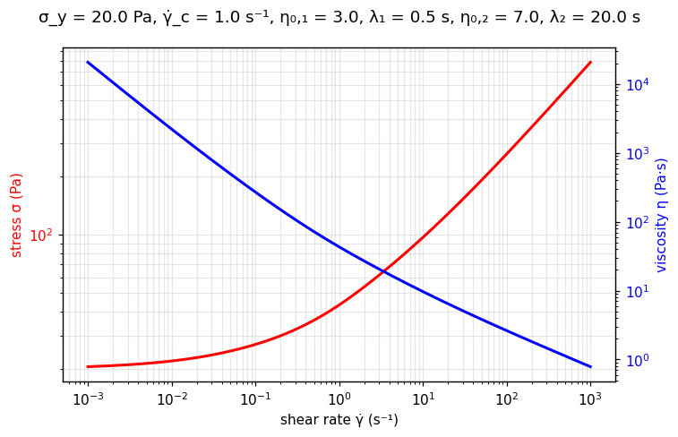

[← All models](index)

# The TCCC Model: Historical Foundations, Physical Mechanics, Limitations, and Fitting Methodologies

## 1. Historical Background and Motivation

The **TCCC** (TC + Carreau + Carreau) model is `rheofit`'s richest
**microstructure-informed rheological model (MIRM)** — a linear combination of the
[TC](tc) model (Caggioni et al., 2020) with **two** [Carreau](carreau) primitives
(Carreau, 1972). It exists for the most demanding consumer-product formulations:
those that deliberately combine a **yield-stress network** with **two distinct
relaxing microstructures** — say a jammed surfactant mesophase, a conditioning
polymer, and an emollient emulsion, each relaxing on its own timescale — to obtain
a tailored texture no simpler model can follow.

TCCC extends [TC-Carreau](tc_carreau) by one more Carreau term, and reduces to it
exactly when $\eta_{0,1} \to 0$ (an exact `PARENT` reduction, unlike the advisory
seeds of the other composite models).

---

## 2. Mathematical Formulation

In pure one-dimensional shear flow:

$$
\sigma = \sigma_y + \sigma_y \left(\frac{\dot{\gamma}}{\dot{\gamma}_c}\right)^{1/2}
\;+\;
\eta_{0,1} \, \dot{\gamma} \left[1 + (\lambda_1 \dot{\gamma})^2\right]^{-1/4}
\;+\;
\eta_{0,2} \, \dot{\gamma} \left[1 + (\lambda_2 \dot{\gamma})^2\right]^{-1/2}
$$

Where:
* $\sigma$ = Total shear stress ($\text{Pa}$)
* $\sigma_y$ = Yield stress ($\text{Pa}$): the jammed network's strength
* $\dot{\gamma}_c$ = Plastic transition rate ($\text{s}^{-1}$): where rearrangements dominate
* $\eta_{0,1}$, $\eta_{0,2}$ = Zero-shear viscosities of Carreau components 1 and 2 ($\text{Pa}\cdot\text{s}$)
* $\lambda_1$, $\lambda_2$ = Relaxation times of Carreau components 1 and 2 ($\text{s}$)
* $\dot{\gamma}$ = Shear rate ($\text{s}^{-1}$)

Four additive terms: **yield**, **plastic** ($\dot{\gamma}^{1/2}$), and **two Carreau
terms** with fixed exponents $-1/4$ and $-1/2$ and distinct relaxation times.

### Asymptotes

* **Low shear**: $\sigma \to \sigma_y$ — the yield stress dominates.
* **High shear**: both Carreau terms saturate (to $\eta_{0,1}\lambda_1^{-1/2}\dot{\gamma}^{1/2}$
  and $\eta_{0,2}/\lambda_2$ respectively), so the curve is yield + bounded
  microstructural stresses + the growing plastic term.

---

## 🔬 Interactive explorer

Drag the sliders to feel what each parameter does — the equation you just read, recomputed
live in your browser (Python via WebAssembly, no server involved). Dashed lines show the
four additive terms: yield, plastic, and the two Carreau components thinning at their own
timescales. The blue axis shows the apparent viscosity $\eta = \sigma/\dot{\gamma}$.

````{only} builder_html
```{raw} html
<iframe src="../_static/interactive/tccc/index.html" width="100%" height="760" style="border: 1px solid #ddd; border-radius: 8px;" title="TCCC model interactive explorer" loading="lazy"></iframe>
```

*Tip: [open the explorer full-screen](../_static/interactive/tccc/index.html).*
````

*Static preview
($\sigma_y$ = 20 Pa, $\dot{\gamma}_c$ = 1.0 s⁻¹, $\eta_{0,1}$ = 3 Pa·s, $\lambda_1$ = 0.5 s,
$\eta_{0,2}$ = 7 Pa·s, $\lambda_2$ = 20 s):*



---

## 3. Physical Foundation

TCCC is the fullest expression of the MIRM idea described on the
{ref}`TC page <mirm>`:
three microstructural populations flowing in parallel — a yielding network plus two
relaxing species — each contributing its own stress term, each fitted parameter
keeping a direct physical readout. It is the top rung of the model ladder:

$$
\text{TC} \;\to\; \text{TC-Carreau} \;\to\; \text{TCCC}
\qquad\text{and}\qquad
\text{Carreau} \;\to\; \text{Carreau-Carreau}
$$

Climb it only when the data demand it. In practice the extra Carreau mode is often
degenerate — when it was tested against TC-Carreau on real formulation data, the
second mode's uncertainty exceeded 100% while barely improving the fit, and the
simpler model won. Flexibility is not free.

---

## 4. Range of Applicable Materials

| Industry / Application | Material Examples | Key Rheological Feature Captured |
| :--- | :--- | :--- |
| **Personal care** | Premium conditioners, styling creams | Yield network + two conditioning polymers/emollients |
| **Home care** | Multi-phase structured detergents | Mesophase yield + dual rheology modifiers |
| **Foods** | Complex dressings, filled sauces | Gel network + two thickener systems |
| **Pharma / cosmetics** | Emulsion creams with polymeric stabilizers | Droplet network yield + polymer + emulsion relaxation |

---

## 5. Intrinsic Limitations

### A. Six parameters — identifiability is the whole game

Two yield/plastic parameters plus two $(\eta_0, \lambda)$ pairs are resolvable only
with wide, clean, well-sampled data showing a yield plateau, a plastic regime, and
two distinct thinning bends. Anything less → degenerate modes and correlated
parameters.

### B. Timescale separation required

If $\lambda_1 \approx \lambda_2$, the Carreau terms merge into one and the model
collapses toward TC-Carreau — which is exactly what the exact parent reduction
says should happen. Let it.

### C. Time-independent

Steady-state only — no thixotropy, aging, or viscoelastic transients, like all
`rheofit` models.

---

## 6. Parameter Fitting Best Practices

1. **Climb from below:** fit [TC](tc), then [TC-Carreau](tc_carreau), then TCCC —
   each rung must beat the last on cross-validated residuals, not just training error.
2. **Seed from the bends:** $\lambda_1$, $\lambda_2$ initial guesses come off the
   viscosity curve at $\dot{\gamma} \sim 1/\lambda_i$; bound them apart.
3. **Kill degenerate modes:** if a Carreau term's relative uncertainty exceeds ~50%,
   drop it and step back down the ladder — parsimony wins.

---

## Verified Literature References

* **Caggioni, M., et al.** (2020). On the elastoplastic transition in soft solids: Unifying the rheology of soft glassy materials. *Journal of Rheology*, 64(3). [https://doi.org/10.1122/8.0000011](https://doi.org/10.1122/8.0000011)

* **Carreau, P. J.** (1972). Rheological equations from molecular network theories. *Transactions of the Society of Rheology*, 16(1), 99–127. [https://doi.org/10.1122/1.549276](https://doi.org/10.1122/1.549276)
