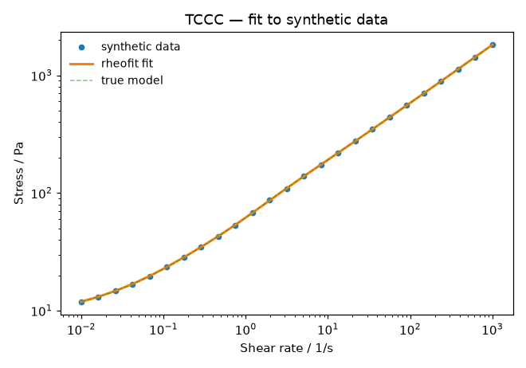
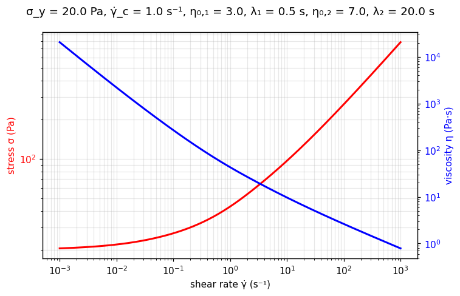

[← All models](index)

# Fitting the TCCC model

> 🧬 **The model itself lives in [rheomodel](https://rheomodel.readthedocs.io/en/latest/models/tccc.html).** Equations, parameters, history, applicability, and references are documented there. In code, `rheofit.models.tccc` is a thin adapter over `rheomodel` — same physics, same parameters. This page is about *fitting* it to data.

The constitutive equation, for reference:

$$
\sigma = \sigma_y + \sigma_y(\dot{\gamma}/\dot{\gamma}_c)^{1/2} + \sum_i \eta_{0,i}\dot{\gamma}[1+(\lambda_i\dot{\gamma})^2]^{-1/4,-1/2}
$$

## Worked example

Six parameters need cleaner data — 0.5% noise here instead of 2%. Generate a flow curve from `rheomodel` with known parameters, add 0.5% noise, and fit it with `rheofit`:

```python
import numpy as np
import pandas as pd
from rheomodel import get_model
import rheofit

# 1. synthetic flow curve from rheomodel: known truth + 0.5% noise
model = get_model("tccc")
gamma_dot = np.logspace(-2, 3, 25)
true = {"sigma_y": 8.0, "gamma_dot_c": 0.05, "eta_0_1": 15.0, "lambda_val_1": 0.5, "eta_0_2": 20.0, "lambda_val_2": 5.0}
rng = np.random.default_rng(0)
stress = model.equation(gamma_dot, **true)
stress = stress * (1 + 0.005 * rng.standard_normal(gamma_dot.size))

# 2. fit it with rheofit
df = pd.DataFrame({"Shear rate / 1/s": gamma_dot, "Stress / Pa": stress})
res = rheofit.fit(df, "tccc", effort="fast", seed=0)

for name, p in res["params"].items():
    print(f"{name:12s} true={true[name]:8.3g}  fit={p['value']:8.3g} ± {p['stderr']:.2g}")
print(f"RedChi2 = {res['redchi']:.2e}")
```

Output:

```
sigma_y      true=       8  fit=     7.8 ± 0.12
gamma_dot_c  true=    0.05  fit=  0.0421 ± 0.0045
eta_0_1      true=      15  fit=      13 ± 1.2
lambda_val_1 true=     0.5  fit=   0.463 ± 0.042
eta_0_2      true=      20  fit=      17 ± 3.3
lambda_val_2 true=       5  fit=    4.78 ± 0.8
RedChi2 = 1.71e-05
```



## 🔬 Interactive explorer

Drag the sliders to feel what each parameter does — the equation you just read, recomputed
live in your browser (Python via WebAssembly, no server involved). Dashed lines show the
four additive terms: yield, plastic, and the two Carreau components thinning at their own
timescales. The blue axis shows the apparent viscosity $\eta = \sigma/\dot{\gamma}$.

````{only} builder_html
```{raw} html
<iframe src="../_static/interactive/tccc/index.html" width="100%" height="760" style="border: 1px solid #ddd; border-radius: 8px;" title="TCCC model interactive explorer" loading="lazy"></iframe>
```

*Tip: [open the explorer full-screen](../_static/interactive/tccc/index.html).*
````

*Static preview
($\sigma_y$ = 20 Pa, $\dot{\gamma}_c$ = 1.0 s⁻¹, $\eta_{0,1}$ = 3 Pa·s, $\lambda_1$ = 0.5 s,
$\eta_{0,2}$ = 7 Pa·s, $\lambda_2$ = 20 s):*


