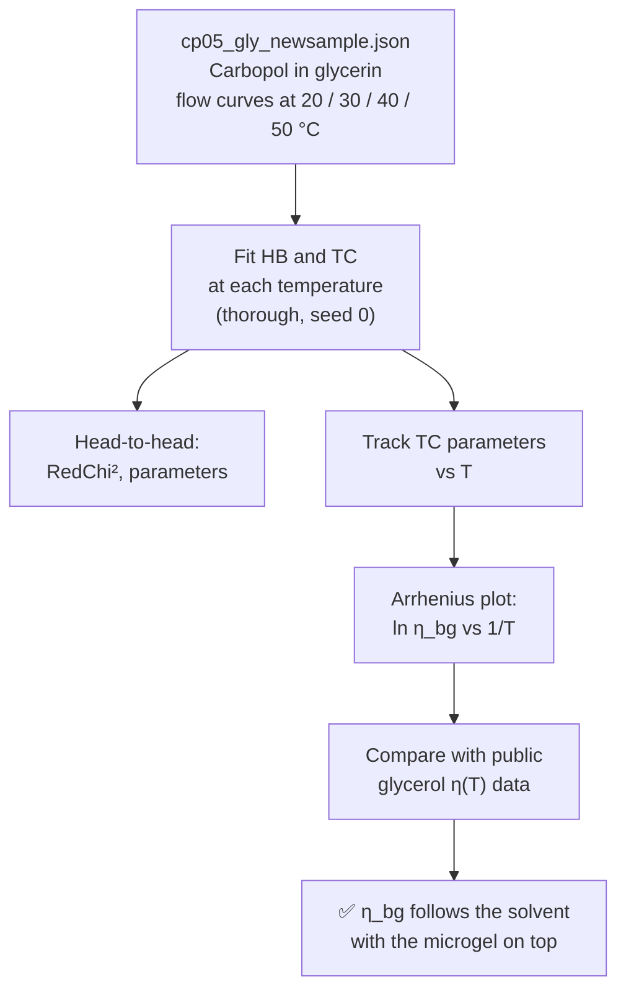
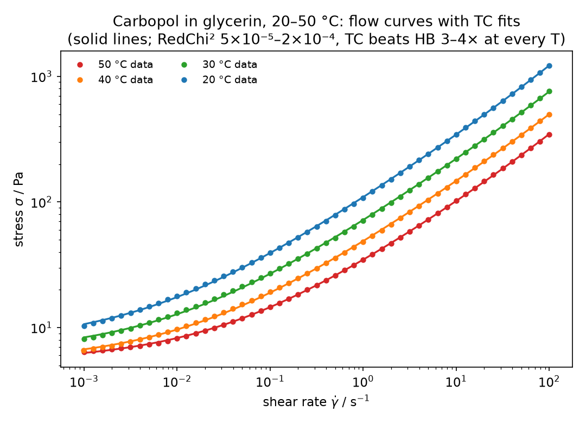
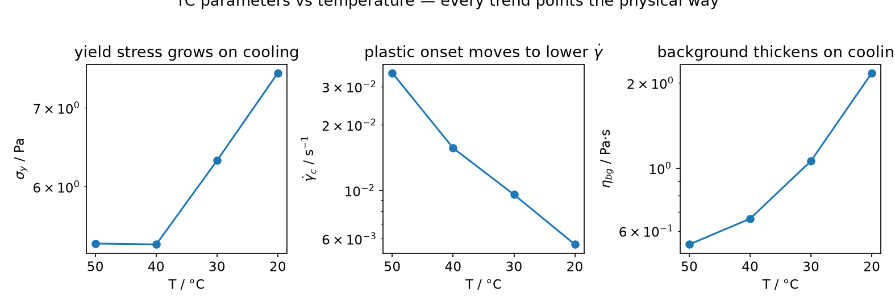
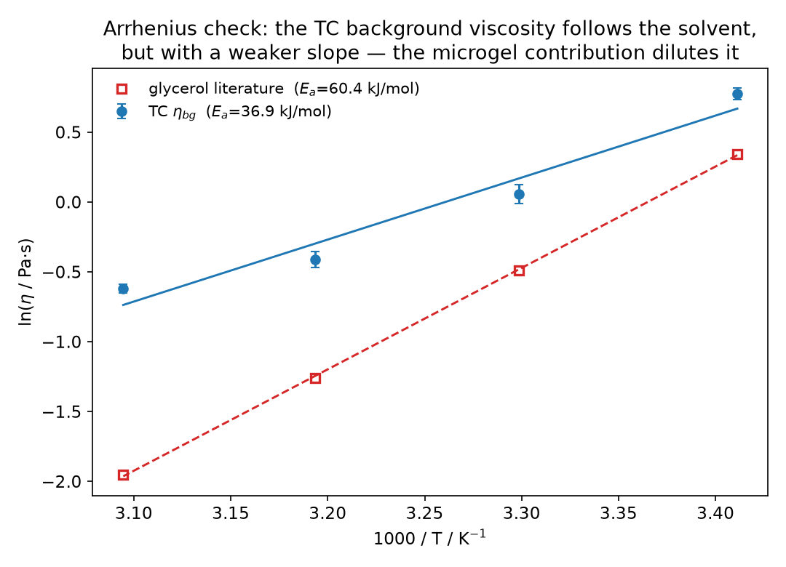

# 🍯🌡️ Walkthrough: the viscous background, measured at four temperatures — HB vs TC on Carbopol in glycerin

*A single flow curve can tell you a viscous background exists. A temperature series lets you
prove it: fit the TC model at 20, 30, 40 and 50 °C, extract the background viscosity
η_bg(T), and check whether it follows the solvent's Arrhenius law. It does — with a twist
that reveals the microgel's own contribution.*

## 🧪 The dataset

`cp05_gly_newsample.json` (attached to [issue #27](https://github.com/rheopy/rheofit/issues/27),
archived here as `walkthrough/cp05_gly_newsample.json`) holds **four equilibrium flow
curves of Carbopol in glycerin at 20, 30, 40 and 50 °C** — 51 points each, 0.001 to
100 s⁻¹, measured on a Peltier plate with 200 s thermal soaks between steps.

```python
import rheofit

rheofit.print_steps("walkthrough/cp05_gly_newsample.json")
dfs = {T: rheofit.load_step("walkthrough/cp05_gly_newsample.json", i)
       for i, T in enumerate([50, 40, 30, 20])}
```

````{only} builder_html

````

```{only} not builder_html

```

## 🥊 Head-to-head: HB vs TC at every temperature

```python
fits = {T: {"hb": rheofit.fit(df, "herschel_bulkley", effort="thorough", seed=0),
            "tc": rheofit.fit(df, "tc", effort="thorough", seed=0)}
        for T, df in dfs.items()}
```

| T (°C) | HB RedChi² | TC RedChi² | TC σ_y (Pa) | TC γ̇_c (s⁻¹) | TC η_bg (Pa·s) |
|--------|-----------|-----------|-------------|---------------|----------------|
| 50 | 1.45×10⁻⁴ | **5.26×10⁻⁵** | 5.368 ± 0.016 | 0.03464 ± 0.00034 | 0.538 ± 0.017 |
| 40 | 4.20×10⁻⁴ | **1.22×10⁻⁴** | 5.358 ± 0.027 | 0.01564 ± 0.00025 | 0.663 ± 0.037 |
| 30 | 5.85×10⁻⁴ | **2.05×10⁻⁴** | 6.314 ± 0.046 | 0.00956 ± 0.00021 | 1.060 ± 0.072 |
| 20 | 6.12×10⁻⁴ | **1.42×10⁻⁴** | 7.494 ± 0.052 | 0.00564 ± 0.00011 | 2.169 ± 0.093 |

On this dataset there is no contest: **TC beats HB by 3–4× at every temperature**, and
every parameter is tightly identified (worst relative error ≈ 7% on η_bg at 30 °C).
The HB fits are respectable — n ≈ 0.52 at all temperatures, the classic Carbopol
shear-thinning signature, independent of T — but TC's explicit background term earns its
keep here.



## 📈 Every TC parameter trends the physical way



- **σ_y grows on cooling** (5.37 → 7.49 Pa): the microgel network strengthens.
- **γ̇_c falls on cooling** (0.035 → 0.0056 s⁻¹): the plastic √γ̇ term takes over at
  progressively lower shear rates as the background thickens.
- **η_bg thickens on cooling** (0.54 → 2.17 Pa·s): the background viscosity itself is
  strongly temperature-dependent — which is exactly what you expect if it is the solvent.

## 🌡️ The Arrhenius test

If η_bg really is the continuous phase (plus whatever the microgel adds at high shear),
it should follow the solvent's temperature law. Glycerol is famously Arrhenius-like:

$$\ln \eta = \ln A + \frac{E_a}{R\,T}$$

Public glycerol data (Segur & Oberstar 1951: 1.412, 0.612, 0.284, 0.142 Pa·s at
20/30/40/50 °C) give a textbook straight line with **E_a = 60.4 kJ/mol** (R² = 0.9998).
The TC background viscosities fall on a clean line too — with **E_a = 36.9 kJ/mol**
(R² = 0.957).



Two things to read off this plot:

1. **η_bg tracks the solvent, always above it.** The ratio η_bg/η_glycerol runs
   1.54 (20 °C) → 1.73 → 2.33 → 3.79 (50 °C): the background is glycerin *plus* the
   Carbopol microgel's own high-shear contribution.
2. **The slope is weaker (36.9 vs 60.4 kJ/mol) — and that makes sense.** The microgel
   contribution is only weakly temperature-dependent, so it dilutes the solvent's steep
   Arrhenius slope. At 20 °C the thick solvent dominates the background; at 50 °C the
   solvent has thinned tenfold and the microgel carries a larger share — hence the
   growing ratio.

This is the payoff of the three-component decomposition: a single number per
temperature, η_bg, that you can hold up against an independent physical measurement and
have it check out.

## 🎯 Takeaways

- **TC beats HB 3–4× on RedChi² at every temperature** — when the continuous phase is
  viscous, the explicit η_bg term is not a luxury, it is the model.
- **η_bg(T) is Arrhenius with E_a = 36.9 kJ/mol**, weaker than pure glycerol's
  60.4 kJ/mol — the microgel's own high-shear contribution dilutes the solvent slope.
- **η_bg/η_glycerol = 1.5 → 3.8 from 20 to 50 °C**: the solvent dominates the
  background when cold; the microgel matters relatively more when hot.
- **HB's n ≈ 0.52 is T-independent** — the microstructure's shear-thinning signature —
  while its K and σ_y absorb everything else. TC separates the physics instead of
  smearing it.

## 📚 References

- W. H. Herschel & R. Bulkley, "Konsistenzmessungen von Gummi-Benzollösungen",
  *Kolloid-Z.* **39**, 291–300 (1926). [doi:10.1007/BF01432034](https://doi.org/10.1007/BF01432034)
- J. B. Segur & H. E. Oberstar, "Viscosity of Glycerol and Its Aqueous Solutions",
  *Ind. Eng. Chem.* **43**, 2117–2120 (1951). [doi:10.1021/ie50501a040](https://doi.org/10.1021/ie50501a040)
- Glycerol data page (viscosity 1.412 Pa·s at 20 °C): <https://en.wikipedia.org/wiki/Glycerol_(data_page)>
- The TC (three-component) model is documented in rheofit's [TC model page](models/tc).
