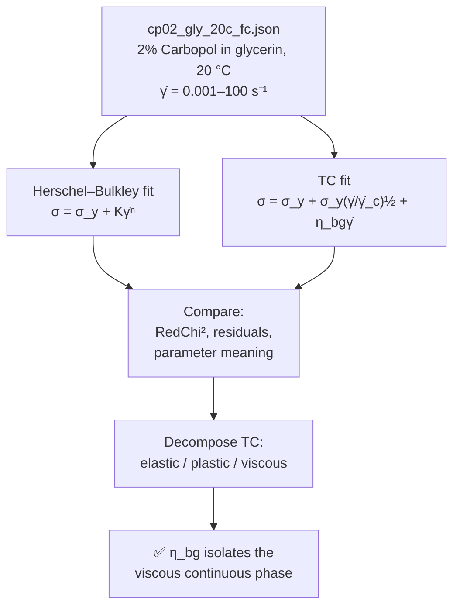
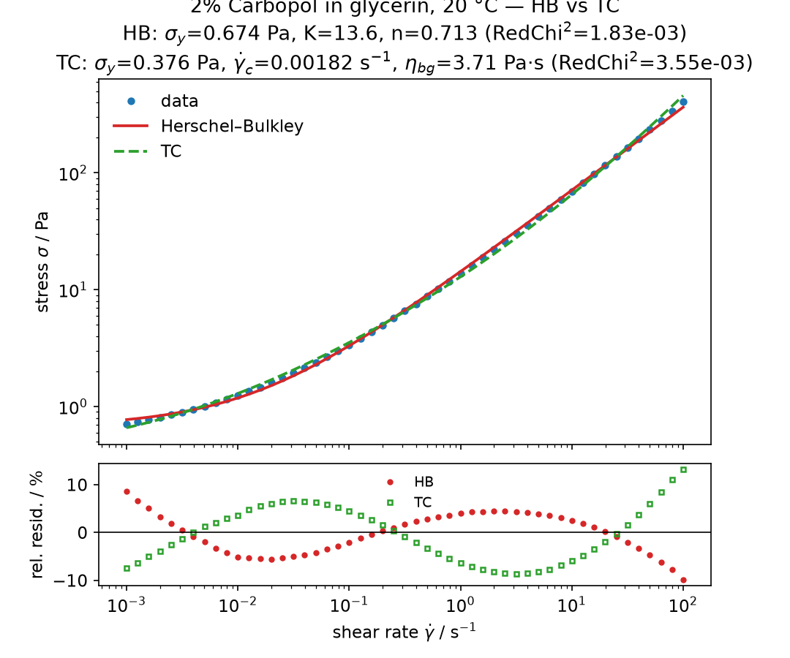
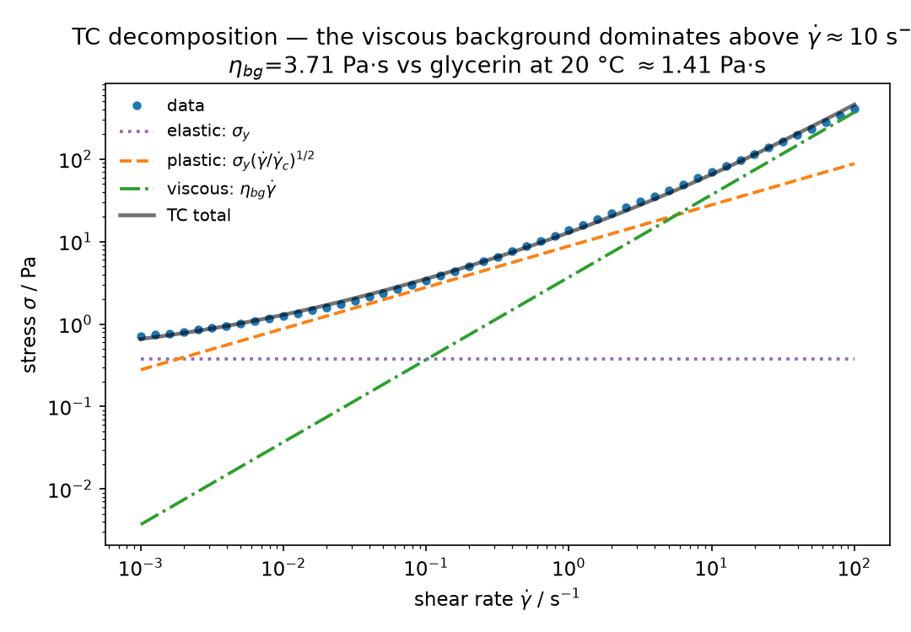
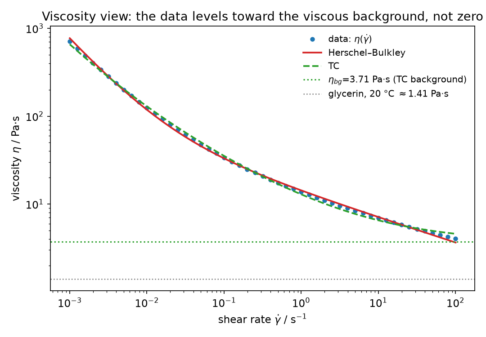

# 🍯 Walkthrough: yield stress in a viscous sea — HB vs TC on 2% Carbopol in glycerin

*Carbopol in water is the textbook yield-stress fluid. Put the same microgel in glycerin —
a continuous phase a thousand times more viscous — and the flow curve changes character.
This case study fits Herschel–Bulkley and the three-component (TC) model side by side and
shows how the TC decomposition isolates exactly what the viscous background is doing.*

## 🧪 The dataset

`cp02_gly_20c_fc.json` (attached to [issue #27](https://github.com/rheopy/rheofit/issues/27), archived here
as `walkthrough/cp02_gly_20c_fc.json`) holds an equilibrium flow curve of **2% Carbopol in
glycerin** at **20 °C**: 51 points from 0.001 to 100 s⁻¹.

```python
import rheofit

rheofit.print_steps("walkthrough/cp02_gly_20c_fc.json")
df = rheofit.load_step("walkthrough/cp02_gly_20c_fc.json", 0)  # flow curve
```

Compare with the [original Carbopol case study](walkthrough) — same polymer, but there the
continuous phase was water (≈1 mPa·s) and here it is glycerin (≈1.41 Pa·s at 20 °C). That
single change rewrites the high-shear half of the flow curve.

````{only} builder_html

````

```{only} not builder_html

```

## 🥊 Head-to-head: HB vs TC

```python
hb = rheofit.fit(df, "herschel_bulkley", effort="thorough", seed=0)
tc = rheofit.fit(df, "tc", effort="thorough", seed=0)
```

| Model | σ_y (Pa) | 2nd param | 3rd param | RedChi² | cond |
|-------|----------|-----------|-----------|---------|------|
| Herschel–Bulkley | 0.674 ± 0.014 | K = 13.65 ± 0.12 Pa·sⁿ | n = 0.713 ± 0.004 | 1.83×10⁻³ | 3.5 |
| TC | 0.376 ± 0.021 | γ̇_c = 0.00182 ± 0.00027 s⁻¹ | η_bg = 3.71 ± 0.10 Pa·s | 3.55×10⁻³ | 16.2 |

Both fits are clean and fully identified. Honestly, HB wins on statistics alone — but the
two models disagree on the *physics*, and that disagreement is the interesting part:



## 🔍 Reading the parameters: where the glycerin shows up

**HB's exponent tells on the background.** In water, Carbopol thins hard (n ≈ 0.4–0.5).
Here n = 0.713 — the curve thins *less* steeply because a large Newtonian background props
up the high-shear stress. HB has no separate knob for that background, so it smears the
effect into K and n.

**TC names the background.** The TC model splits the stress into three additive
contributions — a constant elastic term (the yield stress), a plastic term growing as
√γ̇, and a Newtonian viscous term:

$$\sigma = \sigma_y + \sigma_y\left(\frac{\dot{\gamma}}{\dot{\gamma}_c}\right)^{1/2} + \eta_{bg}\,\dot{\gamma}$$



The decomposition shows the handoff directly: the plastic term carries the mid-range, and
above $\dot{\gamma} \approx$ 10 s⁻¹ the **viscous term $\eta_{bg}\dot{\gamma}$ dominates**.
The fitted background viscosity is **η_bg = 3.71 Pa·s** — about 2.6× the viscosity of
pure glycerin at 20 °C (≈1.41 Pa·s). The excess is the Carbopol microgel's own
contribution to the high-shear viscosity, riding on top of the solvent.

**The two yield stresses differ, and TC's is the honest one.** HB reports σ_y = 0.67 Pa;
TC reports σ_y = 0.38 Pa. Part of what HB attributes to yielding is, in TC's accounting,
viscous stress from the glycerin background that is already present at low shear rates.
When the continuous phase is this viscous, "yield stress" from a two-parameter-style fit
is partly background in disguise.

The viscosity view makes the same point from the other side: the data levels off toward
the TC background instead of thinning toward zero, and HB — with no plateau parameter —
is forced to keep bending downward.



## 🎯 Takeaways

- **The continuous phase sets the high-shear story.** In water the background is
  negligible; in glycerin it dominates above ~10 s⁻¹. Same microgel, different fluid.
- **HB fits slightly better here (RedChi² 1.8×10⁻³ vs 3.6×10⁻³) but explains less.**
  Its n = 0.713 quietly absorbs the background viscosity into the power law.
- **TC's η_bg = 3.71 Pa·s isolates the physics the issue asked about**: a viscous
  background ≈2.6× pure glycerin, with the microgel contributing the rest.
- **Yield stress is model-dependent when the background is viscous.** TC's σ_y = 0.38 Pa
  vs HB's 0.67 Pa — the difference is background viscous stress that HB books as yield.

## 📚 References

- W. H. Herschel & R. Bulkley, "Konsistenzmessungen von Gummi-Benzollösungen",
  *Kolloid-Z.* **39**, 291–300 (1926). [doi:10.1007/BF01432034](https://doi.org/10.1007/BF01432034)
- The TC (three-component) model is documented in rheofit's [TC model page](models/tc).
