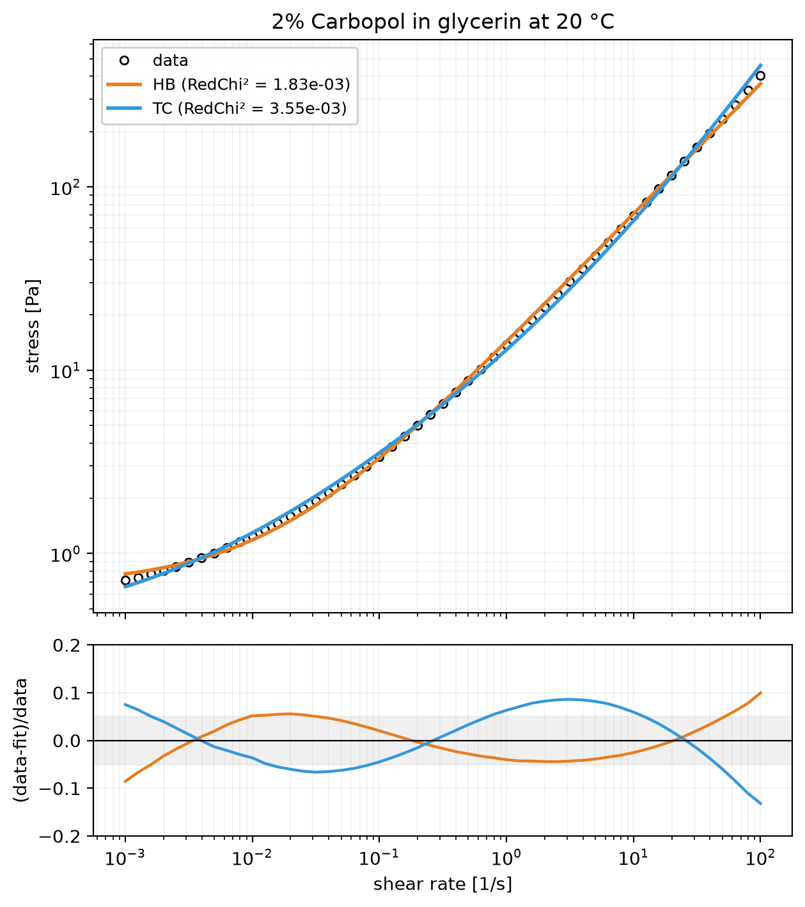
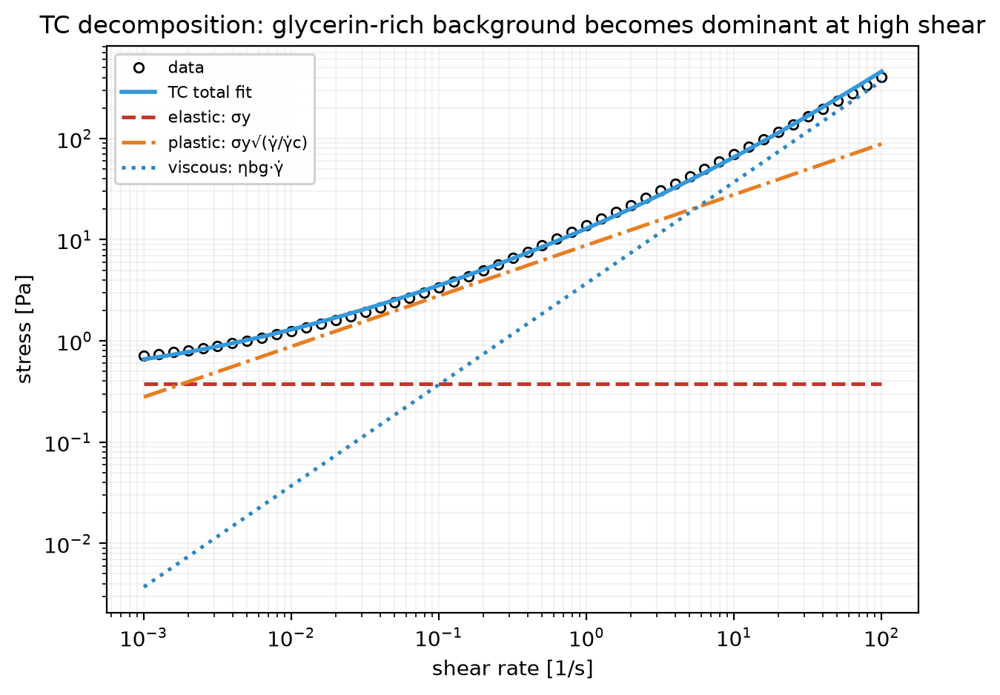

# 🧪 Walkthrough: Herschel–Bulkley and TC fits for 2% Carbopol in glycerin

*A viscous continuous phase changes what the flow curve means. This walkthrough uses a
single 20 °C flow sweep of **2% Carbopol in glycerin** to show, step by step, what you
learn from a classical Herschel–Bulkley fit and what you gain when you also fit the
physically split TC model.*

## 🧾 The sample data

The TRIOS JSON for this example is archived in the docs as
`walkthrough/cp02_gly_20c_fc.json` (added from [issue #27](https://github.com/rheopy/rheofit/issues/27)).
It contains one equilibrium flow sweep:

| # | Step | Range | Points | Temperature |
|---|------|-------|--------|-------------|
| 0 | Flow sweep - 1 | 0.001 → 100 1/s | 51 | 20 °C |

This is a useful teaching sample because Carbopol contributes a yield-stress microgel
network, while glycerin raises the continuous-phase viscosity enough that the high-shear
tail is no longer a small correction.

## 1. Load and process the sample

Start with step discovery, then load the single flow-curve step:

```python
import rheofit

rheofit.print_steps("walkthrough/cp02_gly_20c_fc.json")
df = rheofit.load_step("walkthrough/cp02_gly_20c_fc.json", 0)
```

`load_step()` standardizes the TRIOS column names to the ones used throughout `rheofit`:

- `Shear rate / 1/s`
- `Stress / Pa`
- `Viscosity / Pa.s`

For this file the detected `test_type` is `flow_curve`, all 51 rows are usable, and no
points are dropped during fitting.

## 2. Fit Herschel–Bulkley (HB)

The [Herschel–Bulkley model](models/herschel_bulkley)

$$\sigma = \sigma_y + K \dot{\gamma}^n$$

is the standard engineering baseline for a structured material with yield stress and
power-law flow above yield.

```python
hb = rheofit.fit(df, "herschel_bulkley", effort="thorough", seed=0)
```

| Parameter | Value | Rel. error | Reading |
|---|---:|---:|---|
| σ_y | 0.674 Pa | 2.0 % | small fitted yield offset |
| K | 13.65 Pa·sⁿ | 0.9 % | consistency of the post-yield curve |
| n | 0.713 | 0.5 % | comparatively shallow high-shear thinning |

**RedChi² = 1.83×10⁻³**, with no fit warnings.

### How to read the HB result

- The fit is clean and numerically strong.
- The fitted yield stress is **small** compared with the total stress over most of the
  measured window.
- The exponent **n ≈ 0.71** is doing a lot of work: it is not just describing Carbopol's
  yielding, it is also compensating for the viscous glycerin-rich background.

That is the HB trade-off on this sample: one exponent must absorb several physical effects.

## 3. Fit TC

The [TC model](models/tc)

$$\sigma = \sigma_y + \sigma_y\sqrt{\dot{\gamma}/\dot{\gamma}_c} + \eta_{bg}\dot{\gamma}$$

separates the response into elastic, plastic, and viscous contributions.

```python
tc = rheofit.fit(df, "tc", effort="thorough", seed=0)
```

| Parameter | Value | Rel. error | Reading |
|---|---:|---:|---|
| σ_y | 0.376 Pa | 5.6 % | elastic yield plateau |
| γ̇_c | 1.82×10⁻³ 1/s | 14.9 % | onset scale for the plastic √γ̇ term |
| η_bg | 3.71 Pa·s | 2.7 % | viscous background from the continuous phase |

**RedChi² = 3.55×10⁻³**, with no fit warnings.

### How to read the TC result

- The fit is still good, though not quite as close as HB on this dataset.
- The key payoff is **η_bg = 3.71 Pa·s**: the model gives the viscous background its own
  parameter instead of hiding it inside an empirical exponent.
- In this sample the viscous term is already comparable to the elastic term by
  **γ̇ ≈ 0.10 1/s**, exceeds the plastic term by **γ̇ ≈ 5.7 1/s**, carries about
  **57 %** of the stress at **10 1/s**, and about **81 %** at **100 1/s**.

That is exactly the signature of a yield-stress fluid with a strongly viscous continuous phase.

## 4. Compare the two fits

| model | RedChi² | main message |
|---|---:|---|
| Herschel–Bulkley | **1.83×10⁻³** | best empirical description of the whole curve |
| TC | 3.55×10⁻³ | explicit elastic / plastic / viscous split |



HB wins slightly on relative error, but the residual comparison is only part of the story.
For formulation work, TC exposes the parameter that matters most here: the continuous-phase
viscosity contribution.

## 5. Interpret the TC decomposition



The TC terms show how the balance changes across the sweep:

- **Low shear**: the response is mostly elastic + plastic, so the sample still behaves like a
  structured Carbopol gel.
- **Intermediate shear**: the plastic term dominates as the microgel network rearranges.
- **High shear**: the **η_bg γ̇** term takes over, which is the glycerin-rich continuous phase
  making itself felt directly in the stress.

This is the practical difference between the models: HB says *what the curve looks like*,
while TC says *which mechanism is carrying the stress*.

## 6. Why the viscous continuous phase matters

This sample is a good reminder that a yield-stress material is not defined by its low-shear
plateau alone. Once the continuous phase is viscous enough, the high-shear branch contains
important extra physics:

- In **HB**, that physics is folded into **K** and especially **n**.
- In **TC**, it is assigned to **η_bg**, which is much easier to connect back to formulation.

So if the question is *"Which model reproduces the curve best with three parameters?"*,
HB is slightly better here. But if the question is *"How much of the stress at useful
processing rates is coming from the background liquid?"*, TC is the more revealing model.

## 🎯 Takeaways

- `walkthrough/cp02_gly_20c_fc.json` is a compact reference example for a **yield-stress
  fluid with a viscous continuous phase**.
- **HB** gives the tighter overall fit on this sweep, but its exponent is an empirical
  compromise across yielding and viscous dissipation.
- **TC** gives a slightly looser fit, but it isolates the physically important background
  viscosity: **η_bg ≈ 3.71 Pa·s**.
- For this sample, the viscous term becomes dominant within the measured window, so any
  interpretation that ignores the continuous phase will miss part of the material story.
