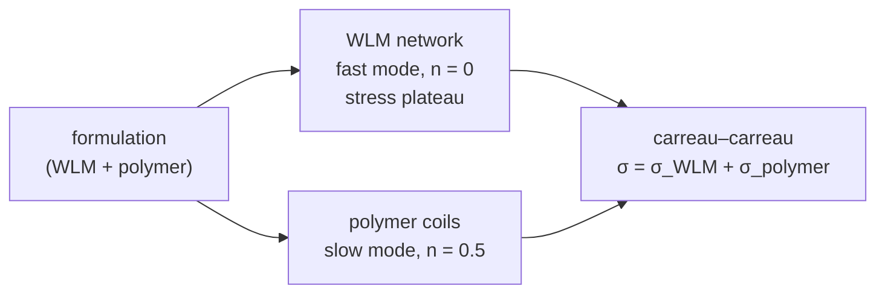
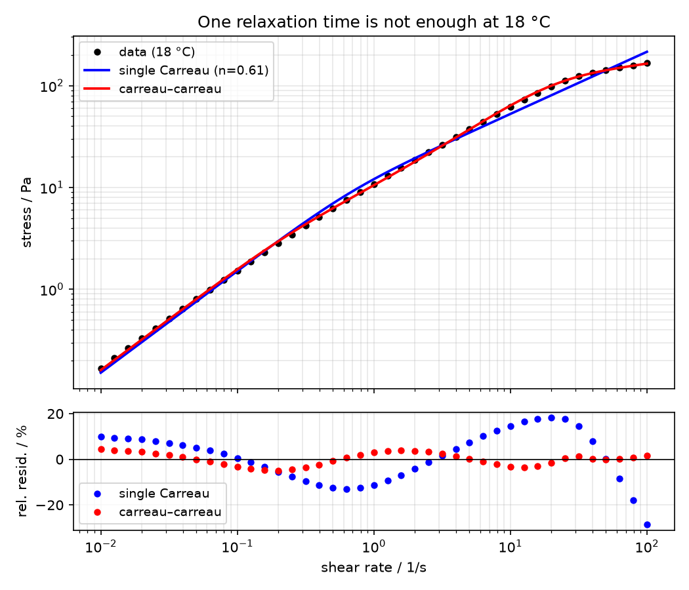
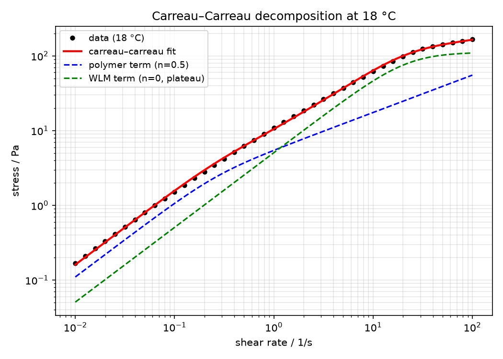
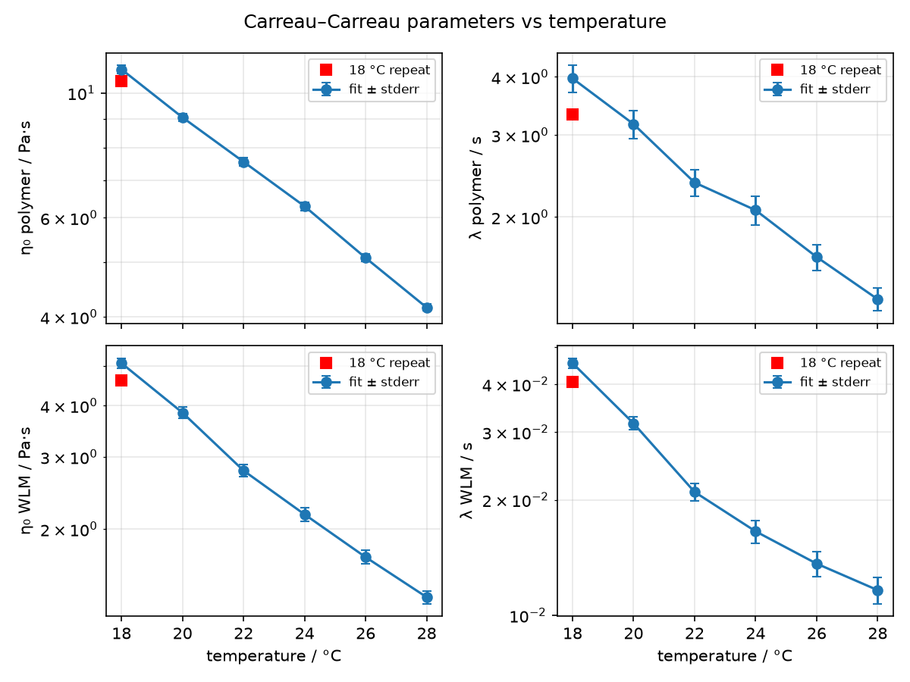

# 🧭 Walkthrough: two microstructures, two relaxation times — `carreau_carreau` on a wormlike-micelle + polymer system

*When a formulation mixes microstructures, the model should too. A temperature-series case study
showing why a single Carreau model fails on a mixed wormlike-micelle/polymer surfactant system —
and how the microstructure-informed `carreau_carreau` model succeeds, with parameters that track
temperature like they mean it.*

## 🧪 The dataset

`aos_2_1.json` (attached to [issue #20](https://github.com/rheopy/rheofit/issues/20), archived here
as `walkthrough/aos_2_1.json`) holds equilibrium flow curves of a mixed surfactant system:
**wormlike micelles (WLM) plus a polymer solution**. Seven flow sweeps at
**18, 20, 22, 24, 26, 28 °C — plus a repeat at 18 °C** — 41 points each from 0.01 to 100 1/s.
The curves carry at least two distinct relaxation times, and that is exactly what makes them
interesting.

```python
import rheofit

rheofit.print_steps("walkthrough/aos_2_1.json")
df18 = rheofit.load_step("walkthrough/aos_2_1.json", 0)  # 18 °C
res = rheofit.fit(df18, "carreau_carreau", effort="thorough", seed=0)
```

## 🤔 The modeling assumption

Assume the WLM contribution can be decoupled from the polymer contribution, and give each its own
Carreau mode with a **fixed** exponent:

- **WLM → stress plateau** at high shear rates → Carreau with **n = 0**
- **polymer → shear-thinning without a plateau** → Carreau with **n = 0.5**

That is precisely the [`carreau_carreau`](models/carreau_carreau) model — a microstructure-informed
(MIRM) sum of two Carreau terms:

σ = η₀₁·γ̇·[1 + (λ₁·γ̇)²]^(−¼) + η₀₂·γ̇·[1 + (λ₂·γ̇)²]^(−½)



## 📉 One Carreau is not enough — 18 °C

Fit a single Carreau model at 18 °C and it does its honest best: η₀ = 15.2 Pa·s, λ = 1.50 s,
**n = 0.61** — a compromise exponent stuck halfway between the plateau mode (n = 0) and the
polymer mode (n = 0.5). Reduced χ² = 1.29e-2, and the residuals trace a systematic S-shape:
the model cannot bend twice.



## ✅ `carreau_carreau` at 18 °C

| parameter | value | ± stderr |
|---|---|---|
| η₀,₁ (polymer) | 11.01 Pa·s | 1.7% |
| λ₁ (polymer) | 3.97 s | 6.7% |
| η₀,₂ (WLM) | 5.08 Pa·s | 2.9% |
| λ₂ (WLM) | 0.0454 s | 3.0% |

Reduced χ² = **8.28e-4** — about **15× better** than the single Carreau — with condition
number 11.6: every parameter identified, no degeneracy. The two relaxation times sit ~90×
apart, exactly the separation the data demanded.



The decomposition tells the physical story: a slow polymer mode (λ ≈ 4 s) carrying the
low-shear viscosity, plus a fast WLM mode (λ ≈ 0.05 s) that flattens into its stress
plateau (σ → η₀,₂/λ₂ ≈ 112 Pa) at high shear rates.

## 🌡️ Across temperatures: the parameters behave

Fitting all seven sweeps independently gives a strikingly orderly picture:

| T / °C | η₀,₁ / Pa·s | λ₁ / s | η₀,₂ / Pa·s | λ₂ / s | Red. χ² (cc) | Red. χ² (1× Carreau) |
|---|---|---|---|---|---|---|
| 18 | 11.01 | 3.97 | 5.08 | 0.0454 | 8.3e-4 | 1.29e-2 |
| 20 | 9.05 | 3.17 | 3.84 | 0.0316 | 9.8e-4 | 8.2e-3 |
| 22 | 7.54 | 2.37 | 2.78 | 0.0210 | 1.0e-3 | 2.9e-3 |
| 24 | 6.29 | 2.07 | 2.17 | 0.0166 | 1.3e-3 | 1.5e-3 |
| 26 | 5.09 | 1.64 | 1.71 | 0.0136 | 1.0e-3 | 6.8e-4 |
| 28 | 4.16 | 1.33 | 1.37 | 0.0116 | 8.1e-4 | 3.3e-4 |
| 18 (repeat) | 10.49 | 3.33 | 4.60 | 0.0405 | 9.6e-4 | 1.0e-2 |



Both relaxation times shorten with temperature and both zero-shear viscosities fall —
the expected thermal softening, cleanly separated per microstructure. The 18 °C repeat
(red squares) lands on top of the first run. And there is a bonus insight hidden in the
last two columns: as temperature rises, the WLM contribution weakens and the single
Carreau becomes competitive — **the data itself tells you when the second microstructure
mode stops mattering**. The MIRM is not an article of faith; it is a hypothesis the
temperature series can falsify.

## 💡 Takeaway

Formulations are mixtures of microstructures, and their flow curves are mixtures of
relaxation modes. A single-mode model forced onto such data returns a compromise —
an exponent of 0.61 that describes neither the micelles nor the polymer. The
microstructure-informed sum fits the physics instead of averaging it, and its parameters
repay the effort by moving with temperature the way real material parameters should.

*Dataset: `walkthrough/aos_2_1.json` (via issue #20). Fits: `rheofit.fit(...,
"carreau_carreau", effort="thorough", seed=0)` with rheofit 1.0.2.*
