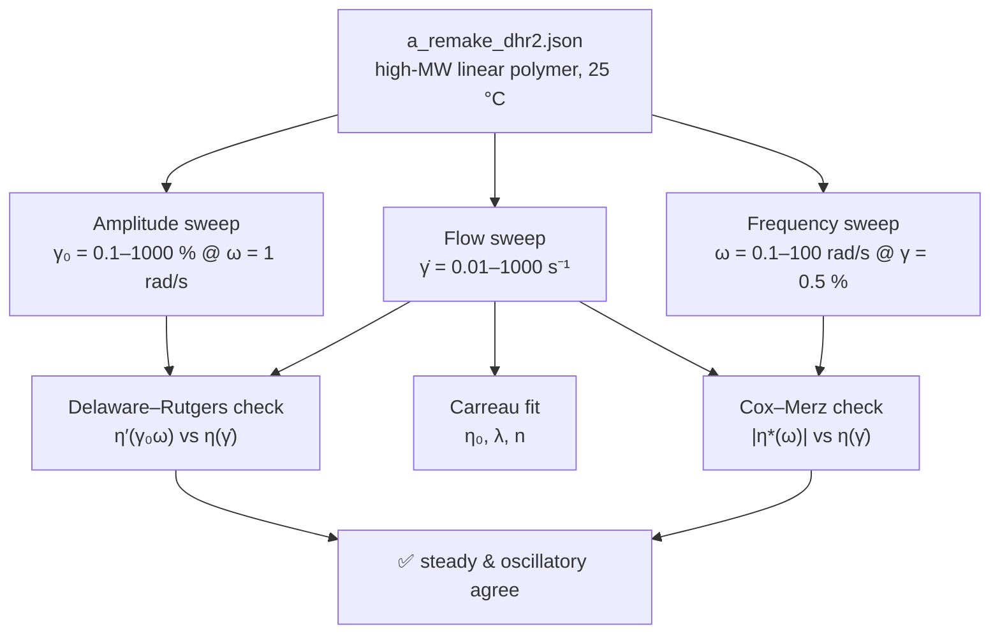
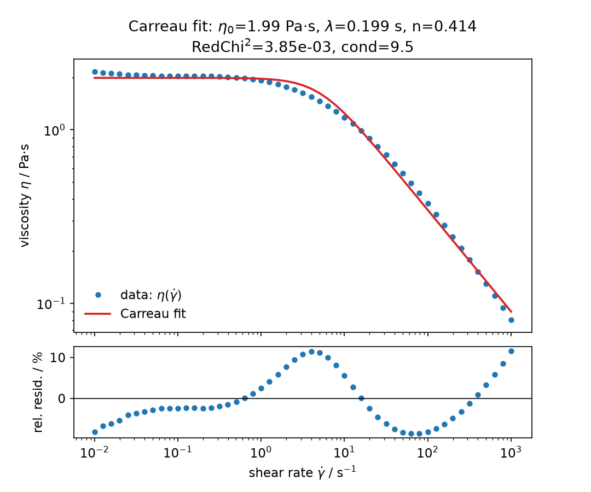
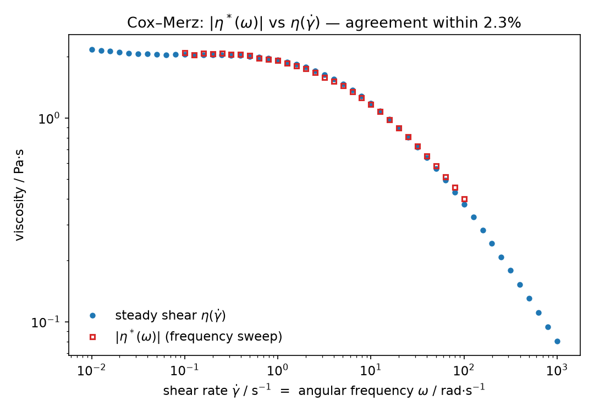
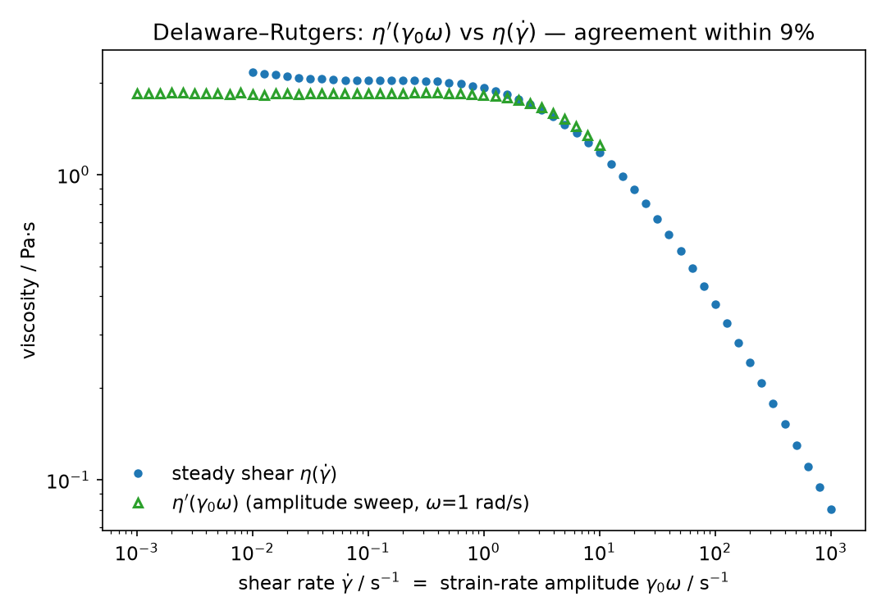
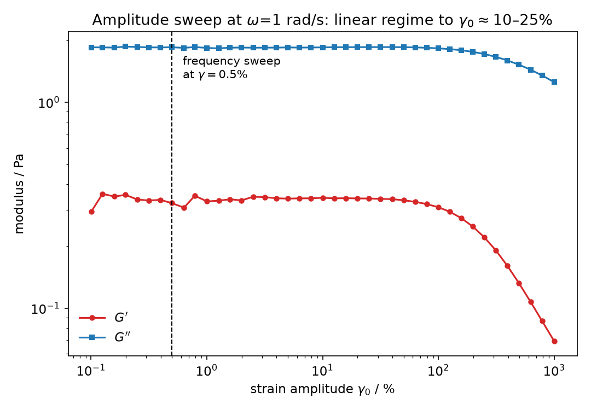

# 🌀 Walkthrough: one polymer, three experiments — Carreau fitting meets Cox–Merz and Delaware–Rutgers

*Steady shear says how a polymer solution flows; oscillation says how it relaxes. For a
high-molecular-weight linear polymer in water, the two stories should be the same story —
and with `rheofit` you can check, quantitatively, that they are.*

## 🧪 The dataset

`a_remake_dhr2.json` (attached to [issue #25](https://github.com/rheopy/rheofit/issues/25), archived here
as `walkthrough/a_remake_dhr2.json`) holds three equilibrium experiments on a **high molecular
weight linear polymer in aqueous solution** at **25 °C**:

| # | Step | Range | Points |
|---|------|-------|--------|
| 0 | Amplitude sweep | strain 0.1 → 1000 % at ω = 1 rad/s | 41 |
| 1 | Flow sweep | shear rate 1000 → 0.01 s⁻¹ | 51 |
| 2 | Frequency sweep | ω = 100 → 0.1 rad/s at γ = 0.5 % | 31 |

```python
import rheofit

rheofit.print_steps("walkthrough/a_remake_dhr2.json")
flow = rheofit.load_step("walkthrough/a_remake_dhr2.json", 1)  # flow curve
amp  = rheofit.load_step("walkthrough/a_remake_dhr2.json", 0)  # amplitude sweep
freq = rheofit.load_step("walkthrough/a_remake_dhr2.json", 2)  # frequency sweep
```

````{only} builder_html

````

```{only} not builder_html

```

## 📐 The Carreau model

The [Carreau](models/carreau) model describes a fluid with a zero-shear plateau that thins
toward a power law at high shear rates:

$$\eta(\dot{\gamma}) = \eta_0 \left[1 + (\lambda \dot{\gamma})^2\right]^{(n-1)/2}$$

Each parameter has a direct physical reading: **η₀** is the zero-shear viscosity of the
fully entangled network, **λ** is the characteristic relaxation time (thinning sets in at
$\dot{\gamma}_c = 1/\lambda$), and **n** is the high-shear power-law exponent. Fitting the
flow curve is one line:

```python
res = rheofit.fit(flow, "carreau", effort="thorough", seed=0)
```

| Parameter | Value | Rel. error | Physical meaning |
|-----------|-------|-----------|------------------|
| η₀ | 1.992 Pa·s | 1.3 % | zero-shear plateau |
| λ | 0.199 s | 6.2 % | relaxation time → thinning above γ̇ ≈ 5 s⁻¹ |
| n | 0.414 | 2.3 % | power-law exponent in the thinning regime |

RedChi² = 3.85×10⁻³, condition number 9.5 — a clean, fully identified fit. The residuals
show a mild S-shape (±10 %), the honest signature of a real polymer solution against the
idealized Carreau form, not a fitting failure.



## 🔁 Cox–Merz: the frequency sweep predicts the flow curve

In 1958, Cox and Merz noticed something remarkable for polymer melts and solutions: the
**steady-shear viscosity equals the magnitude of the complex viscosity** when shear rate
and angular frequency are matched —

$$\eta(\dot{\gamma}) = |\eta^*(\omega)|\Big|_{\omega=\dot{\gamma}}$$

— even though one is a nonlinear steady measurement and the other comes from small,
linear oscillations. No deep theory demanded it; the data did
([Cox & Merz, 1958](https://doi.org/10.1002/pol.1958.1202811812)).

Plotting $|\eta^*(\omega)|$ from the frequency sweep directly onto $\eta(\dot{\gamma})$
from the flow curve:



The two curves coincide to within **2.3 %** (log-RMS) over three decades, 0.1–100 s⁻¹.
For this linear polymer solution, Cox–Merz holds essentially exactly — the small-amplitude
oscillatory measurement predicts the nonlinear flow curve with no adjustable parameters.

## 📊 Delaware–Rutgers: the amplitude sweep predicts the flow curve too

Doraiswamy and co-workers generalized Cox–Merz to *other* shear deformations: in a strain
sweep at fixed frequency, the **dynamic viscosity plotted against the strain-rate amplitude**
recovers the steady-shear viscosity —

$$\eta(\dot{\gamma}) = \eta'(\gamma_0 \omega)\Big|_{\dot{\gamma}=\gamma_0\omega}$$

— known as the **Delaware–Rutgers rule** after the two university groups
([Doraiswamy et al., 1991](https://doi.org/10.1122/1.550184)).

Here the amplitude sweep ran at ω = 1 rad/s, so $\gamma_0\omega$ spans 0.001–10 s⁻¹ —
right across the Carreau plateau and into the thinning regime:



Agreement within **9 %** (log-RMS). The slight shortfall at the highest strain rates is
expected: beyond $\gamma_0 \approx$ 10–25 % the material leaves the linear regime and
$\eta'$ begins its own nonlinear descent.

That the comparison is legitimate at all needs one check — the frequency sweep must sit
*inside* the linear viscoelastic regime. The amplitude sweep confirms it: $G'$ and $G''$
are strain-independent up to $\gamma_0 \approx$ 10–25 %, so the frequency sweep's
$\gamma = 0.5$ % is safely linear.



## 🎯 Takeaways

- **One model, three experiments.** The Carreau fit (η₀ = 1.99 Pa·s, λ = 0.199 s,
  n = 0.414) describes the flow curve; Cox–Merz and Delaware–Rutgers show the oscillatory
  experiments were measuring the same physics all along.
- **No adjustable parameters.** Both superposition rules are parameter-free predictions —
  when they hold this well (2.3 % and 9 %), it is strong evidence the sample is a simple,
  well-behaved linear polymer solution with no thixotropy, slip, or degradation during
  the measurement.
- **Oscillation as a viscometer.** Where steady shear is hard — very low rates, very high
  rates, fragile samples — a frequency or amplitude sweep plus the right rule gives you
  the flow curve anyway.

## 📚 References

- P. J. Carreau, "Rheological equations from molecular network theories",
  *Trans. Soc. Rheol.* **16**, 99–127 (1972). [doi:10.1122/1.549276](https://doi.org/10.1122/1.549276)
- W. P. Cox & E. H. Merz, "Correlation of dynamic and steady flow viscosities",
  *J. Polym. Sci.* **28**(118), 619–622 (1958). [doi:10.1002/pol.1958.1202811812](https://doi.org/10.1002/pol.1958.1202811812)
- D. Doraiswamy, A. N. Mujumdar, I. Tsao, A. N. Beris, S. C. Danforth & A. B. Metzner,
  "The Cox–Merz rule extended: A rheological model for concentrated suspensions and other
  materials with a yield stress", *J. Rheol.* **35**, 647–685 (1991). [doi:10.1122/1.550184](https://doi.org/10.1122/1.550184)
