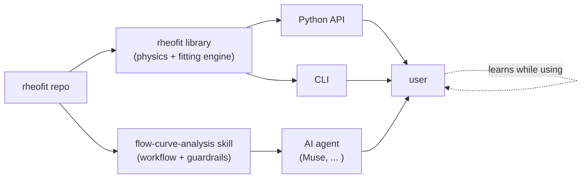
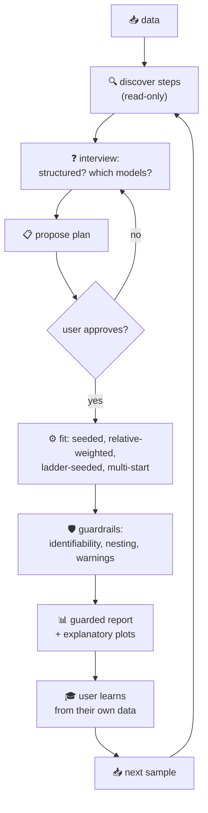
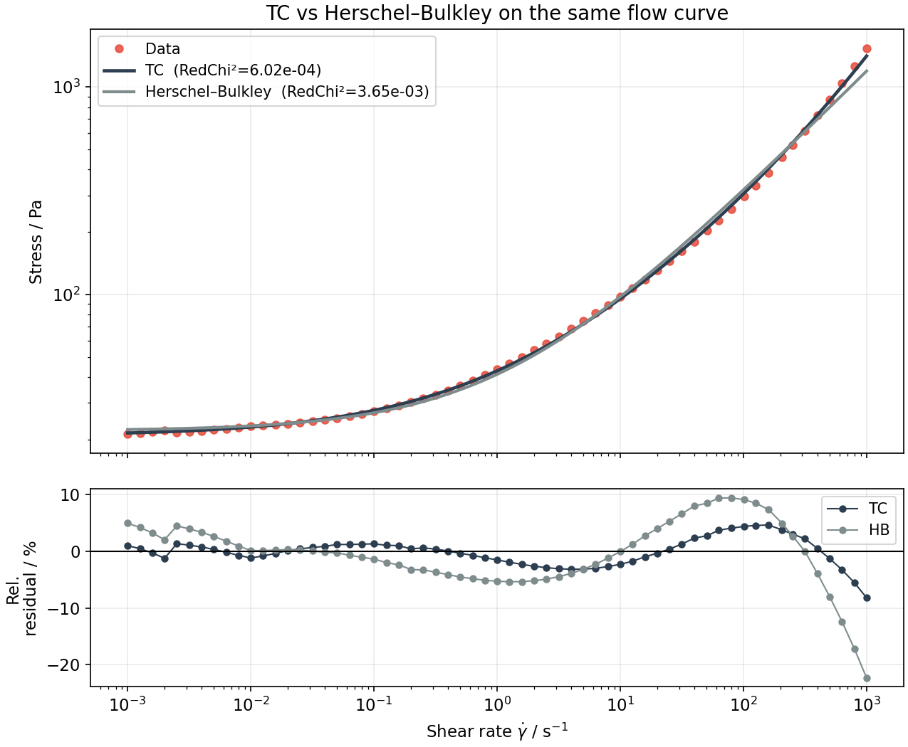
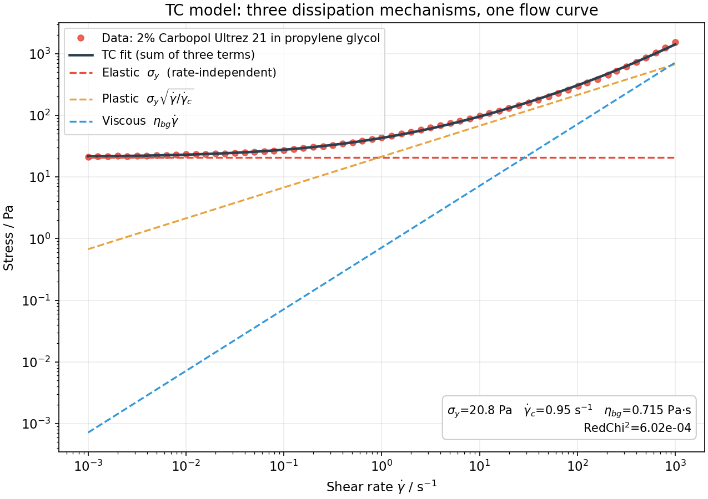
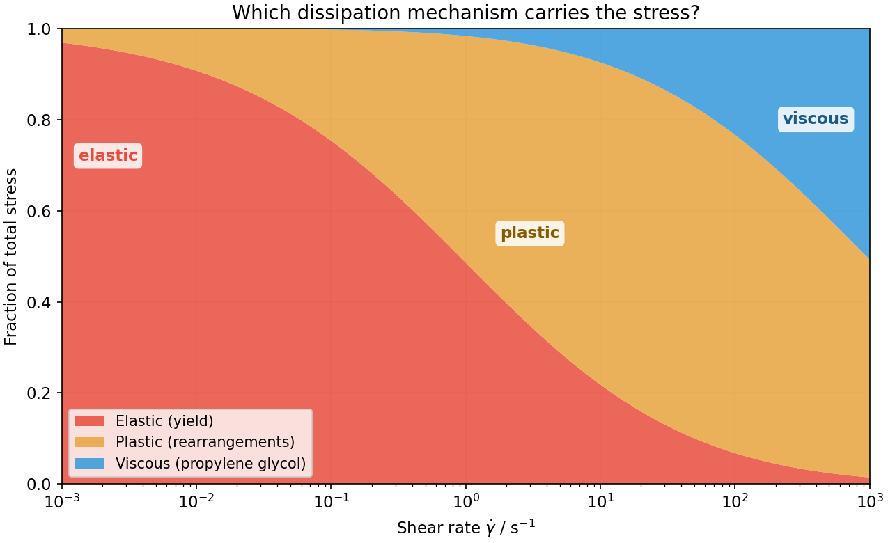

# 🧭 Walkthrough: a Carbopol flow curve, from raw data to physical insight

*How an LLM with a good harness turns a domain tool into a guided, safe, reproducible —
and educational — experience. Traced through a real case study: **2% Carbopol Ultrez 21
in propylene glycol**, fitted with the TC model vs. Herschel–Bulkley.*

## 💡 The premise: the skill travels with the tool

`rheofit` doesn't ship as code alone. It ships as **code + skill**: the `rheofit` library
*and* the `flow-curve-analysis` skill that teaches an AI agent how to wield it — which
questions to ask, which models are legitimate, what "good" looks like, and where the
guardrails are. The skill lives in the same repo
(`.github/skills/flow-curve-analysis/SKILL.md`), versioned with the code, curated by the
same domain experts. When the tool improves, the agent's behavior improves with it — no
prompt engineering by the end user required.



One implementation, three interfaces — and the agent's behavior is pinned to the same
code the experts maintain.

## 🧪 The case study

A single flow sweep of **2% Carbopol Ultrez 21 dispersed in propylene glycol**
(61 points, shear rates 10⁻³–10³ s⁻¹, 20 °C, concentric-cylinder geometry). The data
ships with the repo: `rheofit/data/pgpol_2pc_ultrez21.xlsx` (original export) and
`rheofit/data/pgpol_2pc_ultrez21.json` (TRIOS-shaped conversion used below).

Why this system? Carbopol is a jammed microgel — a soft-particle glass — and propylene
glycol is a *viscous* continuous phase. That combination is exactly where the TC
(three-component) model earns its keep over Herschel–Bulkley, as shown in
Caggioni, Trappe & Spicer, *J. Rheol.* **64**, 413–422 (2020)
([doi:10.1122/1.5120633](https://doi.org/10.1122/1.5120633)): the HB exponent drifts
with the continuous-phase viscosity because HB has no explicit viscous term, while TC
gives each dissipation mechanism its own parameter.

## 🎬 Act 1 — Setup: from "I have data" to working environment

The user points at the data file. Behind the scenes, the harness:

1. 📥 Locates the dataset (`rheofit/data/pgpol_2pc_ultrez21.xlsx`)
2. ⚙️ Installs the pinned environment (`uv sync` — numpy, scipy, matplotlib, pandas, exact versions from `uv.lock`)
3. 📘 Loads the skill — the agent now knows the models, the fitting contract, and the workflow

The user did none of this. They just pointed at data.

## 🎬 Act 2 — The interview: the agent asks before it acts

The skill's golden rule: **interview first, never auto-run.** The only thing the agent may
do unprompted is read-only step discovery. So the session goes:

> **Muse:** Found your file — one flow sweep, 61 points over six decades of shear rate.
> Before I show you models: is this sample **structured** — do you expect a yield stress?
>
> **User:** Yes, it's a Carbopol gel.
>
> **Muse:** Then we're in the yield-stress family. Proposed plan: fit **TC vs
> Herschel–Bulkley** head-to-head on this sweep — thorough effort, fixed seed, scorecards
> plus a term-by-term decomposition of the TC fit. Shall I run it?
>
> **User:** Yes.

Note what's happening: the agent isn't just taking orders — it's teaching the domain's
decision structure (structured vs. unstructured is *the* branching question in flow-curve
analysis) while collecting the choices it needs. The user learns the taxonomy by using it.



## 🎬 Act 3 — The run: reproducible by construction

Once approved, the agent runs both fits — thorough effort, relative-weighted objective
(every decade of stress counts equally), Sobol multi-start with a fixed seed. The exact
commands, reproducible anywhere:

```bash
python -m rheofit rheofit/data/pgpol_2pc_ultrez21.json --steps 0 --model tc \
    --effort thorough --seed 0
python -m rheofit rheofit/data/pgpol_2pc_ultrez21.json --steps 0 --model herschel_bulkley \
    --effort thorough --seed 0
```

Reproducibility isn't a hope, it's a flag: `--seed` makes any run exactly repeatable,
`uv.lock` pins the environment, and the skill, the CLI, and the Python API all call the
same `rheofit` functions. *Skill and library are one thing* — the agent cannot drift from
the documented behavior, because it *is* the documented behavior.

## 🥊 Act 4 — The showdown: TC vs Herschel–Bulkley

| model | RedChi² | parameters |
|---|---|---|
| **TC** | **6.02e-04** | σ_y = 20.8 Pa, γ̇_c = 0.95 s⁻¹, η_bg = 0.715 Pa·s |
| Herschel–Bulkley | 3.65e-03 | σ_y = 22.0 Pa, K = 19.2 Pa·sⁿ, n = 0.595 |

TC wins by a factor of ~6 in relative-weighted error, and every TC parameter is tightly
identified (relative errors 0.6–3%, no warnings). But the number is the least interesting
part. Look at *where* HB fails:



The residual panel tells the physical story: HB's residuals swing in a systematic
S-shape (±10–20%) while TC's stay flat (±5%). A single power-law exponent *n* = 0.595 is
trying to do two jobs at once — mimic the √γ̇ plastic rise at intermediate rates *and*
the linear viscous rise at high rates — and it does neither exactly. This is precisely the
paper's argument: the HB exponent is an empirical compromise that drifts with the
continuous-phase viscosity, while TC separates the two regimes into two physical terms.

## 🔬 Act 5 — Reading the TC fit: three mechanisms, one curve

The TC equation is a sum of three dissipation mechanisms:

$$\sigma = \underbrace{\sigma_y}_{\text{elastic}} +
\underbrace{\sigma_y\sqrt{\dot\gamma/\dot\gamma_c}}_{\text{plastic}} +
\underbrace{\eta_{bg}\,\dot\gamma}_{\text{viscous}}$$

Fitted to the Carbopol data, each term draws its own curve — and each curve means
something:



- 🔴 **Elastic, σ_y = 20.8 Pa** — the rate-independent plateau. The jammed microgel network holds until stress exceeds this; below it, the sample is a solid.
- 🟠 **Plastic, γ̇_c = 0.95 s⁻¹** — the √γ̇ rise from elastoplastic rearrangements (Hébraud–Lequeux / kinetic elastoplastic picture). γ̇_c sets *where* this regime lives.
- 🔵 **Viscous, η_bg = 0.715 Pa·s** — the linear high-shear tail: dissipation through the propylene glycol continuous phase. In water this term would be negligible; in propylene glycol it bends the whole top end of the curve — which is exactly why HB's single exponent fails here.

Which mechanism carries the stress depends on where you look:



At rest and at low rates the response is almost entirely elastic (the yield stress you feel
when the gel won't pour). Through the middle decades, plastic rearrangements take over.
At the highest rates, the viscous continuous phase dominates. Six decades, three
regimes, three parameters — each one tied to something you could formulate *against*:
raise σ_y with more Carbopol, shift γ̇_c with the microgel softness, tune η_bg with the
solvent.

## 🛡️ Act 6 — Safety boundaries, curated by domain experts

This is where shipping the skill with the code pays off. The agent operates inside
boundaries the rheologists wrote, not ones the user must remember to request:

- 🚫 **Never auto-runs** — every fit waited for an explicitly approved plan.
- 🚫 **Never invents models** — only the nine registered models exist; oscillatory data gets plots, never fabricated fits.
- 🚨 **Surfaces every warning** — parameters with >100% relative error, near-degenerate Jacobians, nesting violations are reported in plain language, not buried in a log.
- 🧭 **Nesting violations are optimizer failures, not physics** — if a child model ever scored worse than its nested parent, the skill says re-run with a different seed; it never lets the agent conclude "the simpler model is better."
- ⚖️ **The relative-weighting contract** — every decade of stress counts equally, so RedChi² is comparable across steps, samples, and models; the agent reminds you when reporting.

Here the guardrails stayed quiet — both models were fully identified, no warnings — which
is itself information: the TC win is a clean physics win, not an optimizer artifact.

## 🎓 Act 7 — Learning happens as you use it

The report the user gets isn't just numbers:

> σ_y = 20.8 Pa — a firm gel at rest. γ̇_c ≈ 1 s⁻¹ marks where plastic rearrangements take
> over from the yield plateau, and η_bg = 0.715 Pa·s is the propylene glycol making itself
> felt at high shear — the reason Herschel–Bulkley needs its compromise exponent
> n ≈ 0.6 on this system.

Concepts arrive **attached to the user's own data**: yield stress, plastic vs. viscous
dissipation, why the HB exponent isn't a material constant. A formulator gets *"which
knob to turn"*; a QC scientist gets *"is this batch different from last"*; a student gets
the physics. Same tool, same skill — the *delivery* adapts to the user while the
*analysis* stays rigorous. Nobody opened a textbook; the textbook opened itself around
their sample.

## 🔬 Act 8 — The developer's side: physics and code, not prompt babysitting

For the domain expert maintaining `rheofit`, the skill changes what "shipping" means:

- **One implementation, three interfaces** — Python API, CLI, and agent skill all call the same library. Fix the physics once, every route improves.
- **Docs that can't rot** — `SKILL.md` is simultaneously the agent's workflow and the user-facing documentation of the library. Change a CLI flag or add a model without updating it, and you've broken the repo's own stated contract.
- **Curation scales** — every lab using an AI agent + this skill gets the distilled judgment of the people who wrote the fitting engine: which models are legitimate, what "identified" means, when to climb the ladder. Expertise ships as software.

The developer focuses on higher-quality physics and code. The skill makes sure every user
benefits from it — safely.

## 🔁 The loop

Data in → interview → approved plan → reproducible fit → guarded report → understanding.
Then the user comes back with the next sample, and the loop tightens: they already know
the questions, the agent already knows their context, and the science compounds.

*That's the bet: ship the skill with the tool, and the tool teaches while it works.* 🎓⚗️
